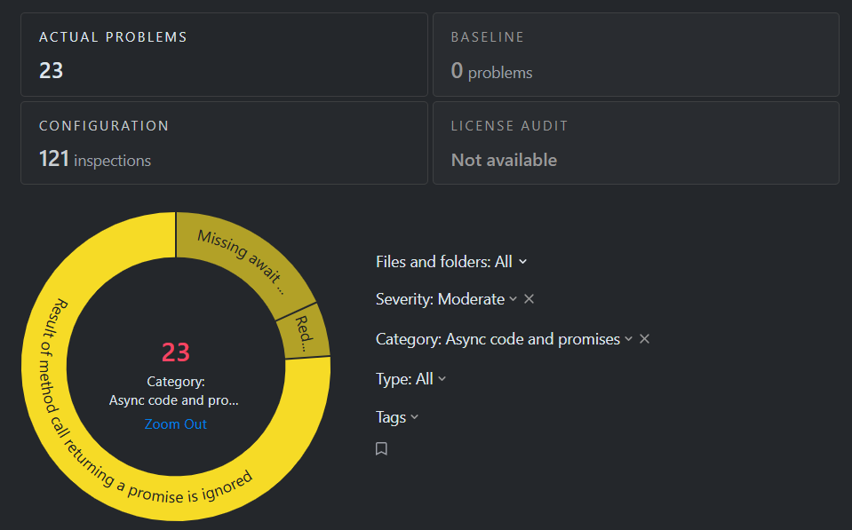
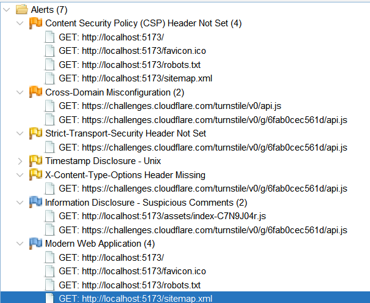

> [!IMPORTANT]
> This repository is still under development and does not yet reflect the final project.

<div style="text-align: center;">
  
</div>

<!-- PROJECT LOGO -->

<br />

<div align="center">

[](https://git.io/typing-svg)

</div>

<div>

  <p align="center">
    <b>A stock trading simulator built for beginners. Learn to trade without the risk</b>
    <br />
    <a href=""><strong>Explore the docs »</strong></a>
    <br />
    <br />
    <a href="#-features">Features</a>
    ·
    <a href="">Report Bug</a>
    ·
    <a href="">Request New Feature</a>
  </p>
</div>


<a id="readme-top"></a>

# 📝Overview 

Soict Stock Trading Platform is a full-stack web application that simulates a real-world stock trading environment. Designed for beginners and educational purposes, it allows users to practice trading stocks, manage portfolios, and learn about market dynamics in a safe, risk-free setting. 

For the security concern, we have implemented some measures by our best knowledge to mitigate common vulnerabilities and attacks. For more details, refer to the [Security Checklist](#-security-checklist) section.

## 🛠️ Technology Stack

The project is built with the following technologies:

<strong>Backend:</strong>
<div style="display: flex; flex-wrap: wrap; gap: 20px; align-items: center; margin-bottom: 20px;">
  
  
  
  
  
  
  
</div>

<strong>Frontend:</strong>
<div style="display: flex; gap: 20px; align-items: center; margin-bottom: 20px;">
  
  
  
  
</div>

<strong>Deployment:</strong>
<div style="display: flex; gap: 20px; align-items: center; margin-bottom: 20px;">
  
  
  
</div>

<strong>Security Testing:</strong>
<div style="display: flex; gap: 20px; align-items: center;">
  
  
</div>


<br>

*For more details explanaction and implementation of the technologies used in this project, please refer to our [techStack_1](docs/techStack/techStack_1.md), [techStack_2](docs/techStack/techStack_2.md)*

# 📖 Features

> [!NOTE]  
> Be patient! It may take a while (~2 minutes) to load all the demo `gif` images of this Feature section.

⚡Quick look ⚡:

<div align="center">
   
</div >

Our application offers some key features:

- **User Authentication**:  Register or log in using email/username and password or using your Google account. Two-factor authentication (2FA) via OTP sent to your email is required on login. Optionally, you can select "Remember this device" to skip OTP next time. Includes "Forgot password" feature with OTP-based password reset.


  <div align="center">
    
  </div >

  *Captcha (Cloudflare Turnstile) is disabled by default during the development stage. To enable it, set the environment variable in `.env` to `product`*


- **View Stock board**: Browse a real-time stock list with live price updates. Click on any stock to view detailed info, including price history shown in candlestick and line charts.

  <div align="center">
    
  </div >

- **Tutorial**: Step-by-step guide to help new users navigate the app and understand basic stock trading concepts.

  <div align="center">
    
  </div >

- **Trading**:  Place buy/sell orders with support for both **market** and **limit** order types. You will get a notification at the home page when your order iss matched.

  <div align="center">
    
  </div >

- **Portfolio**: Track your portfolio including available balance, estimated total value, the stocks you own, view transaction history and add funds to your account.

   <div align="center">
    
  </div >

- **Admin page** (for admin account only): Start or end a trading session.

  <div align="center">
    
  </div >

> [!NOTE]
> Some features of the website require third-party services such as Google SSO, Recaptcha with Cloudflare Turnstile, QR code banking payments via Sepay, and remote access through Cloudflare Tunnel. These services may become unavailable after the project is made public, as we plan to delete the associated accounts or projects for security and resource reasons. However, we provide [detailed instructions 1](docs/techStack/techStack_1.md), [detailed instructions 2](docs/techStack/techStack_2.md) so you can reconfigure these services using your own keys or tokens.

<p align="right">(<a href="#readme-top">back to top</a>)</p>

# 🚀 Installation & Setup

## Option 1: Using Docker

If you just want to **quickly try out the app** without diving into the code, we’ve got you covered with a `docker-compose` setup. Follow these steps:

1. Download the [`docker-compose.yml`](docker-compose.yml) file.
2. Create a `.env` file in the same directory as the docker-compose file, following the template in [`env.example`](env.example), replace the values with your own credentials.
3. Start Docker on your machine.
4. Run the following command in the directory containing `docker-compose.yml`:

```bash
docker-compose up
```
This will pull the latest images for the backend, frontend, and database from Dockerhub then build and run them in containers.


The web will be available at:

- Frontend: http://localhost:5173

- Backend API: http://localhost:3000

- pgAdmin (UI management tool for PostgreSQL): http://localhost:5050

## Option 2: Building from Source

> [!NOTE]
> Prerequisites: We assume that you have **Node.js**, **Yarn** installed on your system.

If you're interested in exploring the code and running the project manually, follow these steps:

1. **Clone the repo and navigate to the project directory**
   ```bash
    git clone https://github.com/chutrunganh/Stock-Trading-Platform.git
    cd Stock-Trading-Platform
    ```

2. **Set up environment variables**

    Create a .env file in the project root by copying the template from .env.example, then fill in the required values by your own credentials. 

3. **Set up the database**

    You have two options:

    - **Option 1**: Install PostgreSQL manually via the their official website.

    - **Option 2**: Use our Docker setup to run only the database. In this case, you need to command out our backend and frontend services inside the docker-compose file to run the database only. 
    
    
    In both case, please recheck variables in the `.env` to make sure that:
    - `DB_HOST` is `localhost`, not `postgres`
    - `BE_URL` is `http://localhost:3000`, not a domain name
    - `FE_URL` is `http://localhost:5173`, not a domain name
      
    Then run `docker-compose up` to start the database.

    For detailed instructions on database setup, including configuration variables and solutions to common issues, we highly recommend taking a quick look at our [Database Setup Guide](docs/setupInstructions/setupDatabase.md).


4. **Start the backend**
    ```bash
    cd app/backend
    yarn install # Install dependencies
    yarn start
    ```
5. **Start the frontend**
    ```bash
    cd app/frontend
    yarn install # Install dependencies
    yarn dev
    ```

6. **Open your browser and navigate** to `http://localhost:5173` to see the web in action.


> [!TIP]
> When you start the backend, it will automatically connect to the database and seed some initial data. However, for stock prices, it only seeds data for one day, so the chart may not display fully as shown in the demo due to insufficient historical data. To populate the database with realistic stock prices, we provide a Python script that fetches real-world stock data and inserts it into the database. You can find the script in `app/backend/src/utils/seedStockPrice`. Please refer to [this guide](app/backend/src/utils/seedStockPrice/README.md) for instructions on how to run it.

## Optional: Package the web with Docker 🐳

If you want to package the whole application with your source code changes to Docker images, update the `docker-compose.yml` file:

1. Uncommen the backend and frontend service, then under the `build` section, comment out the `image` lines (which pull from Docker Hub).

2. Then, uncomment the `context` and `dockerfile` lines.

3. Check again the `.env` file, pay attention to these variables:

| Variable  | Description                                                                                                                      | Example Value                                         |
| --------- | -------------------------------------------------------------------------------------------------------------------------------- | ----------------------------------------------------- |
| `DB_HOST` | Must be set to `postgres`, **not** `localhost`                                                                                   | `postgres`                                            |
| `BE_URL`  | Backend URL. Use: <br> - `http://localhost:3000` if running locally <br> - `YOUR_DOMAIN_NAME` if exposing via Cloudflare Tunnel  | `http://localhost:3000` or `https://soictstock.io.vn` |
| `FE_URL`  | Frontend URL. Use: <br> - `http://localhost:5173` if running locally <br> - `YOUR_DOMAIN_NAME` if exposing via Cloudflare Tunnel | `http://localhost:5173` or `https://soictstock.io.vn` |


> [!NOTE]
> Make sure FE_URL and BE_URL are set correspondingly, depending on whether you're running locally or using a public domain.


This will build the Docker images directly from the source code in the `./app/backend` and `./app/frontend` directories, which already contains the `Dockerfile`. This will run 4 services:

- Backend
- Frontend + Nginx as a proxy
- Postgres SQL
- Pgadmin

Access te webpage at: `http://localhost:5173`.

You can take an additional step to securely expose your Docker services to the internet using Cloudflare Tunnel (formerly Argo Tunnel). To do this, register a tunnel and link it to the domain name you specify in the `BE_URL` and `FE_URL` variables in your `.env` file. Then, follow the official instructions on the Cloudflare website to run the tunnel and make your services publicly accessible. The webpage now can be access via `https://soictstock.io.vn`.

# 🏗️ Project Structure

## Overall Structure

```plaintext
Stock-Trading-Platform/
├── app/
│   ├── backend/        
│   │   ├── src/              # Source code for the backend
│   │   │── package.json      # Backend dependencies
│   │   └── Dockerfile        # Dockerfile for backend
│   │
│   └── frontend/             # Source code for the frontend
│       ├── src/              # Source code for the frontend
│       │── package.json      # Frontend dependencies
│       ├── vite.config.js    # Vite configuration file
│       ├── nginx.conf        # Nginx configuration file
│       └── Dockerfile        # Dockerfile for frontend
│
├── docs/
│   ├── design/                 # Detail system design documents
│   ├── reports/                # Project reports
│   ├── setupInstructions/      # Setup instructions for the project
│   ├── techStack/              # All the technologies used, details guide configuring them.
│   └── stockFundementalThoery/ # Some financial terminology, mechanism of order matching, etc.
│
├── .env                # Environment variables (not committed to GitHub)
├── .env.example        # Example environment variables file (serve as a template)
└── docker-compose.yml  # Run the whole app with Docker
```

*For more details about the project structure, please refer to our reports in the `docs/reports` directory.*

# Deployment Architecture

```plaintext
                            ┌────────────────────────────┐
                            │    🌐 Public Internet      │
                            └────────────┬───────────────┘
                                         │
                                         ▼
                          ┌─────────────────────────────┐
                          │   🌩️ Cloudflare Proxy Edge  │
                          └────────────┬────────────────┘
                                       │  (Tunnel)
                                       ▼
               ┌──────────────────────────────────────────────────┐
               │          🖥️ Local Machine (Docker Host)          │
               │  (All services isolated inside Docker network)   │
               │                                                  │
               │  ┌──────────────────────────────────────────┐    │
               │  │  🛡️ cloudflared (Cloudflare Tunnel)      │    │
               │  │  - Forwards to frontend:5173 (Nginx)     │    │
               │  └────────────┬─────────────────────────────┘    │
               │               │                                  │
               │               │                                  │
               │      ┌────────┴───────────┐                      │
               │      │   frontend         │                      │
               │      │   (Nginx 5173:80)  │                      │
               │      └────────┬───────────┘                      │
               │               │                                  │
               │               │                                  │
               │        ┌──────┴───────────┐   ┌────────────────┐ │
               │        │  backend         │───┤  postgres      │ │
               │        │(Node 3000:3000)  │   │  (DB 5432:5432)│ │
               │        └──────────────────┘   └──────┬─────────┘ │
               │                                      │           │
               │                                ┌─────┴───────┐   │
               │                                │  pgAdmin    │   │    
               │                                │ (UI 5050:80)│   │    
               │                                └─────────────┘   │     
               └──────────────────────────────────────────────────┘
```

**Format: $HOST_PORT:$CONTAINER_PORT*

<p align="right">(<a href="#readme-top">back to top</a>)</p>

# 🔐 Security Checklist

<table border=2>
  <thead>
    <tr>
      <th>Criteria</th>
      <th>Requirements</th>
      <th>Solution</th>
    </tr>
  </thead>
  <tbody>
    <tr>
      <td rowspan="4">1. Password Authentication</td>
      <td>🟢 Enforce password policy</td>
      <td>
        Verified at both frontend and backend this policy:
        <ul>
            <li> Password length: 6–72 characters.
            <li> At least 1 uppercase letter, 1 number, and 1 special character (<code>@$!%*?&</code>)
            <li> Must not contain 3 or more consecutive characters from the username.
        </ul>
        Refer to <a href="app/backend/src/utils/passwordUtil.js"><code>passwordUtils.js</code></a>  for implementations. <br>
        <i>This password policy is a simplified version from
        <a href="https://www.vndirect.com.vn/tin_vndirect/thong-bao-thay-doi-mat-khau-giao-dich-dinh-ky/" target="_blank">VNDIRECT Securities JSC</a>.</i>
      </td>
    </tr>
    <tr>
      <td>🟢 Secure password storage</td>
      <td>Use <code>bcrypt</code> for salting + slow hashing when storing passwords. Refer to <a href="app/backend/src/services/security/userAuthService.js"><code>userAuthService.js</code></a>  for implementations.
      </td>
    </tr>
    <tr>
      <td>🟢 Prevention of password guessing</td>
      <td>Use CAPTCHA provided by <code>Cloudflare Turnstile</code> service to block spam/automated logins. Validate on both frontend and backend.  Refer to <a href="app/backend/src/services/security/turnstileService.js"><code>turnstileService.js</code></a>  for implementations.</td>
    </tr>
    <tr>
      <td>🟢 Password recovery</td>
      <td>
        Send OTPs to the user's email with expiration. For demo, we use <code>Ethereal</code> email. OTPs are 8 characters (mixed lower, upper case and numbers), expiry in 1 minute (testing only), generated with <code>otp-generator</code> dependency. Refer to <a href="app/backend/src/services/security/otpService.js"><code>otpService.js</code></a>, <a href="app/backend/src/services/security/userAuthService.js"><code>userAuthService.js</code></a>, <a href="app/frontend/src/context/AuthContext.jsx"><code>AuthContext.jsx</code></a>  for implementations.
      </td>
    </tr>
    <tr>
      <td rowspan="3">2. Session Authentication & Management</td>
      <td>🟢 Secure mechanisms for using access tokens: prevention of tampering and guessing, expiration control</td>
      <td>
    Use <code>JWT</code> with short-lived Access Tokens (expiry in1 minute for testing) and longer-lived Refresh Tokens (expiry in 7 days).  
    Tokens include a timestamp in the payload before signing to ensure uniqueness on every login.  
    Return tokens to the client via cookies with the following security attributes:  
    <ul>
      <li><code>Secure</code> (enabled in production only)</li>
      <li><code>HttpOnly</code></li>
      <li><code>SameSite='Strict'</code></li>
    </ul>
    On logout or browser close, clear all cookies on the client and revoke the Refresh Token on the server. Refer to <a href="app/backend/src/utils/jwtUtil.js"><code>jwtUtil.js</code></a>, <a href="app/backend/src/utils/setCookieUtil.js"><code>setCookieUtil.js</code></a>, <a href="app/backend/src/middlewares/authenticationMiddleware.js"><code>authenticationMiddleware.js</code></a>,  <a href="app/frontend/src/context/AuthContext.jsx"><code>AuthContext.jsx</code></a>   for implementations.
  </td>
    </tr>
    <tr>
      <td>🟢 CSRF defense</td>
      <td>
      <ul>
        <li> Only allow requests from the frontend origin using: (in the <a href="app/backend/src/index.js"><code>index.js</code></a> )
        <pre><code>app.use(cors({
  origin: process.env.FE_URL}));</code></pre>
        We do not provide public API. 
        <li> Cookies with <code>SameSite='Strict'</code> property.
        </ul>
      </td>
    </tr>
    <tr>
      <td>🟢 Session hijacking defense</td>
      <td>Using tokens with cookies as mentioned above</td>
    </tr>
    <tr>
  <td>3. Authorization</td>
  <td>🟢 Implement suitable access control: MAC, DAC, RBAC</td>
  <td>
    Implemented <strong>Role-Based Access Control (RBAC)</strong> with permission matrix: <pre><code>
    const ROLE_PERMISSIONS = {
      [ROLE_HIERARCHY.ADMIN]: {
        canAccessAdminDashboard: true,
        canControlTradingSession: true
      },
      [ROLE_HIERARCHY.USER]: {
        canAccessAdminDashboard: false,
        canControlTradingSession: false
      }
    };
    </code></pre> 
    The application currently supports two roles: <code>user</code> and <code>admin</code>.  
    <ul>
      <li>Public guests: Can access <em>Home</em> and <em>Tutorial</em> pages.</li>
      <li>Logged-in users: Can additionally access <em>Trade</em> and <em>Portfolio</em> pages.</li>
      <li>Admins: Can additionally access <em>Admin</em> page.</li>
    </ul>
     Refer to <a href="app/backend/src/middlewares/roleBasedAccessControlMiddleware.js"><code>roleBasedAccessControlMiddleware.js</code></a>  for implementations.
  </td>
  </tr>
    <tr>
      <td rowspan="4">4. Input Validation & Output Sanitization</td>
      <td>🟢 Input validation and sanitization</td>
      <td>
      User input is validated and sanitized using middleware located in 
      <a href="app/backend/src/middlewares/userValidationMiddleware.js"><code>userValidationMiddleware.js</code></a> 
      (used for login, registration, and password reset forms), 
      <a href="app/backend/src/middlewares/orderMiddleware.js"><code>orderMiddleware.js</code></a>, 
      and 
      <a href="app/backend/src/middlewares/tradingSessionMiddleware.js"><code>tradingSessionMiddleware.js</code></a> 
      (used for enforcing order constraints).
      <br><br>
      Response data is filtered using 
      <a href="app/backend/src/middlewares/responseSanitizationMiddleware.js"><code>responseSanitizationMiddleware.js</code></a> 
      and 
      <a href="app/backend/src/middlewares/errorHandlerMiddleware.js"><code>errorHandlerMiddleware.js</code></a>.
      <br><br>
      We use the <code>joi</code> and <code>xss</code> libraries for input and output sanitization. 
      In addition, a Content Security Policy (CSP) is configured to restrict the types of resources the browser can load.
  </td>
    </tr>
    <tr>
      <td>🟢 Protection against injection attacks</td>
      <td>
        <ul>
          <li>Use parameterized queries with placeholders like <code>$1</code> for SQL to prevent injections. See in <a href="app/backend/src/services/userCRUDService.js"><code>userCRUDService.js</code></a> for an SQL query example.
          <li> Config <code>CSP (Content Security Policy)</code> with <code>helmet</code> dependency to limit resource that browser can load, see in <a href="app/backend/src/index.js"><code>index.js</code></a>.
        </ul>
      </td>
    </tr>
    <tr>
      <td>🟡 Prevention of path traversal</td>
      <td>
      Prevent IDOR (Insecure Direct Object Reference) by :
        <ul>
          <li>Using <code>UUID</code> instead of auto-incrementing ID for primary key in sensitive database tables (See the <a href="app/backend/src/models/userModel.js"><code>userModel.js</code></a> and <a href="app/backend/src/models/portfolioModel.js"><code>portfolioModel.js</code></a>).
          <li>With routes that need to query by ID, extract the userID/portfolioID from the JWT, we do not accept it from the request parameters. See in <a href="app/backend/src/controllers/portfolioController.js"><code>portfolioController.js</code></a>, <a href="app/backend/src/controllers/orderController.js"><code>orderController.js</code></a> as some examples. However this is not fully implemented for all needed routes yet.
          <li>
          For routes that not allow to access (require authentication or authorization) return <a href="app/frontend/src/pages/NotFound/NotFoundPage.jsx">this 404 page</a>.
          </li>
        </ul>
      </td>
    </tr>
    <tr>
      <td>🟢 File upload restriction</td>
      <td>No file upload functionality in current app version so no need to implement this</td>
    </tr>
    <tr>
      <td rowspan="3">5. Sensitive Information Leakage</td>
      <td>🟡 Minimization of sensitive information leakage about servers, software, and applications</td>
      <td>Checkout our <a href="app/frontend/nginx.conf"><code>nginx.conf</code></a> file for more details on security headers and configurations to minimize information leakage.</td>
    </tr>
    <tr>
      <td>🟢  Minimization of sensitive information leakage in response</td>
      <td>Disable <code>X-Powered-By</code> in HTTP response header through using <code>helmet</code> dependency. This header is set by default in Express and some other frameworks to reveals which framework the server is using, which can aid attackers during reconnaissance</td>
    </tr>
    <tr> 
    <td>🟢 Mitigate Clickjacking</td>
    <td>Set <code>X-Frame-Options: DENY</code> in HTTP response header through using <code>helmet</code> dependency to prevent website to be embeded into other sites using <code>iframe</code> tag </td>
    </tr>
    <tr>
      <td rowspan="3">6. Compliance with Standards</td>
      <td>🟢 HTTPS implementation</td>
      <td>Use <code>Cloudflare Tunnels</code> to public web service and get free SSL</td>
    </tr>
    <tr>
      <td>🟡 Mitigation of DoS attacks</td>
      <td>Requests pass through Cloudflare proxy when using Cloudflare Tunnel. Configure rate-limiting, geography-based IP rule, block specified user agents on Cloudflare WAF (Web Application Firewall), see <a href="docs/images/WAF_1.png">WAF_1</a> and <a href="docs/images/WAF_2.png">WAF_2</a>. However, we just enable and use prebuild rules template without any research, customization or testing these settings yet.</td>
    </tr>
    <tr>
      <td>🟢 Secure storage and management of sensitive values</td>
      <td>
      Use an environment variables file named <code>.env</code> to store secret values and keys.  
      All parts of the source code that need these values must load them from this file instead of hardcoding them.  
      The <code>.env</code> file is not committed to GitHub.  
      Instead, we provide a <code>.env.example</code> file as a template to help you recreate your own <code>.env</code> file with your credentials.
    </td>
    </tr>
    <tr>
      <td rowspan="2">7. Security Testing</td>
      <td>🟢 Code review with automated tools</td>
      <td>Scan with <code>Qodana</code> from Jetbrains. All <code>Critical</code>, <code>High</code> level warning have been fixed, still some <code>Moderate</code> warnings left.</td>
    </tr>
    <tr>
      <td>🟢 Penetration testing with tools</td>
      <td>Using ZAP Proxy. No <code>High</code> level alerts, only alerts at <code>Medium</code>, <code>Low</code> and <code>Informational</code> level left.</td>
    </tr>
    <tr>
      <td rowspan="4">8. Bonus</td>
      <td>🟢 Multi-factor authentication</td>
      <td>
        After enter correct username/email and password, OTP is sent to user's email. OTP must be valid and unexpired. We also have "Remember device in ...  time" implemented to skip OTP next time login. Devices are idntified by using <code>fingerprintJS</code> dependency (free version). See in <a href="app/backend/src/services/security/otpService.js"><code>otp service</code></a> (for otp implementation) and <a href="app/frontend/src/components/forms/LoginForm.jsx"><code>LoginForm.jsx</code></a> (for device fingerprint indentification).
      </td>
    </tr>
    <tr>
      <td>🔴 Advanced session hijacking prevention</td>
      <td>Track user IPs, detect unfamiliar devices/browsers.</td>
    </tr>
    <tr>
      <td>🟡 Advanced HTTP flood prevention</td>
      <td>Configure the Cloudflare WAF for the domain.</td>
    </tr>
    <tr>
      <td>🟢 Single Sign-On (SSO)</td>
         <td>Implemented Google OAuth 2.0 using <code>passport</code> dependency, see in <a href="app/backend/src/config/passportConfig.js"><code>passportConfig.js</code></a> and <a href="app/backend/src/services/security/userAuthService.js"><code>userAuthService.js</code></a>.
         </td>
      </tr>
  </tbody>
</table>


Status Explanation:

- 🟢 **Done**: Mitigation measures have been implemented to the best of our knowledge. (Note: This does not guarantee complete immunity from the attack.)

- 🟡 **Partially Done / Not Applicable**: The measure is either just propose ideas, partially implemented  and have not been fully tested or validated yet.

- 🔴 **Not Implemented**: No mitigation has been applied yet.

<p align="right">(<a href="#readme-top">back to top</a>)</p>

## Code review with Qodana

<div align='center'>
  
</div>

All warning at `Critical`, `High` level have been fixed. There are still some `Medium` level warnings left we can not fix yet due to time constraints. 

## Code penetration testing with OWASP ZAP

<div align='center'>
  
</div>

No alerts at `High` level, only alerts at `Medium`, `Low` and `Informational` level left.

<p align="right">(<a href="#readme-top">back to top</a>)</p>

<!-- CONTRIBUTING -->
# 🤝 Contributing

Contributions are what make the open source community such an amazing place to learn, inspire, and create. Any contributions you make are **greatly appreciated**.

If you have a suggestion that would make this better, please fork the repo and create a pull request. You can also simply open an issue with the tag "enhancement".
Don't forget to give the project a star! Thanks again!

1. Fork the Project
2. Create your Feature Branch (`git checkout -b feature/AmazingFeature`)
3. Commit your Changes (`git commit -m 'Add some AmazingFeature'`)
4. Push to the Branch (`git push origin feature/AmazingFeature`)
5. Open a Pull Request

For the success of this project, I want a special thanks to:

- **Project supervisor**: MSc. Bùi Trọng Tùng, Dr. Đỗ Bá Lâm
- **Team members**:

  | Name | Student ID |
  |:--|:--|
  | Chu Trung Anh (team leader)| 20225564 |
  | Bùi Duy Anh | 20225563 |
  | Phạm Mạnh Tiến| 20225555 |


<!-- LICENSE -->
# 📜 License

[](https://www.apache.org/licenses/LICENSE-2.0)


Distributed under the Apache-2.0 License License. See `LICENSE` for more information.


<!-- CONTACT -->
# 📧 Contact

This project is maintained by: Chu Trung Anh - [Email](mailto:chutrunganh04@gmail.com).

Feel free to contact me if you have any question or suggestion.

<p align="right">(<a href="#readme-top">back to top</a>)</p>
