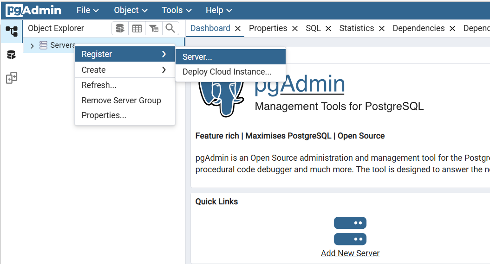
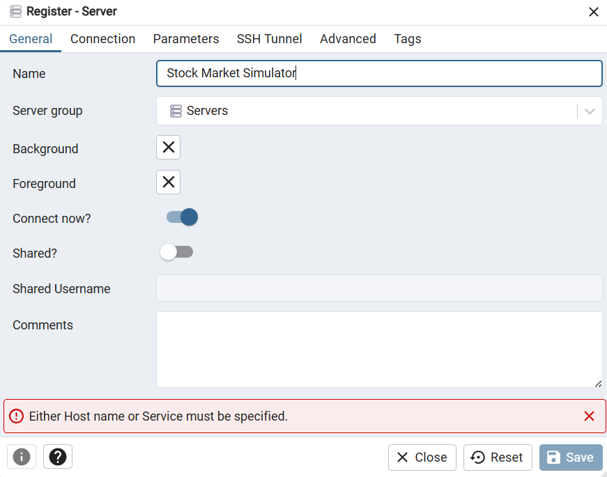
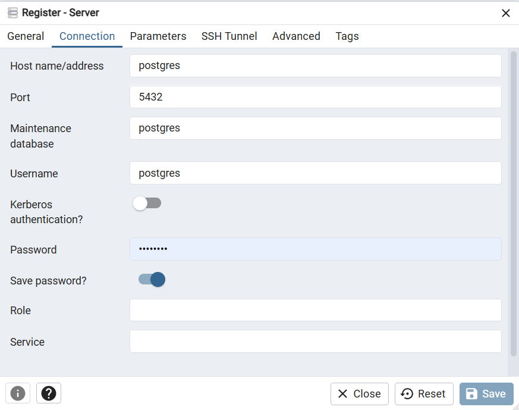
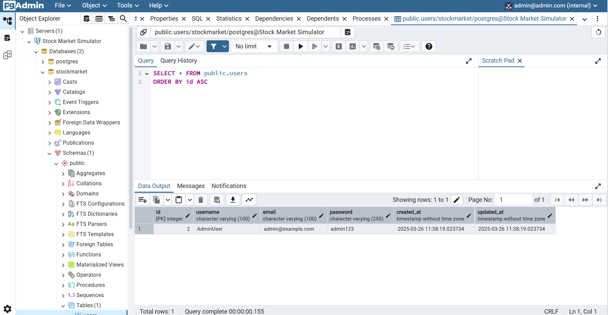

> [!IMPORTANT]  
> If you already have PostgreSQL (PostgresSQL.exe) and PgAdmin (PgAdmin4.exe) installed on your local computer, you have two options:
> - Keep using your existing installation without using our Docker containers. In this case, you might need to change the database connection settings in the `.env` file to match your existing installation if there is any error. You can skip the following steps and go to the next section. 
> - Use our Docker containers for PostgreSQL and PgAdmin. In this case, you NEED to stop your existing PostgreSQL and PgAdmin services to avoid port conflicts. For example with PostgreSQL service, use `net stop postgresql-x64-14` for Windows or `sudo service postgresql stop` for Linux/Mac. This will prevent the exe file and Docker services from using the same 5432 port, which could lead to unexpected behaviors. 

# Running PostgreSQL and PgAdmin with Docker

The Postgres databse and PgAdmin (to manage the database with GUI) are run in Docker containers, so just simply run this command to bring them up:

```bash
docker-compose up -d
```

*The `-d` flag is for detached mode, which means the containers will run in the background. If you want to see the logs, you can remove the `-d` flag.*

Wait a few seconds for Docker to initialize everything.

# Initializing the Database

Once Docker has started, you need to run the backend to initialize the database. This will:

- Connect to the database.

- Create necessary tables.

- Seed the database with initial data.

To do this, navigate to the backend directory and run:

```bash
cd app/backend
yarn install # to install the dependencies
yarn start # to start the server
```

# Managing the Database with PgAdmin

Once everything is set up, you can log in to **PgAdmin** to manage the database by accessing the URL `http://localhost:5050`. You can use PgAdmin to create, modify, and delete tables, as well as run SQL queries against the database.

To login to PgAdmin, enter credential based on field `PGADMIN_DEFAULT_EMAIL` and `PGADMIN_DEFAULT_PASSWORD` defined inside `.env`. After that, set up the server connection to the PostgreSQL database by following these steps:

1. On the left panel, right click on "Servers" and select "Register" -> "Server...".



2. Enter name of the server as you wish:



3. Change to the "Connection" tab, enter the following information:



- Host name/address: postgres (must use the same as PostgreSQL service name as defined in the `docker-compose.yml` file)
- Port: see the `BD_PORT` field in the `.env` file
- Username: see the `DB_USER` field in the `.env` file
- Password: see the `DB_PASSWORD` field in the `.env` file

Click "**Save**" to save the server configuration. After that, you should see your database viewable in the left panel. Click on the database name to see the tables inside.

 

4 . To stop the database, run `docker-compose down` in the root directory of the project or `docker-compose down -v` to remove the volumes as well. The `-v` flag will remove the database and all data inside it, so be careful with this command.