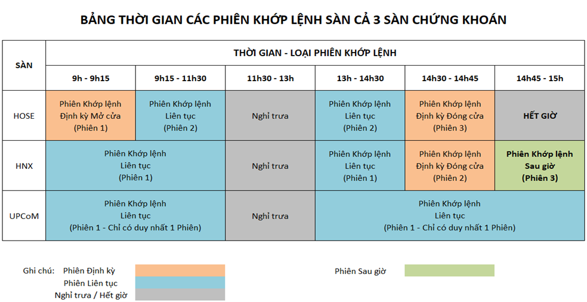
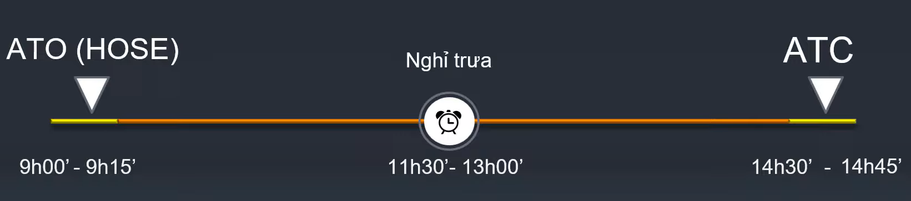
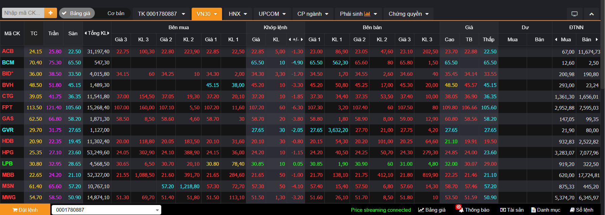
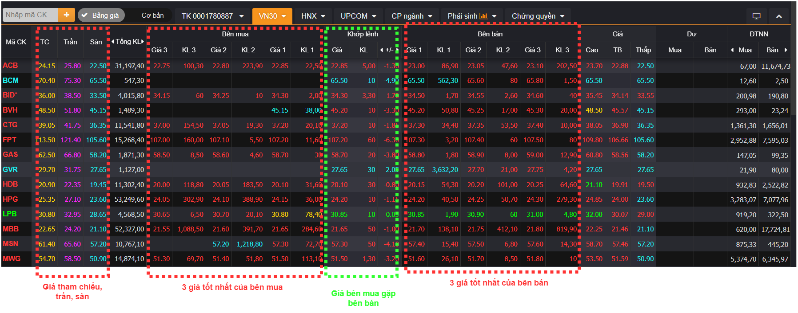

> [!NOTE]  
> Nếu bạn chưa có kiến thức về chứng khoán, đọc qua file này để biết các khái niệm cơ bản cũng như cách tính toán các loại giá (giá đóng mở cửa, giá tham chiếu, giá cổ phiếu) mà chúng tôi sử dụng trong dự án này.

# 1. Phiên giao dịch

Thời gian phiên giao dịch và loại phiên giao dịch tại các sàn có thể khác nhau, ví dụ với 3 sàn HOSE, HNX và UpCOM thì thời gian giao dịch như sau:

Tuy nhiên ở dự án này, chúng tôi chỉ giả lập tuân theo các phiên giao dịch dựa trên hoạt động của sàn chứng khoán **HOSE** (Sở giao dịch chứng khoán TP.HCM). Các phiên giao dịch của sàn HOSE được chia thành 3 phiên chính:

1. **Phiên khớp lệnh định kỳ ATC và ATO**

- Thời gian: Phiên giao dịch mở cửa hay ATO At The Open (9:00 - 9:15) và phiên giao dịch đóng cửa hay ATC At The Close (14:30 - 14:45), các ngày từ thứ 2 đến thứ 6 (trừ ngày nghỉ lễ).

- Cách xác định giá: Các lệnh được gửi lên sàn trong khoảng thời gian này sẽ không đem so khớp giá ngay mà phải đợi hết khoảng thời gian 15 phút. Sau 15 phút, quét qua toàn bộ các lệnh này và xem tại giá nào thì **khối lượng giao dịch** là lớn nhất. Giá này chính là **giá mở cửa** (**Open Price**) với phiên ATO và **giá đóng cửa** (**Close Prices**) với phiên ATC.  *Xem thêm về cơ chế khớp lệnh trong khớp lệnh định kỳ ATC tại đây: [VN Uptrend Youtube - Khớp lệnh định kỳ ATC](https://youtu.be/8k5EiRoNWtg?si=GzVQjQsGTGURF_TQ).*

2. **Phiên khớp lệnh liên tục (Continuous Matching)**

- Thời gian: 9:15 - 11:30 (sáng) và 13:00 - 13:30 (chiều).

- Cách xác định giá: Các lệnh được gửi lên sẽ ngay lập tức được so khớp để tìm ra giá khớp lệnh. Nếu có lệnh đối ứng (tức thỏa mãn giá mua ≥ giá bán) thì sẽ được khớp ngay lập tức, nếu không có lệnh đối ứng thì lệnh sẽ được đưa vào hàng đợi và chờ khớp.

# 2. Giá trần, giá sàn và giá tham chiếu

Trong các phiên giao dịch, nhà đầu tư có thể đặt bất cứ giá nào miễn là giá sàn <= giá đặt <= giá trần của cổ phiếu. Công thức tính giá trần, giá sàn là:

> **Giá trần = Giá tham chiếu + biên độ dao động giá**

> **Giá sàn = Giá tham chiếu - biên độ dao động giá**

Với:

- Biên độ giao động giá ở đây được quy định theo từng sàn như sau: 

| Loại cổ phiếu | HOSE | HNX | UpCOM |
|--------------|------|------|-------|
| Cổ phiếu trong ngày | 7% | 10% | 15% |
| Cổ phiếu mới niêm yết trong ngày đầu tiên hoặc được giao dịch trở lại sau khi bị tạm ngừng giao dịch trên 25 ngày | 20% | 30% | 40% |
| Cổ phiếu trong ngày giao dịch không hưởng quyền để trả cổ tức hoặc thưởng bằng cổ phiếu quỹ cho cổ đông hiện hữu | 20% | 30% | 40% |

- Giá tham chiếu ở đây được quy định theo từng sàn như sau: 

| Sàn giao dịch | Cách xác định giá tham chiếu |
|--------------|-----------------------------|
| **Sàn HOSE** | Mức giá đóng cửa đã khớp lệnh trong ngày giao dịch liền trước. *(Trừ những trường hợp đặc biệt)* |
| **Sàn HNX**  | Mức giá đóng cửa đã khớp lệnh trong ngày giao dịch liền trước. *(Trừ những trường hợp đặc biệt)* |
| **Sàn UpCOM** | Trung bình cộng của các mức giá giao dịch lô chẵn (bình quân gia quyền), dựa trên hình thức khớp lệnh vào ngày liền trước đó. *(Trừ những trường hợp đặc biệt)* |

**(trừ những trường hợp đặc biệt) như cổ phiếu mới niêm yết hoặc điều chỉnh do chia cổ tức, tách cổ phiếu, v.v.*

Xem chi tiết trong: [Giá trần, giá sàn, giá tham chiếu trong chứng khoán là gì? Màu sắc trên bảng giá chứng khoán?](https://youtu.be/LRy7jM1mjlM?si=hmDZTfj1eRFQPnkC)

-------------

**⚠️⚠️⚠️ Trong giới hạn dự án, chúng tôi sẻ chỉ giả lập một  phiên khớp lệnh liên tục của sàn HOSE (tức không có ATO, ATC hay nghỉ trưa). Vì ATO và ATC là các phiên tạo ra giá mở cửa và giá đóng cửa, mà chúng tôi không mô phỏng, nên chúng tôi thay đổi cơ chế tính giá mở và đóng cửa như sau:**

- **Giá mở cửa = giá của lệnh đầu tiên được khớp trong phiên khớp lệnh liên tục. Nếu trong ngày đó không có giao dịch nào được khớp thì giá mở cửa giữ nguyên từ ngày giao dịch trước (Trên thực tế sàn HNX cũng dùng cách tính này do sàn đó cũng không có phiên ATO)**

- **Giá đóng cửa = giá của lệnh cuối cùng được khớp trong phiên khớp lệnh liên tục.  Nếu trong ngày đó không có giao dịch nào được khớp thì giá đóng cửa giữ nguyên từ ngày giao dịch trước**

**Ngoài ra để đơn giản, chúng tôi tính giá trần và giá sàn theo biên độ cố định 7% cho tất cả các cổ phiếu, thay vì theo quy định của từng sàn như trên. Còn giá tham chiếu vẫn được tính theo quy tắc của sàn HOSE, tức là giá đóng cửa của ngày giao dịch hôm trước.**

-------------------

# 3. Các loại lệnh cơ bản

**⚠️⚠️⚠️ Hiện tại app chúng tôi chỉ hỗ trợ lệnh thị trường và lệnh giới hạn, một sàn chứng khoán trên thực tế còn hỗ trợ nhiều loại lệnh khác như lệnh dừng lỗ, lệnh dừng chốt lời, ....**

**Lệnh thị trường (Market Order)**: Là lệnh mua/bán ngay lập tức theo giá tốt nhất hiện có trên thị trường, không yêu cầu nhập giá cụ thể. Cụ thể

- Lệnh mua thị trường (Market Buy Order): Là lệnh mua với giá thị trường hiện tại. Lệnh này sẽ được khớp ngay lập tức với lệnh bán có giá thấp nhất trong sổ lệnh.

- Lệnh bán thị trường (Market Sell Order): Là lệnh bán với giá thị trường hiện tại. Lệnh này sẽ được khớp ngay lập tức với lệnh mua có giá cao nhất trong sổ lệnh. 

**Lệnh giới hạn (Limit Order)**:  Là lệnh mua/bán với mức giá cụ thể do nhà đầu tư chọn, chỉ khớp khi thị trường đạt đến giá đó. Cụ thể:

- Lệnh mua giới hạn (Buy Limit Order): Là lệnh mua với mức giá tối đa mà nhà đầu tư sẵn sàng trả. Nếu có lệnh bán với giá bằng hoặc thấp hơn giá này, lệnh sẽ được khớp ngay lập tức. Nếu không, lệnh sẽ được đưa vào hàng đợi cho đến khi có lệnh bán phù hợp.

- Lệnh bán giới hạn (Sell Limit Order): Là lệnh bán với mức giá tối thiểu mà nhà đầu tư sẵn sàng chấp nhận. Nếu có lệnh mua với giá bằng hoặc cao hơn giá này, lệnh sẽ được khớp ngay lập tức. Nếu không, lệnh sẽ được đưa vào hàng đợi cho đến khi có lệnh mua phù hợp.

Các lệnh giới hạn sẽ ở trong hàng đợi cho tới khi có lệnh đối ứng thì khớp và loại khỏi hàng đợi hoặc nếu không có lệnh đối ứng cho tới cuối phiên giao dịch thì lệnh đó sẽ bị giải tỏa, tiền ứng mua được sàn trả lại cho nhà đầu tư.

Ngoài ra còn một loại lệnh phổ biến khác mà chúng tôi sẽ xem xét triển khai trong dự án nếu thời gian cho phép, đó là **lệnh dừng lỗ (Stop Loss Order)**. Lệnh này cho phép nhà đầu tư đặt một mức giá cụ thể để tự động **bán** cổ phiếu khi giá giảm xuống dưới mức đó, nhằm hạn chế thua lỗ. Ngược lại với lệnh này là **lệnh dừng chốt lời (Take Profit Order)**, cho phép nhà đầu tư đặt một mức giá cụ thể để tự động **bán** cổ phiếu khi giá tăng lên trên mức đó, nhằm bảo vệ lợi nhuận.

Cùng là đặt giá giống lệnh giới hạn nhưng chúng khác nhau ở điểm nào:

- Giá trong lệnh giới hạn là để giới hạn khoảng giá mà bạn mong muốn **mua/bán** trong đó -> Lệnh này tập trung vào việc kiểm soát giá, đảm bảo bạn không mua/bán ở mức giá tệ hơn mong muốn. Bạn đặt lệnh mua cổ phiếu A với giá giới hạn 100.000 VNĐ. Nếu giá thị trường giảm xuống 100.000 VNĐ hoặc thấp hơn, lệnh sẽ được kích hoạt; nếu không, lệnh sẽ không thực hiện.

- Giá trong lệnh dừng lỗ là để kích hoạt lệnh thị trường **bán** khi giá cổ phiếu đạt đến mức đó -> Lệnh này **không kiểm soát được giá** thực hiện chính xác vì nó chuyển thành lệnh thị trường khi kích hoạt, chủ yếu tập trung vào việc quản lý rủi ro khi thị trường có xu hướng giảm và bạn không chấp nhận lỗ thêm nữa. Ví dụ: Bạn đặt lệnh dừng bán cổ phiếu A ở mức 90.000 VNĐ khi giá hiện tại là 100.000 VNĐ. Nếu giá giảm xuống 90.000 VNĐ, lệnh sẽ kích hoạt và bán ngay ở giá thị trường lúc đó (có thể là 89.000 VNĐ hoặc thấp hơn).

# 4. Matching Engine 

Sau khi các lệnh của người dùng được gửi lên sàn, để khớp các lệnh (**Order**) của người dùng, sàn chứng khoán sử dụng một thành phần gọi là **Matching Engine**. Khi một người dùng đặt lệnh mua hoặc bán, thông tin lệnh sẽ được gửi đến Matching Engine. Thành phần này sẽ tìm kiếm các lệnh đối ứng trong hệ thống và thực hiện việc khớp lệnh dựa trên các tiêu chí định trước. Khi một lệnh mua và một lệnh bán được khớp bởi matching engine, giao dịch (**Transaction**) sẽ được thực hiện và thông tin về giao dịch đó sẽ được ghi lại trong cơ sở dữ liệu. Về các tiêu chí mà Matching Engine sử dụng để khớp lệnh gồm 2 cách tiếp cận chính là: **price-time priority system** and **pro-rata system**. Đọc kỹ hơn trong bài viết này: [Order matching system: Explained](https://tiomarkets.com/article/order-matching-system-guide). **Trong dự án này, chúng tôi sử dụng tiêu chí giá- thời gian.**

Theo đó, ta sẽ duy trì một sổ lệnh (**Book Order**) cho mỗi mã cổ phiếu. Thường thì Booker Order sẽ hiển thị 3 giá bán và 3 giá mua tốt nhất (cao nhất cho bids, thấp nhất cho asks) từ các lệnh của người dùng gửi lên (Hiển thị giá và số lượng). *Chỉ hiển thị 3 giá để tiết kiệm không gian còn thực tế Book Order vẫn phải xử lý với tất cả các lệnh trong hàng đợi.*

Khi người dùng gửi lệnh mua/bán cổ phiếu mới lên sàn bao gồm giá + số lượng lên sàn:

- Nếu đó là lệnh thị trường (**Market Order**), quét qua các lệnh trong Book Order và khớp với các lệnh có giá tốt nhất (tức là giá thấp nhất cho lệnh mua và giá cao nhất cho lệnh bán), nếu có hai người bán/mua đưa ra cùng một mức giá thì khớp với người có thời gian đặt lệnh sớm hơn. Sau khi khớp xong thì cập nhật Book Order ở trường "Khớp lệnh" với giá và số lượng của lệnh vừa được khớp.

- Nếu đó là lệnh giới hạn (**Limit Order**), quét qua các lệnh trong Book Order xem có lệnh nào thỏa mãn điều kiện giá không:

    - Nếu có thì thực hiện khớp lệnh (ưu tiên giá xong đến thời gian) và cập nhật Book Order.

    - Nếu không thì lệnh đó được đưa vào hàng đợi của Book Order, chờ cho tới khi:
        - có lệnh đối ứng thì khớp và loại khỏi hàng đợi 
        - nếu không có lệnh đối ứng cho tới cuối phiên giao dịch thì lệnh đó sẽ bị giải tỏa.

**Cách giá hình thành:**

Theo cơ chế trên, giá chứng khoán được quyết định bởi cung - cầu và tâm lý nhà đầu tư thông qua lệnh mua/bán trong Order Book. Mỗi nhà đầu tư đặt lệnh theo chiến lược riêng:

- Người mua luôn muốn mua với giá thấp nhất có thể.

- Người bán luôn muốn bán với giá cao nhất có thể.

Để dễ hiểu thì đây là 3 kịch bản điển hình:

- Bên bán áp đảo:

  - Khi lượng lệnh bán nhiều hơn mua, người bán buộc phải cạnh tranh hạ giá để thu hút người mua. (Vì nếu không hạ giá thì lệnh của người đó sẽ bị xếp sau trong hàng đợi bán và chỉ được xét đến khi các lệnh bên trên được khớp hết)

  - Kết quả: Giá có xu hướng giảm.

- Bên mua áp đảo:

  - Khi lượng lệnh mua nhiều hơn bán, người mua phải cạnh tranh tăng giá để tranh mua.

  - Kết quả: Giá có xu hướng tăng.

- Cân bằng cung - cầu:

  - Nếu hai bên không nhượng bộ (người mua không chịu tăng giá, người bán không chịu hạ giá), không có giao dịch xảy ra.

  - Kết quả: Giá đứng yên cho đến khi có lệnh mới phá vỡ thế cân bằng.

Chi tiết hơn xem trong video này: [VN Uptrend Youtube - Thời gian giao dịch và nguyên tắc khớp lệnh chứng khoán](https://youtu.be/3SJRObB-SUk?si=IJGkCBmZT9izFHvR)

Code implementation của Book Order matching tham khảo: [Medium-Stock Market Orders Matching Engine in NodeJS](https://jindalujjwal0720.medium.com/stock-market-order-book-orders-matching-engine-in-nodejs-3dff82f70080)

# 5. Bảng giá

Các lệnh mua và bán liên tục của người dùng được hiển thị trên bảng giá, hay còn được gọi là bảng điện tử.

Bảng giá là nơi hiển thị thông tin về các mã chứng khoán đang được giao dịch trên sàn. Bảng giá bản chất là hiển thị book order của các mã chứng khoán cùng một vài thông tin khác. Ví dụ về một bảng giá như sau:

Bảng gồm các phần chính:

](../images/stock_table_2.png)

Tham khảo các đọc bảng giá này tại đây: [Hướng dẫn cách đọc Bảng giá chứng khoán cơ sở tại VNDIRECT](https://support.vndirect.com.vn/hc/vi/articles/900001015386-H%C6%B0%E1%BB%9Bng-d%E1%BA%ABn-c%C3%A1ch-%C4%91%E1%BB%8Dc-B%E1%BA%A3ng-gi%C3%A1-ch%E1%BB%A9ng-kho%C3%A1n-c%C6%A1-s%E1%BB%9F-t%E1%BA%A1i-VNDIRECT) hoặc xem vid này: [CÁCH ĐỌC BẢNG GIÁ CHỨNG KHOÁN - HỌC CHỨNG KHOÁN CƠ BẢN CÙNG TRUE INVEST](https://youtu.be/Rhe-aVEekwU?si=XQCdHYrAI0xFEjL6). 

Các màu xanh , đỏ, tím,... trên bảng giá là dựa theo quy tắc này: [MÀU SẮC - NGUYÊN TẮC KHỚP LỆNH](https://youtu.be/1_xz-nJrK5o?si=jlULS4zPuuZJneGh)

**⚠️⚠️⚠️ Trong app của chúng tôi sẽ chỉ hiện thị 2 giá mua và 2 giá bán tốt nhất thay vì 3 giá như trên bảng giá thực tế, và chúng tôi sẽ không làm các cột như Dư, Đầu tư nước ngoài (DTNN)**

