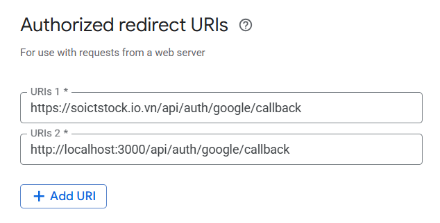

> [!NOTE]
> This file contains the tech stack used in the project, including the theory and examples implemented in the code.


# 1. bcrypt

## Theory

To store the password securely, we use bcrypt to hash the password before storing it in the database. How does bcrypt work?

1. It auto generates a random salt, concatenates it with the password, and then hashes the result. This will prevent attackers from using precomputed hash tables (rainbow tables) to crack the password. 

2. bcrypt uses a slow hashing algorithm, which makes it computationally expensive to brute-force the password. The cost factor (`SALT_ROUNDS`) determines how many iterations of the hashing algorithm are performed. A higher cost factor means more iterations, making it harder to crack the password. In the code, we use 10 rounds which tells bcrypt to perform 2^10 iterations of the hashing algorithm. The larger the number of rounds, the more secure the hash is, but it also requires more hardware resources to compute. As OWASP recommends, a cost factor should be at least 10.

So in theory, when user register, the process would be: **hash(password_user_input + salt)**, we store this result in the database. When the user tries to log in, take in the password they entered, hash it again with the **SAME** salt, and compare the result to the stored hash. This means we need to store both the hashed password and the salt in the database corresponding to user account. However, in practical, we do not need to create another field in the database or write any code to store the salt, bcrypt **automatically** handles that under the hood. For more detail, bcrypt auto includes the salt in the output string itself, so when you hash a password, the output will include both the salt and the hash. The output string is something like this:

```plaintext
$2a$10$abcdefghijklmnopqrstuu3guuo/XeYbYBk7Zenk4Yf9XuYoeZ4JWD
```
With:
- `$2a$`: The bcrypt version identifier.
- `$10$`: The cost factor (SALT_ROUNDS).
- `abcdefghijklmnopqrstuu`: The salt used for hashing (22 characters).
- `3guuo/XeYbYBk7Zenk4Yf9XuYoeZ4JWD`: The actual hashed password.

## Implementation

When user register a new account -> create hash using `bycrypt.hash` function. This function take two parameters: the password to hash and the cost factor (SALT_ROUNDS) -> Store this output hash in the database.


```javascript
// Hash the password before storing it
const hashedPassword = await bcrypt.hash(password, SALT_ROUNDS);
```
When user login -> fetch the user from the database by email -> compare the password user input with the hashed password in the database using `bcrypt.compare` function. This function takes two parameters: the password to compare and the hashed password from the database. It returns true if they match, false otherwise.

However, we need to be careful when implementing the login function. If we check the email first, if not exist then throw error, if exist then calculate the hash of input password and compare again the password stored in database, we can introduce a **timing attack** vulnerability. 

An attacker can determine if an email exists in the database by measuring the time it takes to respond to the login request, like in case the web immediately response, attacker can know that the email does not exist in the database, and if the web takes a long time to respond (since it  need to slow hash the provided password and compare it with the hashed password in the database), attacker can know that the email exists in the database.

To prevent this, **always** perform password hashing, even if the email does not exist in the database. This way, the time it takes to respond to the login request will be the same regardless of whether the email exists or not.
    
```javascript   
export const loginUserService = async (email, password) => {
  try {
    // Fetch the user by email
    const result = await pool.query(
      'SELECT id, username, email, password, role FROM users WHERE email = $1',
      [email]
    );

    let user = result.rows[0];

    // Generate a fake hash
    const fakeHashedPassword = '$2b$10$abcdefghijklmnopqrstuv';  // A dummy bcrypt hash
    
    // Determine the hashed password to use for comparison
    const hashedPassword = user ? user.password : fakeHashedPassword; // Use the actual hashed password if user exists, otherwise use a dummy hash

    // ALWAYS perform input password hash and comparison, even if the email does not exist. The idea is we ALWAYS hash the password user input, incase the email exists, we compare with true hashed password, otherwise we compare with a fake hash to maintain timing attack resistance
    const isPasswordValid = await bcrypt.compare(password, hashedPassword ); 

    // If user does not exist or password is incorrect, return the same error message
    if (!user || !isPasswordValid) {
      throw new Error('Invalid email or password');
    }
```

More info, how does bcrypt.compare work under the hood?

1. It extracts the salt and cost factor from string of the hashed password.

2. It hashes the user input password with the extracted salt and cost factor.

3. It compares the newly hashed password with the stored hashed password. This comparison uses a constant-time algorithm instead of naive === comparison to prevent timing attacks (This timing attack is mentioned about guessing the password one character at a time aspect, not for the timing attack in brute force login name we mentioned earlier).

*Why using === comparison is not a good idea?*

String comparison in JavaScript with === terminates as soon as it finds a mismatch. This means if two strings are not the same length or have an early mismatch, === stops immediately. An attacker can measure response time and gradually guess the correct password one character at a time.


# 2. JWT

## Theory

See more about JWT: https://youtu.be/fyTxwIa-1U0?si=9TshHtO-Hl3oiS4L, https://youtu.be/LxeYH4D1YAs?si=1lOsrVljX55OVXfH to see how it is different from session-based authentication. 

The JWT secret key is used to sign the token, ensuring that it cannot be tampered with. The secret key should be kept private in the `.env` file and not exposed in the code. The JWT token contains user information (user ID, username, email, role) and is signed with the secret key. The token is then sent back to the client and stored in a cookie. The client sends the token back to the server in subsequent requests to authenticate the user.

## Implementation

Here is our function to generate the JWT token, see in `utils/jwt.js` file. When signing, we include: relevant user information (like user ID, portfolio ID, email, role) that enough for server to identify the user + time stamp (to prevent generate same tokens everytime)

```javascript
export function generateTokens(payload) {
  const login_at = Date.now();
  const accessToken = jwt.sign(
    { ...payload, type: 'access', login_at },
    ACCESS_SECRET,
    { expiresIn: ACCESS_EXPIRES_IN }
  );
```

This function will be called when user login successfully, we will generate two tokens return to the user:

- **Access Token**: This token is used to authenticate the user for accessing protected routes. The access token has a short expiration time (e.g., 15 minutes) to limit the impact of a compromised token. We return this to clients in a cookie, server no need to store this token in any form.

- **Refresh Token**: This token is used to obtain a new access token when the current one expires. It has a longer expiration time (e.g., 7 days). We return this to clients in a cookie as we did in this project (but it is more recommended to store in client localstorage instead) and in the server side will store these refresh tokens in the database (but in the scope of this project, for simplicity, we just store user refreshes tokens on a global variable in server side). 

For more detail on the working mechanism of the access and refresh tokens, view this video: https://youtu.be/XwQ-wxfCeJs?si=pQgemvQDUj2TSK_2

After user login successfully, we generate a JWT token (inside the `userService.js file`).

As mentioned, we return tokens to clients in cookies. The cookie is set with:

- `httpOnly` flag, which prevents JavaScript from accessing the cookie (XSS protection)

- `secure` flag, which ensures that the cookie is only sent over HTTPS in production. 

- `sameSite` option prevents the cookie from being sent in cross-site requests.

- `expires` option sets the cookie expiration time. In this project, i set `expires` to false, which means the cookie will be expires. Instead, when user logout or close the browser, the cookies will be deleted.


The process will be as follows:

1. User login successfully, the server return to clients
   - Access token in a cookie
   - Refresh token in a cookie

   Client store both cookies in the browser, server store the refresh token.

2. User want to access a protected route, the browser automatically sends the access token cookie to the server.

    - If the access token is valid, the server allows the user to access the protected route.

    - If the access token is expired, the server returns something for the frontend to notify that, like "Access token expired", then the frontend (or for more accurate, the axios interceptor in the frontend) will automatically send refresh token to the server

      - If refresh token is valid (server checks this sending refresh token with the refresh token server store in the database previously), the server generates a new access token and sends it back to the client in a cookie. Using this new access token, the client can access the protected route again.

      - If refresh token is invalid (either expired or not found in the database), the server returns an error, and the client will need to redirect the user to the login page to re-authenticate.
  

Now we have cookie containing the JWT token, every time the client makes a request to the server, their browser will automatically send the cookie back to the server. The server can then verify the token and authenticate the user, allow them to access protected routes. This is done in the `authMiddleware.js` file.

```javascript
// Get token from cookie
if (req.cookies && req.cookies.jwt) {
token = req.cookies.jwt;
} 
// Or from Authorization header (for API clients that don't use cookies)
else if (req.headers.authorization && req.headers.authorization.startsWith('Bearer')) {
token = req.headers.authorization.split(' ')[1];
}

if (!token) {
return res.status(401).json({
    status: 401,
    message: 'Not authorized, no token provided',
    data: null
});
}

try {
// Verify token
const decoded = jwt.verify(token, process.env.JWT_SECRET || 'your-secret-key-here');

// Attach user info to request object
req.user = {
    id: decoded.id,
    username: decoded.username,
    email: decoded.email,
    role: decoded.role
};
```  


# 3. cors

## Theory

Cros stand for Cross-Origin Resource Sharing, it is a security feature implemented by web browsers to prevent malicious websites from making requests to a different domain than the one that served the original web page. CORS allows servers to specify which origins are allowed to access their resources. This is done by including specific HTTP headers in the server's response. See more about cros in this link: https://youtu.be/FggsjTsJ7Hk?si=Cwp0EzYCwREDtG7R , https://youtu.be/E6jgEtj-UjI?si=lmJzdVFbUFbnRXsZ, https://200lab.io/blog/cors-la-gi

## Implementation

In our case, just in case the frontend and backend are running on ports, we need to configure CORS in our Express server to allow requests from the frontend domain. Without this config, the frontend/ client browser can not send the cookie to the backend server. This is done using the `cors` setting in the `index.js` file.


```javascript
// Idealy, defined the origin in the .env file and use it here.
app.use(cors({
  origin: process.env.FE_URL, // Allow frontend origin
  credentials: true, // Important for cookies to work with CORS
  methods: ['GET', 'POST', 'PUT', 'DELETE', 'OPTIONS'],
  allowedHeaders: ['Content-Type', 'Authorization'],
  exposedHeaders: ['Content-Type']
}));

app.use(cookieParser()); // Add cookie-parser middleware
```


# 4. SSO

## Theory

Single Sign-On (SSO) is a mechanism that allows a user to authenticate once and gain access to multiple applications or systems without needing to log in again. Imagine you log into one app, and then you can seamlessly use other apps without re-entering your credentials—that’s SSO in action. 

An example like when you access a website for the firsttime, beside the option to create a new account using username and password, you also have the option to login using your Google or Facebook account. This is SSO, where you can use your Google or Facebook account to access multiple applications without needing to create a new account for each one. 

Another example can be the HUST email system, where you can use your HUST email account to access multiple website in the HUST system without needing to create a new account for each one fro example: qldt, ictsv, ehust,... Everytime you access to these websites, you will be redirect to this login page:


**How SSO Works Behind the Scenes**

SSO relies on a centralized **Identity Provider (IdP)**, which is a trusted service responsible for authenticating users. Your applications, known as **Service Providers (SPs)**, delegate authentication to this IdP. Here’s the general flow:

1. User Attempts to Access Your App: The user tries to visit a protected route in your NodeJS app.

2. Redirect to IdP: If the user isn’t authenticated, your app redirects them to the IdP’s login page.

3. User Logs In: The user enters their credentials (e.g., username and password) at the IdP. If they’ve already logged in recently (via another app using the same IdP), this step is skipped because the IdP recognizes their active session.

4. IdP Issues Tokens: After successful authentication, the IdP generates tokens (e.g., an ID token and an access token) and sends them back to your app.

5. App Verifies and Grants Access: Your app verifies the tokens and allows the user to access the protected resources.

6. SSO Across Apps: If the user then accesses another app that uses the same IdP, the process repeats, but since the IdP already has an active session, it immediately returns tokens without prompting for login again.

Some Key Components:

- **Identity Provider (IdP)**: Manages user identities and authentication. Example like Auth0, Okta, Keycloak, which allow you to set up organization accounts and manage users or Google, facebook, Github, etc. which force you to use your Google, Facebook, Github account to login to other applications.

- **Tokens**: Typically, SSO uses protocols like SAML (XML-based assertions) or OpenID Connect (OIDC) (JWT-based tokens) to communicate authentication details. In our project, we choose OIDC.

- Session: The IdP often sets a cookie in the user’s browser tied to its domain. This cookie indicates an active session, enabling SSO across apps.


Here’s a simplified diagram of the SSO process using OIDC:

```plaintext
User          Your Node.js App (SP)                      Identity Provider (IdP)
 |                    |                                             |
 | 1. Access app      |                                             |
 |------------------->|                                             |
 |                    | 2. Not authenticated yet?                   |
 |                    |    Redirect to IdP                          |
 |                    |-------------------------------------------->|
 |                                                                  |
 | 3. Google login page show up                                     |
 |<-----------------------------------------------------------------|
 |                                                                  |
 | 4. User logs in with Google account                              |
 |----------------------------------------------------------------->|
 |                                                                  |
 |                    | 5. Redirect user back to the app + tokens   |
 |                    |<--------------------------------------------|
 |                    |                                             |        
 |                    | 6. Verify tokens, grant access user         |
 |                    |     to protected route                      |
 |                    |                                             |
 ```

## Implementation

1. Go to [Console Google Cloud](https://console.cloud.google.com/), click on `Select a project` and then `create a new project`. If you already have a project, select it from the list.


2. Name your project and click `Create`


3. Setup the credentials for your project. Click on `APIs & Services` -> `Credentials` -> `Create Credentials` -> `OAuth client ID`


You may be ask to create a consent screen first, click on `Configure consent screen` 


Set up the consent screen by Google instructions. Here is explaination about some impoetanr settings:

- User Type: Choose between "External" and "Internal". In my case I choose External 
  - External: For a webapp available to all Google account users (public-facing).
  - Internal: For a webapp restricted to users within your Google Workspace organization.

- User Support Email: Provide an email for user inquiries.
- Developer Contact Information: Add your email address.
- Under Scopes, add the following for basic sign-in:
  - openid (required for OAuth authentication)
  - profile (to access the user’s basic profile info)
  - email (to get the user’s email address)

Click `Save` and Continue through the remaining steps (e.g., "Scopes," "Test Users") and save the consent screen. This screen defines what users see when granting permissions to your app.


4. Config the OAth client ID

Choose the application type as `Web application` and give it a name (e.g., "Web App Client").

Under `Authorized Redirect URIs`, add the URL where Google will send users after authentication (e.g., https://yourapp.com/auth/google/callback). For development, you can use `http://localhost:port/auth/google/callback` with `:port` being the port our backend server is running on.


Incase you want to have your domain name to deploy your web to public internet, add it as the second `Authorized Redirect URIs`, but DO NOT INCLDUE THE PORT NUMBER, just use the domain name, for example my is `https://soictstock.io.vn`



After creating the OAuth client ID, you will see the `Client ID` and `Client Secret`. You need to copy these values and put them in your `.env` file.


After registor our webapp to the Google Developer Console, we can start implementing the SSO in our webapp.

1. Create a config file for the Google SSO call `passportConfig.js` inside the `config` folder. This file will contain the Google OAuth client ID and client secret, which we will use to authenticate users with Google.

```javascript
// Configure Google OAuth 2.0 strategy
const configurePassport = () => {
  passport.use(
    new GoogleStrategy(
      {
        clientID: process.env.GOOGLE_CLIENT_ID,
        clientSecret: process.env.GOOGLE_CLIENT_SECRET,
        callbackURL: process.env.GOOGLE_CALLBACK_URL,
        scope: ['profile', 'email']
      },
      async (accessToken, refreshToken, profile, done) => {
        try {
          // Extract user information from Google profile
          const userData = {
            google_id: profile.id,
            email: profile.emails[0].value,
            username: profile.displayName || profile.emails[0].value.split('@')[0]
          };

          // Find or create user based on Google ID
          const user = await findOrCreateGoogleUserService(userData);
          return done(null, user);
        } catch (error) {
          return done(error, null);
        }
      }
    )
  );

  // Serialize user into the session
  passport.serializeUser((user, done) => {
    done(null, user.id);
  });

  // Deserialize user from the session
  passport.deserializeUser(async (id, done) => {
    try {
      // Use your existing service to find user by ID
      const user = await getUserByIdService(id);
      done(null, user);
    } catch (error) {
      done(error, null);
    }
  });

  return passport;
};

export default configurePassport;
```

The config file use a function `findOrCreateGoogleUserService` to find or create a user in the database based on the Google ID. This function is implemented in the `userService.js` file. 

```javascript
export const findOrCreateGoogleUserService = async (userData) => {
  const { google_id, email, username } = userData;
  
  try {
    // Begin transaction
    const client = await pool.connect();
    try {
      await client.query('BEGIN');
      
      // First check if user exists with this Google ID
      let result = await client.query(
        'SELECT id, username, email, role, google_id, created_at FROM users WHERE google_id = $1',
        [google_id]
      );
      
      let user = result.rows[0];
      
      // If no user found with Google ID, check if user exists with the same email
      if (!user) {
        result = await client.query(
          'SELECT id, username, email, role, google_id, created_at FROM users WHERE email = $1',
          [email]
        );
        
        user = result.rows[0];
        
        // If user exists with same email but no Google ID, link the accounts
        if (user) {
          result = await client.query(
            'UPDATE users SET google_id = $1 WHERE id = $2 RETURNING id, username, email, role, google_id, created_at',
            [google_id, user.id]
          );
          
          user = result.rows[0];
        } 
        // If no user exists at all, create a new one
        else {
          result = await client.query(
            'INSERT INTO users (username, email, google_id, role) VALUES ($1, $2, $3, $4) RETURNING id, username, email, role, google_id, created_at',
            [username, email, google_id, 'user']
          );
          
          user = result.rows[0];
        }
      }
      
      // Commit transaction
      await client.query('COMMIT');
      
      // Generate JWT token
      const userForToken = {
        id: user.id,
        username: user.username,
        email: user.email,
        role: user.role
      };
      
      const token = jwt.sign(
        userForToken,
        process.env.JWT_SECRET,
        { expiresIn: process.env.JWT_EXPIRES_IN || '24h' }
      );
      
      return {
        user: User.getSafeUser(user),
        token
      };
    } catch (error) {
      await client.query('ROLLBACK');
      throw error;
    } finally {
      client.release();
    }
  } catch (error) {
    throw new Error(`Error during Google authentication: ${error.message}`);
  }
};
```
This function first check if the user already exists in the database with the same Google ID. If not, it checks if a user exists with the same email. If a user is found with the same email but no Google ID, it updates the user's record to link the Google ID. If no user is found at all, it creates a new user in the database. Not forget to add the `google_id` field in the `users` table in the database.

```javascript
class User {
  constructor(userData) {
    this.id = userData.id;
    this.username = userData.username;
    this.email = userData.email;
    this.role = userData.role;
    this.created_at = userData.created_at;
    this.updated_at = userData.updated_at;
    this.google_id = userData.google_id;
  }
```  

2. Create routes for Google SSO in the `userRoutes.js` file. We will create two routes: one for redirecting the user to Google for authentication and another for handling the callback from Google after authentication.

```javascript
router.get("/auth/google", googleAuth); // Google SSO authentication initiate
router.get("/auth/google/callback", googleAuthCallback);  // Google SSO authentication callback
```

These two routes will call two functions in the `userController.js` file: `googleAuth` and `googleAuthCallback`. 

```javascript
// Initiate Google OAuth authentication, no need to call to any services since this is handled by Passport.js built in function
export const googleAuth = (req, res, next) => {
    passport.authenticate('google', { scope: ['profile', 'email'] })(req, res, next);
  };
  
// Handle Google OAuth callback, no need to call to any services since this is handled by Passport.js built in function
export const googleAuthCallback = (req, res, next) => {
    passport.authenticate('google', { session: false }, async (err, user, info) => {
        if (err) {
            return next(err);
        }
        
        if (!user) {
            return handleResponse(res, 401, 'Google authentication failed');
        }
        
        try {
            // Put the JWT token in a cookie
            res.cookie('jwt', user.token, {
                httpOnly: true,
                secure: process.env.NODE_ENV === 'production',
                maxAge: 24 * 60 * 60 * 1000, // 24 hours
                sameSite: 'strict'
            });
            
            // For easy testing, return the token in the response as well
            if (process.env.NODE_ENV === 'development') {
                return handleResponse(res, 200, 'Google authentication successful', {
                    user: user.user,
                    token: user.token, // Include token for testing
                    message: 'Copy this token for testing protected routes'
                });
            }
            
            // In production, redirect to frontend
            res.redirect(process.env.FE_URL);
        } catch (error) {
            next(error);
        }
    })(req, res, next);
};
```

The passport.js library already have built in functions for these so our controller do not need to call any service as other controllers do.


# 5. Matching Engine

> [!NOTE]
> In our app. we only implement two types of orders: Limit Orders and Market Orders. Together with two actions: Buy and Sell, we have four types of orders:
> - Limit Buy: A limit order to buy a stock at a specified price or lower.
> - Limit Sell: A limit order to sell a stock at a specified price or higher.
> - Market Buy: A market order to buy a stock at the best available price on the Sell side.
> - Market Sell: A market order to sell a stock at the best available price on the Buy side.
>
> Some other types of orders like Stop-Loss, Stop-Limit, Trailing Stop, etc. are not implemented in this project yet.

This is the heart of the stock trading system, responsible for matching buy and sell orders based on the rules of the stock market. 

## 1. Order Creation

First, let talk about orders, how can they be created, see more detail in the `orderCRUDService.js` file.

```javascript
export const createOrderService = async (orderData) => {
    const { userId, stockId, quantity, price, orderType } = orderData;
    
    // Get the actual portfolio ID for this userID
    try {
        const portfolioQuery = `
            SELECT portfolio_id
            FROM portfolios
            WHERE user_id = $1`;
            
        // Using the imported pool to make a query to the database
        const portfolioResult = await pool.query(portfolioQuery, [userId]);
        
        if (portfolioResult.rows.length === 0) {
            throw new Error(`No portfolio found for user ID: ${userId}`);
        }
        
        const portfolioId = portfolioResult.rows[0].portfolio_id;
        
        const order = {
            id: Date.now().toString(), // Unique ID as string
            portfolioId: portfolioId, // Using the correct portfolioId from the query
            userId: userId, // Add userId to the order object
            stockId,
            volume: quantity,
            price,
            type: orderType, // "Limit Buy", "Limit Sell", "Market Buy", "Market Sell"
            timestamp: Date.now(), // Timestamp for order arrangement incase of limit orders with same price
        };

    console.log('Creating order with information:', order);
```

For example the apyload of the request to create a new order will be like this:

```json
### Test for creating a limit buy order
POST http://localhost:3000/api/createOrder
Content-Type: application/json

{
  "userId": 1,
  "stockId": 101,
  "quantity": 20,
  "price": 50,
  "orderType": "Limit Buy"
}

### Test for creating a limit sell order
POST http://localhost:3000/api/createOrder
Content-Type: application/json

{
  "userId": 2,
  "stockId": 101,
  "quantity": 20,
  "price": 5,
  "orderType": "Limit Sell"
}

### Test a market order
POST http://localhost:3000/api/createOrder
Content-Type: application/json

{
  "userId": 2,
  "stockId": 101,
  "quantity": 30,
  "price": 0,
  "orderType": "Market Buy"
}


### Test for canceling an order
DELETE http://localhost:3000/api/cancelOrder/1744103796519
```
There order will be send to the orders book (or order matching engine, lightling table or what every you call it), which is responsible for matching buy and sell orders based on the rules of the stock market. In our code, we implement this using an `orderBook` instance, which is a singleton instance that handles all the order matching logic. We will talk about it later. Here is the process of adding orders to the order book:

```javascript
// Create a new order instance
const order = new Order(order);

// Use the shared orderBook instance
const orderBook = OrderBook.getInstance(); // Get the singleton instance of OrderBook

// DEBUGGING: Display the order book before matching
console.log('Before matching, currently book:') 
orderBook.displayOrderBook();

// Add the order to the order book
orderBook.addOrder(order); // This will handle both adding to queue and matching
```

This is the backend console output when a new order is arrived:

```plaintext
Creating order with information: {
  id: '1748330867908',
  portfolioId: 'f5279494-90d0-4086-9136-b473e3de4bcf',
  userId: '850eb6be-6033-44f6-86fb-e5bde1376d5f',
  stockId: 6,
  volume: 5,
  price: 160.23,
  type: 'Limit Sell',
  timestamp: 1748330867908
}
[Order] Processing Limit Sell order for stock 6, price 160.23, volume 5
[Order] No immediate match found for sell order 1748330867908, emitting update for new order in book
After matching, currently book:


╔════════════╦═══════════════════════════════════════╦════════════════════╦═══════════════════════════════════════╗
║ Stock ID   ║                   Bid                 ║       Matched      ║               Ask                     ║
║            ╠═══════════╦═══════╦═══════════╦═══════╬═══════════╦════════╬═══════════╦═══════╦═══════════╦═══════╣
║            ║   Prc 2   ║ Vol 2 ║   Prc 1   ║ Vol 1 ║    Prc    ║  Vol   ║   Prc 1   ║ Vol 1 ║   Prc 2   ║ Vol 2 ║
╠════════════╬═══════════╬═══════╬═══════════╬═══════╬═══════════╬════════╬═══════════╬═══════╬═══════════╬═══════╣
║ 6          ║           ║       ║           ║       ║           ║        ║    160.23 ║     5 ║           ║       ║
╚════════════╩═══════════╩═══════╩═══════════╩═══════╩═══════════╩════════╩═══════════╩═══════╩═══════════╩═══════╝

[SSE] Broadcasting update to 0 connected clients
[SSE] Broadcasting update to 0 connected clients
```

Add another order:

```plaintext
Creating order with information: {
  id: '1748331035658',
  portfolioId: 'f5279494-90d0-4086-9136-b473e3de4bcf',
  userId: '850eb6be-6033-44f6-86fb-e5bde1376d5f',
  stockId: 6,
  volume: 3,
  price: 150.23,
  type: 'Limit Buy',
  timestamp: 1748331035658
}
[Order] Processing Limit Buy order for stock 6, price 150.23, volume 3
[Order] No immediate match found for buy order 1748331035658, emitting update for new order in book
After matching, currently book:


╔════════════╦═══════════════════════════════════════╦════════════════════╦═══════════════════════════════════════╗
║ Stock ID   ║                   Bid                 ║       Matched      ║               Ask                     ║
║            ╠═══════════╦═══════╦═══════════╦═══════╬═══════════╦════════╬═══════════╦═══════╦═══════════╦═══════╣
║            ║   Prc 2   ║ Vol 2 ║   Prc 1   ║ Vol 1 ║    Prc    ║  Vol   ║   Prc 1   ║ Vol 1 ║   Prc 2   ║ Vol 2 ║
╠════════════╬═══════════╬═══════╬═══════════╬═══════╬═══════════╬════════╬═══════════╬═══════╬═══════════╬═══════╣
║ 6          ║           ║       ║    150.23 ║     3 ║           ║        ║    160.23 ║     5 ║           ║       ║
╚════════════╩═══════════╩═══════╩═══════════╩═══════╩═══════════╩════════╩═══════════╩═══════╩═══════════╩═══════╝
```


The  `orderCRUDService` is also provides functions to trigger the matching process (triggered here I mean they call the matching functions in the `orderBook` instance).

```javascript
    
    // Use the shared orderBook instance
    // Incase it is a market order, execute it immediately
    if (order.type === 'Market Buy' || order.type === 'Market Sell') {
        orderBook.marketOrderMatching(order); // Perform matching for market orders
    } else if (order.type === 'Limit Buy' || order.type === 'Limit Sell') {
        // For limit orders, add them to the queue and perform matching
        orderBook.limitOrderMatching(order); // This will handle both adding to queue and matching
    }    

    // DEBUGGING: Display the order book after matching
    console.log('After matching, currently book:') 
    orderBook.displayOrderBook();
    return order;
```

Also have the cancel order function, but we haven't implement in the UI:

```javascript
// Service to remove an order from the queue by ID (Cancel order)
export const cancelOrderService = async (orderId) => {
    // Use the shared orderBook instance
    orderBook.removeOrderFromQuene(orderId);
    console.log('After removing, currently book:') 
    orderBook.displayOrderBook();
};
```

## 2. Add orders to the Order Book, display the order book 

Now come to the `orderMatchingService.js` file, which is the heart of the stock trading system, responsible for matching buy and sell orders based on the rules of the stock market. The `OrderBook` class is a singleton instance that handles all the order matching logic. 

```javascript
export class OrderBook {
  constructor() {

    // Only market order needs to use queue for matching
    // Market orders are executed immediately and do not need to be queued
    this.limitBuyOrderQueue = [];
    this.limitSellOrderQueue = [];
    
    // Store recent transactions for display purposes
    this.recentTransactions = {};
  }

  // Singleton pattern to ensure only one instance of OrderBook exists
  // This instance will be shared across all order CRUD operations
  static getInstance() {
    if (!OrderBook.instance) {
      OrderBook.instance = new OrderBook();
    }
    return OrderBook.instance;
  }
```

This instance maintains two quenes for limit buy and limit sell orders. For more accurate, two piority queues, which are sorted by price and timestamp:

```javascript
  // Push orders into the appropriate queue with piority based on price and timestamp
  addOrderToQuene(order) {
    if (order.type === "Limit Buy") {
      this.limitBuyOrderQueue.push(order);
      this.limitBuyOrderQueue.sort((a, b) => b.price - a.price || a.timestamp - b.timestamp);
    } else if (order.type === "Limit Sell") {
      this.limitSellOrderQueue.push(order);
      this.limitSellOrderQueue.sort((a, b) => a.price - b.price || a.timestamp - b.timestamp);
    }
  }
```

With Limit:

- Limit Buy orders: Lower prices are prioritized (since your always want to buy at the lowest price possible), and if two orders have the same price, the one that arrived first (earlier timestamp) is prioritized, but no need to implement this since the default behaviour First In First Out (FIFO) of the queue data structure already have this.

- Limit Sell orders: Higher prices are prioritized (since your always want to sell at the highest price possible), and if two orders have the same price, the one that arrived first (earlier timestamp) is prioritized.

So how about market orders, they don't need to be queued?

-> Not nessary, market orders are executed immediately and do not need to be queued. They are matched with the best available limit orders in the order book. We do not count the case that multiple market orders are placed at the same time, which may require quene and more sophisticated matching logic to avoid the race condition.

The queues will maintain all the orders that are not matched yet (still hanging in the order book). But we can not display all the orders in the queues to the user, normally, the stock table will jsut display the three best prices, meaning:

- Three highest prices for the `Bid`/Buy side. The highest will correspond to `Prc 1`, the second highest will correspond to `Prc 2`, and so on. 
- Three lowest prices for the `Ask`/Sell side. The lowest will correspond to `Prc 1`, the second lowest will correspond to `Prc 2`, and so on. 

The `Prc 1` will be the closest column to the `Matched` column, then lower<sup>th</sup> prices expand to two sides of it. Each `Prc` column will have a `Vol` column on the right side of it, something like this:

```plaintext
╔════════════╦═══════════════════════════════════════╦════════════════════╦═══════════════════════════════════════╗
║ Stock ID   ║                   Bid                 ║       Matched      ║               Ask                     ║
║            ╠═══════════╦═══════╦═══════════╦═══════╬═══════════╦════════╬═══════════╦═══════╦═══════════╦═══════╣
║            ║   Prc 2   ║ Vol 2 ║   Prc 1   ║ Vol 1 ║    Prc    ║  Vol   ║   Prc 1   ║ Vol 1 ║   Prc 2   ║ Vol 2 ║
╠════════════╬═══════════╬═══════╬═══════════╬═══════╬═══════════╬════════╬═══════════╬═══════╬═══════════╬═══════╣
║            ║           ║       ║           ║       ║           ║        ║           ║       ║           ║       ║
╚════════════╩═══════════╩═══════╩═══════════╩═══════╩═══════════╩════════╩═══════════╩═══════╩═══════════╩═══════╝
```

*For simplicity and easy looking for begginers, we only display the first two best prices, in reality, it normaly be three best prices.*

Example:

First place limit buy at price 145.00 for 2 stocks:

```plaintext
╔════════════╦═══════════════════════════════════════╦════════════════════╦═══════════════════════════════════════╗
║ Stock ID   ║                   Bid                 ║       Matched      ║               Ask                     ║
║            ╠═══════════╦═══════╦═══════════╦═══════╬═══════════╦════════╬═══════════╦═══════╦═══════════╦═══════╣
║            ║   Prc 2   ║ Vol 2 ║   Prc 1   ║ Vol 1 ║    Prc    ║  Vol   ║   Prc 1   ║ Vol 1 ║   Prc 2   ║ Vol 2 ║
╠════════════╬═══════════╬═══════╬═══════════╬═══════╬═══════════╬════════╬═══════════╬═══════╬═══════════╬═══════╣
║ 6          ║           ║       ║    145.00 ║     2 ║           ║        ║           ║       ║           ║       ║
╚════════════╩═══════════╩═══════╩═══════════╩═══════╩═══════════╩════════╩═══════════╩═══════╩═══════════╩═══════╝
```

Then place a limit sell order at price 150.00 for 1 stocks. The buy price is higher than the previous order, so this new order will piority over the previous order, go to the `Prc 1` column and previous order will go to the `Prc 2` column:

```plaintext
╔════════════╦═══════════════════════════════════════╦════════════════════╦═══════════════════════════════════════╗
║ Stock ID   ║                   Bid                 ║       Matched      ║               Ask                     ║
║            ╠═══════════╦═══════╦═══════════╦═══════╬═══════════╦════════╬═══════════╦═══════╦═══════════╦═══════╣
║            ║   Prc 2   ║ Vol 2 ║   Prc 1   ║ Vol 1 ║    Prc    ║  Vol   ║   Prc 1   ║ Vol 1 ║   Prc 2   ║ Vol 2 ║
╠════════════╬═══════════╬═══════╬═══════════╬═══════╬═══════════╬════════╬═══════════╬═══════╬═══════════╬═══════╣
║ 6          ║    145.00 ║     2 ║    150.00 ║     1 ║           ║        ║           ║       ║           ║       ║
╚════════════╩═══════════╩═══════╩═══════════╩═══════╩═══════════╩════════╩═══════════╩═══════╩═══════════╩═══════╝
```

Add a new order with even a higher price, for example a limit buy order at price 160.00 for 2 stocks, then this new order will go to the `Prc 1` column and the previous order (at price 150) will go to the `Prc 2` column, the previous of previous order (at price 145) will no longer be display in the table since we only display the first two best prices (no display to console output but still hang in the order book):

```plaintext
╔════════════╦═══════════════════════════════════════╦════════════════════╦═══════════════════════════════════════╗
║ Stock ID   ║                   Bid                 ║       Matched      ║               Ask                     ║
║            ╠═══════════╦═══════╦═══════════╦═══════╬═══════════╦════════╬═══════════╦═══════╦═══════════╦═══════╣
║            ║   Prc 2   ║ Vol 2 ║   Prc 1   ║ Vol 1 ║    Prc    ║  Vol   ║   Prc 1   ║ Vol 1 ║   Prc 2   ║ Vol 2 ║
╠════════════╬═══════════╬═══════╬═══════════╬═══════╬═══════════╬════════╬═══════════╬═══════╬═══════════╬═══════╣
║ 6          ║    150.00 ║     1 ║    160.00 ║     2 ║           ║        ║           ║       ║           ║       ║
╚════════════╩═══════════╩═══════╩═══════════╩═══════╩═══════════╩════════╩═══════════╩═══════╩═══════════╩═══════╝
```

Also, when a new order comes in with the same price as the order is being displayed in the table, they are still count as two seperate orders, but in the console table (and also in the frontend UI table) need to aggregate the volume of the orders with the same price for easy looking. For example, our current order book is like this:

```plaintext
╔════════════╦═══════════════════════════════════════╦════════════════════╦═══════════════════════════════════════╗
║ Stock ID   ║                   Bid                 ║       Matched      ║               Ask                     ║
║            ╠═══════════╦═══════╦═══════════╦═══════╬═══════════╦════════╬═══════════╦═══════╦═══════════╦═══════╣
║            ║   Prc 2   ║ Vol 2 ║   Prc 1   ║ Vol 1 ║    Prc    ║  Vol   ║   Prc 1   ║ Vol 1 ║   Prc 2   ║ Vol 2 ║
╠════════════╬═══════════╬═══════╬═══════════╬═══════╬═══════════╬════════╬═══════════╬═══════╬═══════════╬═══════╣
║ 6          ║    150.00 ║     1 ║    160.00 ║     2 ║           ║        ║           ║       ║           ║       ║
╚════════════╩═══════════╩═══════╩═══════════╩═══════╩═══════════╩════════╩═══════════╩═══════╩═══════════╩═══════╝
```

Then a new limit buy order comes in at price 150.00 for 3 stocks, then this new order will be aggregated with the previous order at price 150.00, so the volume of the order at price 150.00 will be updated to 4 stocks:

```plaintext
Creating order with information: {
  id: '1748355398282',
  portfolioId: '048ef582-6043-44cd-9222-3edc995c1ed6',
  userId: 'f3617107-0462-4876-8b30-9e729a090d8e',
  stockId: 6,
  volume: 3,
  price: 150.00,
  type: 'Limit Buy',
  timestamp: 1748355398282
}
[Order] Processing Limit Buy order for stock 6, price 150.00, volume 3
[Order] No immediate match found for buy order 1748355398282, emitting update for new order in book
After matching, currently book:


╔════════════╦═══════════════════════════════════════╦════════════════════╦═══════════════════════════════════════╗
║ Stock ID   ║                   Bid                 ║       Matched      ║               Ask                     ║
║            ╠═══════════╦═══════╦═══════════╦═══════╬═══════════╬════════╬═══════════╦═══════╦═══════════╦═══════╣
║            ║   Prc 2   ║ Vol 2 ║   Prc 1   ║ Vol 1 ║    Prc    ║  Vol   ║   Prc 1   ║ Vol 1 ║   Prc 2   ║ Vol 2 ║
╠════════════╬═══════════╬═══════╬═══════════╬═══════╬═══════════╬════════╬═══════════╬═══════╬═══════════╬═══════╣
║ 6          ║    150.00 ║     4 ║    160.00 ║     3 ║           ║        ║           ║       ║           ║       ║
╚════════════╩═══════════╩═══════╩═══════════╩═══════╩═══════════╩════════╩═══════════╩═══════╩═══════════╩═══════╝
```

## 3. Matching Orders


After we have finsih create the order, add order to the order book, we can start matching orders. The general priciple of matching orders is as follows:

### 3.1 Limit Buy Orders

For **Limit Buy** orders, when come to the order book, we scan all orders in the **Limit Sell** queue to find if there are any any orders that have the lower or equal price than the limit buy order (Actually, no need to scan the whole limit sell orders quene, since the queue is sorted by price, we scan from the frirst till we find the order that meet the condition, then we can stop scanning). If:

- There are any, we execute the order and remove that order from the queue (Both the  order in the seller side and the buyer side)
  
- There are no orders that meet the condition, we add the limit buy order to the limit buy queue. The order will be hang there untill there are any limit sell orders that meet the condition or a market sell order comes in. If untill the end of the session (admin click the "End Session" button in the UI), whole orderbook will be cleared and all pending orders will be removed from the queue.

  For example, I place a  limit order to buy a stock id 6 at price 150.00 for 2 stocks:

```plaintext
╔════════════╦═══════════════════════════════════════╦════════════════════╦═══════════════════════════════════════╗
║ Stock ID   ║                   Bid                 ║       Matched      ║               Ask                     ║
║            ╠═══════════╦═══════╦═══════════╦═══════╬═══════════╦════════╬═══════════╦═══════╦═══════════╦═══════╣
║            ║   Prc 2   ║ Vol 2 ║   Prc 1   ║ Vol 1 ║    Prc    ║  Vol   ║   Prc 1   ║ Vol 1 ║   Prc 2   ║ Vol 2 ║
╠════════════╬═══════════╬═══════╬═══════════╬═══════╬═══════════╬════════╬═══════════╬═══════╬═══════════╬═══════╣
║ 6          ║           ║       ║    150.00 ║     2 ║           ║        ║           ║       ║           ║       ║
╚════════════╩═══════════╩═══════╩═══════════╩═══════╩═══════════╩════════╩═══════════╩═══════╩═══════════╩═══════╝
```

If a new limit sell order comes in for the same stock id 6, but the price still can not meet the condition, for example a limit sell order at price 160.00 for 2 stocks, then both orders will be hang in the order book:

```plaintext
╔════════════╦═══════════════════════════════════════╦════════════════════╦═══════════════════════════════════════╗
║ Stock ID   ║                   Bid                 ║       Matched      ║               Ask                     ║
║            ╠═══════════╦═══════╦═══════════╦═══════╬═══════════╦════════╬═══════════╦═══════╦═══════════╦═══════╣
║            ║   Prc 2   ║ Vol 2 ║   Prc 1   ║ Vol 1 ║    Prc    ║  Vol   ║   Prc 1   ║ Vol 1 ║   Prc 2   ║ Vol 2 ║
╠════════════╬═══════════╬═══════╬═══════════╬═══════╬═══════════╬════════╬═══════════╬═══════╬═══════════╬═══════╣
║ 6          ║           ║       ║    150.00 ║     2 ║           ║        ║    160.00 ║     2 ║           ║       ║
╚════════════╩═══════════╩═══════╩═══════════╩═══════╩═══════════╩════════╩═══════════╩═══════╩═══════════╩═══════╝
```

Take example when a new limit sell order comes but the price can meet the condition, for example a limit sell order at price 145.00 for 2 stocks, then this order is matched with the fisrt santisfy buy limit order, which is the limit buy order at price 150.00 for 2 stocks, then the order book will be updated as follows:

```plaintext
╔════════════╦═══════════════════════════════════════╦════════════════════╦═══════════════════════════════════════╗
║ Stock ID   ║                   Bid                 ║       Matched      ║               Ask                     ║
║            ╠═══════════╦═══════╦═══════════╦═══════╬═══════════╦════════╬═══════════╦═══════╦═══════════╦═══════╣
║            ║   Prc 2   ║ Vol 2 ║   Prc 1   ║ Vol 1 ║    Prc    ║  Vol   ║   Prc 1   ║ Vol 1 ║   Prc 2   ║ Vol 2 ║
╠════════════╬═══════════╬═══════╬═══════════╬═══════╬═══════════╬════════╬═══════════╬═══════╬═══════════╬═══════╣
║ 6          ║           ║       ║           ║       ║    150.00 ║      2 ║    160.00 ║     2 ║           ║       ║
╚════════════╩═══════════╩═══════╩═══════════╩═══════╩═══════════╩════════╩═══════════╩═══════╩═══════════╩═══════╝
```

*In the frontend, the stock table always shows the latest changes in the order book. However, in the backend console, I'm not sure why **sometimes** the `Matched` column doesn't update immediately when a matching order comes in. Instead, it only updates after the next change in the order book — for example, placing a neworder, the table in drawout in the backend console one more times and now you see the previous `Matched` column update. It looks like this might be due to a display issue in the console. The `Bid` and `Ask` columns in console still update immediately, and I've tested the business logic — it works correctly. So the problem seems to be only with how the `Matched` column is displayed in the backend console. But one again, this is just about the visualization in the backend console, the business logic is still working as expected.*


### 3.2 Limit Sell Orders

For **Limit Sell** orders apply the same logic as Limit Buy orders, but in reverse: we scan all orders in the **Limit Buy** queue to find if there are any orders that have the higher or equal price than the limit sell order. If:

- There are any, we execute the order and remove that order from the queue (Both the order in the buyer side and the seller side)
  
- There are no orders that meet the condition, we add the limit sell order to the limit sell queue. The order will be hang there untill there are any limit buy orders that meet the condition or a market buy order comes in. If untill the end of the session (admin click the "End Session" button in the UI), whole orderbook will be cleared and all pending orders will be removed from the queue.

For example, I place a limit order to sell a stock id 6 at price 150.00 for 2 stocks:

```plaintext
Creating order with information: {
  id: '1748346855246',
  portfolioId: '544a0bc9-704d-4ce5-88e8-87c651cb1c44',
  userId: '7511f722-bd32-479f-961d-cf5a7a87d8be',
  stockId: 6,
  volume: 2,
  price: 150,
  type: 'Limit Sell',
  timestamp: 1748346855246
}
[Order] Processing Limit Sell order for stock 6, price 150, volume 2
[Order] No immediate match found for sell order 1748346855246, emitting update for new order in book
After matching, currently book:
╔════════════╦═══════════════════════════════════════╦════════════════════╦═══════════════════════════════════════╗
║ Stock ID   ║                   Bid                 ║       Matched      ║               Ask                     ║
║            ╠═══════════╦═══════╦═══════════╦═══════╬═══════════╦════════╬═══════════╦═══════╦═══════════╦═══════╣
║            ║   Prc 2   ║ Vol 2 ║   Prc 1   ║ Vol 1 ║    Prc    ║  Vol   ║   Prc 1   ║ Vol 1 ║   Prc 2   ║ Vol 2 ║
╠════════════╬═══════════╬═══════╬═══════════╬═══════╬═══════════╬════════╬═══════════╬═══════╬═══════════╬═══════╣
║ 6          ║           ║       ║           ║       ║           ║        ║    150.00 ║     2 ║           ║       ║
╚════════════╩═══════════╩═══════╩═══════════╩═══════╩═══════════╩════════╩═══════════╩═══════╩═══════════╩═══════╝
```

Then I add a limit buy order for the same stock id 6 at price 145.00 for 2 stocks, this order offer a lower price than the limit sell order, so it will not be matched, and both orders will be hang in the order book:

```plaintext
Creating order with information: {
  id: '1748346882030',
  portfolioId: '544a0bc9-704d-4ce5-88e8-87c651cb1c44',
  userId: '7511f722-bd32-479f-961d-cf5a7a87d8be',
  stockId: 6,
  volume: 2,
  price: 145,
  type: 'Limit Buy',
  timestamp: 1748346882030
}
[Order] Processing Limit Buy order for stock 6, price 145, volume 2
[Order] No immediate match found for buy order 1748346882030, emitting update for new order in book
After matching, currently book:


╔════════════╦═══════════════════════════════════════╦════════════════════╦═══════════════════════════════════════╗
║ Stock ID   ║                   Bid                 ║       Matched      ║               Ask                     ║
║            ╠═══════════╦═══════╦═══════════╦═══════╬═══════════╬════════╬═══════════╦═══════╦═══════════╦═══════╣
║            ║   Prc 2   ║ Vol 2 ║   Prc 1   ║ Vol 1 ║    Prc    ║  Vol   ║   Prc 1   ║ Vol 1 ║   Prc 2   ║ Vol 2 ║
╠════════════╬═══════════╬═══════╬═══════════╬═══════╬═══════════╬════════╬═══════════╬═══════╬═══════════╬═══════╣
║ 6          ║           ║       ║    145.00 ║     2 ║           ║        ║    150.00 ║     2 ║           ║       ║
╚════════════╩═══════════╩═══════╩═══════════╩═══════╩═══════════╩════════╩═══════════╩═══════╩═══════════╩═══════╝
```

Then a new market buy order comes in for the same stock id 6, this order will be matched with the lowest prices in the **Limit Sell** queue, which is the limit sell order at price 150.00 for 2 stocks, so the order book will be updated as follows:

```plaintext
Creating order with information: {
  id: '1748346895445',
  portfolioId: '544a0bc9-704d-4ce5-88e8-87c651cb1c44',
  userId: '7511f722-bd32-479f-961d-cf5a7a87d8be',
  stockId: 6,
  volume: 2,
  price: null,
  type: 'Market Buy',
  timestamp: 1748346895445
}
After matching, currently book:
╔════════════╦═══════════════════════════════════════╦════════════════════╦═══════════════════════════════════════╗
║ Stock ID   ║                   Bid                 ║       Matched      ║               Ask                     ║
║            ╠═══════════╦═══════╦═══════════╦═══════╬═══════════╦════════╬═══════════╦═══════╦═══════════╦═══════╣
║            ║   Prc 2   ║ Vol 2 ║   Prc 1   ║ Vol 1 ║    Prc    ║  Vol   ║   Prc 1   ║ Vol 1 ║   Prc 2   ║ Vol 2 ║
╠════════════╬═══════════╬═══════╬═══════════╬═══════╬═══════════╬════════╬═══════════╬═══════╬═══════════╬═══════╣
║ 6          ║           ║       ║    145.00 ║     2 ║    150.00 ║      2 ║           ║       ║           ║       ║
╚════════════╩═══════════╩═══════╩═══════════╩═══════╩═══════════╩════════╩═══════════╩═══════╩═══════════╩═══════╝
```


### 3.3 Market Orders

- For **Market Buy** orders, we take the first order in the **Limit Sell** queue (the one with the lowest price) (Some case it only need to take the first order, but in some case it may need to take multiple orders, since in this case the order can only be partially matched, we will talk about this later) then match the orders. Since the market buy order is executed at the best available price without waiting for any condition, it will be executed immediately and no hanging in the order book (we do not count the case that there is a market buy order but in the market currently there is no limit sell order, in this case the market buy order should still be hang in the order book, but this is not a common case).

For example, currenly in the market there are two limit sell oders at price 150 for 2 stocks and at price 160 for 2 stocks, then a market buy order comes in for 2 stocks, the order book will be updated as follows:

```plaintext
╔════════════╦═══════════════════════════════════════╦════════════════════╦═══════════════════════════════════════╗
║ Stock ID   ║                   Bid                 ║       Matched      ║               Ask                     ║
║            ╠═══════════╦═══════╦═══════════╦═══════╬═══════════╦════════╬═══════════╦═══════╦═══════════╦═══════╣
║            ║   Prc 2   ║ Vol 2 ║   Prc 1   ║ Vol 1 ║    Prc    ║  Vol   ║   Prc 1   ║ Vol 1 ║   Prc 2   ║ Vol 2 ║
╠════════════╬═══════════╬═══════╬═══════════╬═══════╬═══════════╬════════╬═══════════╬═══════╬═══════════╬═══════╣
║ 6          ║           ║       ║           ║       ║           ║        ║    150.00 ║     2 ║    160.00 ║     2 ║
╚════════════╩═══════════╩═══════╩═══════════╩═══════╩═══════════╩════════╩═══════════╩═══════╩═══════════╩═══════╝

Creating order with information: {
  id: '1748353746654',
  portfolioId: 'cbf474f0-abf0-4095-8926-39c18e5097dc',
  userId: '3e6dd451-7b6c-4787-b9f0-8d0e72f0630e',
  stockId: 6,
  volume: 2,
  price: null,
  type: 'Market Buy',
  timestamp: 1748353746654
}
After matching, currently book:


╔════════════╦═══════════════════════════════════════╦════════════════════╦═══════════════════════════════════════╗
║ Stock ID   ║                   Bid                 ║       Matched      ║               Ask                     ║
║            ╠═══════════╦═══════╦═══════════╦═══════╬═══════════╦════════╬═══════════╦═══════╦═══════════╦═══════╣
║            ║   Prc 2   ║ Vol 2 ║   Prc 1   ║ Vol 1 ║    Prc    ║  Vol   ║   Prc 1   ║ Vol 1 ║   Prc 2   ║ Vol 2 ║
╠════════════╬═══════════╬═══════╬═══════════╬═══════╬═══════════╬════════╬═══════════╬═══════╬═══════════╬═══════╣
║ 6          ║           ║       ║           ║       ║    150    ║    2   ║    160.00 ║     2 ║           ║       ║
╚════════════╩═══════════╩═══════╩═══════════╩═══════╩═══════════╩════════╩═══════════╩═══════╩═══════════╩═══════╝
```


- For **Market Sell** orders, we take the first order in the **Limit Buy** queue (the one with the highest price) ... same logic as Market Buy orders but in reverse.

### 3.4 Partially Matching Orders

That is about matching on price, above we are assuming that te orders are **Fully matched**, but there might (actually often) be cases where the orders are **Partially matched**. For example:

- A sell limit hanging at $150 for 2 stock, another sell limits order that hanging at $160 for 3 stock comes in

- A market buy order comes in, asking to buy 4 stock.

In this case, our engine need to make sure that the buy order will by at $150 for 2 stocks and at $160 for 2 remaining stocks:

```plaintext
╔════════════╦═══════════════════════════════════════╦════════════════════╦═══════════════════════════════════════╗
║ Stock ID   ║                   Bid                 ║       Matched      ║               Ask                     ║
║            ╠═══════════╦═══════╦═══════════╦═══════╬═══════════╬════════╬═══════════╦═══════╦═══════════╦═══════╣
║            ║   Prc 2   ║ Vol 2 ║   Prc 1   ║ Vol 1 ║    Prc    ║  Vol   ║   Prc 1   ║ Vol 1 ║   Prc 2   ║ Vol 2 ║
╠════════════╬═══════════╬═══════╬═══════════╬═══════╬═══════════╬════════╬═══════════╬═══════╬═══════════╬═══════╣
║ 6          ║           ║       ║           ║       ║           ║        ║    150.00 ║     2 ║    160.00 ║     3 ║
╚════════════╩═══════════╩═══════╩═══════════╩═══════╩═══════════╩════════╩═══════════╩═══════╩═══════════╩═══════╝
```

Then an buy market order comes in for 4 stocks, the order book will be updated as follows:

```plaintext
╔════════════╦═══════════════════════════════════════╦════════════════════╦═══════════════════════════════════════╗
║ Stock ID   ║                   Bid                 ║       Matched      ║               Ask                     ║
║            ╠═══════════╦═══════╦═══════════╦═══════╬═══════════╬════════╬═══════════╦═══════╦═══════════╦═══════╣
║            ║   Prc 2   ║ Vol 2 ║   Prc 1   ║ Vol 1 ║    Prc    ║  Vol   ║   Prc 1   ║ Vol 1 ║   Prc 2   ║ Vol 2 ║
╠════════════╬═══════════╬═══════╬═══════════╬═══════╬═══════════╬════════╬═══════════╬═══════╬═══════════╬═══════╣
║ 6          ║           ║       ║           ║       ║    160.00 ║      2 ║    160.00 ║     1 ║           ║       ║
╚════════════╩═══════════╩═══════╩═══════════╩═══════╩═══════════╩════════╩═══════════╩═══════╩═══════════╩═══════╝
```

The engine performs the matching twice or the buy market order with quantity 4 stocks:

1. Match the first 2 stocks at price $150
2. Match the next 2 stocks at price $160, so you can see in the table, the `Matched` show the later match, the `Ask` column price $150 sell all 2 stocks it has,  price $160 sell 2 stocks it have, so only has 1 stock left in the order.

In the `stockMatchingService.js` file, we implement the matching logic for each kind of orders base on what we have discussed above:

```javascript
// For market order (Market Buy and Market Sell)
async marketOrderMatching(order) {
    if (order.type === "Market Buy") {
      // Some complicated logic here to handle both fully matched and partially matched orders
    } else if (order.type === "Market Sell") {
        // Some complicated logic here to handle both fully matched and partially matched orders    
    }
}
```

```javascript
// --- Limit Order Matching ---

// Handle limit order matching
async limitOrderMatching(order) {
  // Add the order to the appropriate queue
  this.addOrderToQuene(order);

  // Try to match the order immediately
  if (order.type === "Limit Buy") {
    let matchOccurred = false;
    const relevantSellOrders = this.limitSellOrderQueue.filter(
      so => so.stockId === order.stockId && so.volume > 0
    ); // Filter for the same stock and positive volume

    let sellOrderIndex = 0;
    while (sellOrderIndex < relevantSellOrders.length && order.volume > 0) {
      const sellOrder = relevantSellOrders[sellOrderIndex];
      if (order.price >= sellOrder.price) { // Price condition for limit buy
        const matchedQuantity = Math.min(order.volume, sellOrder.volume);
        const matchedPrice = sellOrder.price; // Matched at the sell order's price

        console.log(`[Match] Buy match found: ${matchedQuantity} @ ${matchedPrice} (Stock ${order.stockId})`);
        matchOccurred = true;

        // Update volumes
        order.volume -= matchedQuantity;
        sellOrder.volume -= matchedQuantity;

        ....

        // Remove completed sell order from global queue
        if (sellOrder.volume === 0) {
          this.limitSellOrderQueue = this.limitSellOrderQueue.filter(o => o.id !== sellOrder.id);
          relevantSellOrders.splice(sellOrderIndex, 1);
          // Do not increment index
        } else {
          sellOrderIndex++;
        }

        // If buy order is filled, remove it from queue
        if (order.volume === 0) {
          this.limitBuyOrderQueue = this.limitBuyOrderQueue.filter(o => o.id !== order.id);
          break; 
        }
      } else {
        // Sell order price is too high, no more matches possible for this buy order against sorted sell orders
        break;
      }
    }
    
    if (!matchOccurred && order.volume > 0) { // if order still has volume and no match, it was added to queue earlier
      console.log(`[Order] No immediate match found for buy order ${order.id}, emitting update for new order in book`);
      await emitOrderBookUpdate();
    } else if (matchOccurred && order.volume === 0) {
        console.log(`[Order] Buy order ${order.id} fully matched and filled.`);
    } else if (matchOccurred && order.volume > 0) {
        console.log(`[Order] Buy order ${order.id} partially matched, remaining volume added to book.`);
        // Order was already added by addOrderToQuene, its volume is now updated.
        await emitOrderBookUpdate();
    }

  } else if (order.type === "Limit Sell") {
    // Similar logic for limit sell orders
  }
}
```

Above we mentioned how the order is match and update the orderbook, but when orders are matched, we also need to handle the **settlement** of the orders. 

The settlement process is responsible for:

- Add the quantity of matched stocks to the buyer's portfolio, minus their cash balance 

- Minus the quantity of matched stocks from the seller's portfolio, plus their cash balance

See details in the `orderSettlementService.js` file:

Reference: https://jindalujjwal0720.medium.com/stock-market-order-book-orders-matching-engine-in-nodejs-3dff82f70080


# 6. SSE (Server-Sent Events) for Real-Time Updates

## Theory

To provide real-time updates to the frontend when the order book changes, we use Server-Sent Events (SSE). 

Server-Sent Events (SSE) is a technology that allows a server to push real-time updates to a client over a single HTTP connection. Unlike WebSockets, which provide full-duplex communication, SSE is unidirectional, meaning the server can send updates to the client, but the client cannot send messages back over the same connection. SSE is ideal for scenarios where the server needs to continuously send updates, such as live data feeds, notifications, or real-time dashboards. In our case, we use SSE since it it more simple to setup and also the data send from client to server is not that frequent (we only plan to develop for the demo purpose with few users and they do not continuously send orders to the server, so SSE is enough for our case).

## Implementation

The SSE need to be setup in both the frontend and backend. 

### Backend

In the backend, see the `orderBookController.js` file, we setup the SSE endpoint to send updates to the frontend when the order book changes:

```javascript
// Set up SSE connection
import { EventEmitter } from 'events';
import { OrderBook } from '../services/orderMatchingService.js';

const sseClients = new Set();
const orderBookEmitter = new EventEmitter();

// Controller to handle SSE connections
export const orderBookSSE = (req, res) => {
  // Set headers for SSE
  res.writeHead(200, {
    'Content-Type': 'text/event-stream',
    'Cache-Control': 'no-cache',
    'Connection': 'keep-alive'
  });

  // Send heartbeat to keep connection alive
  const heartbeat = setInterval(() => {
    res.write(`data: ${JSON.stringify({ type: 'heartbeat', timestamp: new Date().toISOString() })}\n\n`);
  }, 30000); // Send heartbeat every 30 seconds

  // Send initial data
  const sendInitialData = async () => {
    try {
      const stocksResult = await getAllStocksWithLatestPricesService();
      const orderBook = OrderBook.getInstance();
      const buyOrders = orderBook.limitBuyOrderQueue || [];
      const sellOrders = orderBook.limitSellOrderQueue || [];
      const recentTransactions = orderBook.recentTransactions || {};
      
      const processedData = processOrderBookData(stocksResult, buyOrders, sellOrders, recentTransactions);
      res.write(`data: ${JSON.stringify({ type: 'initial', data: processedData })}\n\n`);
      console.log(`[SSE] Initial data sent to new client. ${sseClients.size+1} total clients`);
    } catch (error) {
      console.error('Error sending initial data:', error);
    }
  };

  // Function to send updates to this client
  const sendUpdate = (update) => {
    try {
      res.write(`data: ${JSON.stringify({ type: 'update', data: update })}\n\n`);
    } catch (error) {
      console.error('[SSE] Error sending update to client:', error);
      // Remove client if we can't send to it
      sseClients.delete(res);
      orderBookEmitter.removeListener('update', sendUpdate);
      if (heartbeat) clearInterval(heartbeat);
    }
  };

  // Add this client to our Set of active clients
  sseClients.add(res);
  
  // Send initial data
  sendInitialData();

  // Listen for updates
  orderBookEmitter.on('update', sendUpdate);

  // Handle client disconnect
  req.on('close', () => {
    console.log('[SSE] Client disconnected');
    sseClients.delete(res);
    orderBookEmitter.removeListener('update', sendUpdate);
    clearInterval(heartbeat);
  });
};
```

When never there is a change in the order book, we emit an event to notify/ broadcasting to all connected clients:

```javascript
// Function to emit updates to all connected clients
export const emitOrderBookUpdate = async (matchData = null) => {
  try {
    const stocksResult = await getAllStocksWithLatestPricesService();
    const orderBook = OrderBook.getInstance();
    const buyOrders = orderBook.limitBuyOrderQueue || [];
    const sellOrders = orderBook.limitSellOrderQueue || [];
    const recentTransactions = orderBook.recentTransactions || {};
    
    // If matchData is provided, update the recentTransactions for the matched stock
    if (matchData) {
      const { stockId, price, volume, buyerUserId, sellerUserId } = matchData;
      recentTransactions[stockId] = { 
        price, 
        volume, 
        timestamp: new Date(),
        buyerUserId,
        sellerUserId
      };
      
      // Log that a match happened and we're broadcasting it
      console.log(`[SSE] Broadcasting match event for stock ${stockId}: ${price} x ${volume}`);
    }
    
    const processedData = processOrderBookData(stocksResult, buyOrders, sellOrders, recentTransactions);
    
    // Check the number of connected clients and log it
    console.log(`[SSE] Broadcasting update to ${sseClients.size} connected clients`);
    
    // Force the broadcast as a high-priority update if there was a match
    if (matchData) {
      orderBookEmitter.emit('update', processedData);
      
      // Add a small delay and send another update to ensure all clients receive it
      setTimeout(() => {
        orderBookEmitter.emit('update', processedData);
        console.log(`[SSE] Sent follow-up broadcast for match event`);
      }, 300);
    } else {
      orderBookEmitter.emit('update', processedData);
    }
  } catch (error) {
    console.error('Error emitting order book update:', error);
  }
};
```

### Frontend

In the frontend, we also need to setup the SSE connection at the endpoints as well:

- `apiClient.js` file:

```javascript
// Helper function to create SSE connections
export const createSSEConnection = (path) => {
  return new EventSource(`${getBaseUrl()}${path}`);
};
```

- `orderBook.js` file reuses the above helper function to create the SSE connection:

```javascript
/**
 * Creates an EventSource connection to the server for real-time updates.
 * @returns {EventSource} The EventSource object for the SSE connection
 */
export const createOrderBookStream = () => {
  return createSSEConnection('/orders/orderBook/stream');
};
```

Then in the `Table.jsx` file where render the order book table, we can use the `createOrderBookStream` function to create the SSE connection and listen for updates:

```javascript
  // Improve SSE connection handling
  useEffect(() => {
    let eventSource = null;
    let retryCount = 0;
    let retryTimeout = null;
    const maxRetries = 3;
    let pollInterval = null;
    
    // Load initial data and set up polling
    const loadInitialData = async () => {
      ... // Load initial order book data
    
    // Set up polling for data freshness
    const setupPolling = () => {
      // Clear any existing poll interval
      if (pollInterval) {
        clearInterval(pollInterval);
      }
      
      // Poll every 2 seconds to ensure data is fresh
      pollInterval = setInterval(async () => {
        try {
          console.log('[Sync] Polling for fresh data');
          const freshData = await getOrderBookData();
          if (freshData && Array.isArray(freshData)) {
            // Check if there are any differences between current and fresh data
            const hasChanges = JSON.stringify(freshData) !== JSON.stringify(orderBookData);
            
            if (hasChanges) {
              console.log('[Sync] Detected changes in polled data, updating UI');
              setOrderBookData(freshData);
              setLastUpdateTime(new Date());
            } else {
              console.log('[Sync] No changes detected in polled data');
            }
          }
        }
      }, 2000); // Poll every 2 seconds
    };
```