> [!NOTE]
> This file contains the tech stack used in the project, including the theory and examples implemented in the code.


# 6. Cloudflare Tunnel

## Theory

Cloudflare Tunnels is a service that allows you to securely expose your local development server to the internet without needing to open ports on your router or firewall. It works like this: 

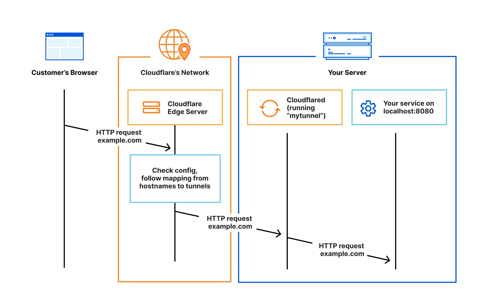

We run our web services locally (e.g., a website in a Docker container), and a Cloudflare Tunnel service locally (run as a Docker container, .exe, etc.). This Cloudflare Tunnel service acts as a secure bridge between the local machine and Cloudflare’s edge network. Any requests to the Cloudflare Edge server are securely forwarded to our local services through this tunnel, without exposing ports or public IPs.

This approach can be benefitial for several reasons:

- **Security**: It eliminates the need to expose your local machine to the internet, reducing the risk of attacks. Also, when using the Cloudflare Edge server as reverse proxy, it provides additional security features such as DDoS protection, Web Application Firewall (WAF), and SSL/TLS encryption.

- **Cost-effective**: It allows you to use your local machine as a server without needing to pay for a cloud server. Cloudfalre Tunnel have free plan which is enough for most small projects.

## Implementation

Cloudfalre Tunnel can be set up either using your domain name or not using a domain name (in this case, Cloudflare Tunnles will give our a random string as the domain name to access on the Internet). In this project, I use the first method, since I already have a domain name for this project: `soictstock.io.vn`.

To set up Cloudflare Tunnel, follow these steps:

1. **Register the domain name on the Cloudflare website.**

Follow the instructions on the Cloudflare website to add your domain name, which will require you to change the DNS records of your domain name to point to Cloudflare's nameservers instead of your original nameservers. This process may take some time to propagate, wait for a few minutes or hours until the domain name is fully registered on Cloudflare.

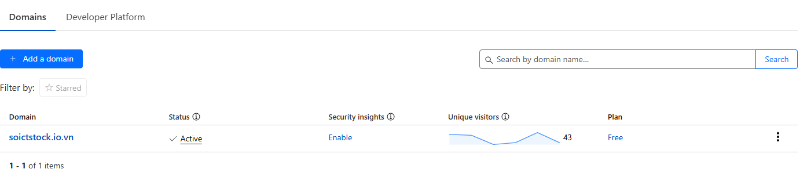

2. **Enable SSL/TLS for your domain name.**

Go to the SSL/TLS section in the Cloudflare dashboard and set the SSL mode for your domain name:

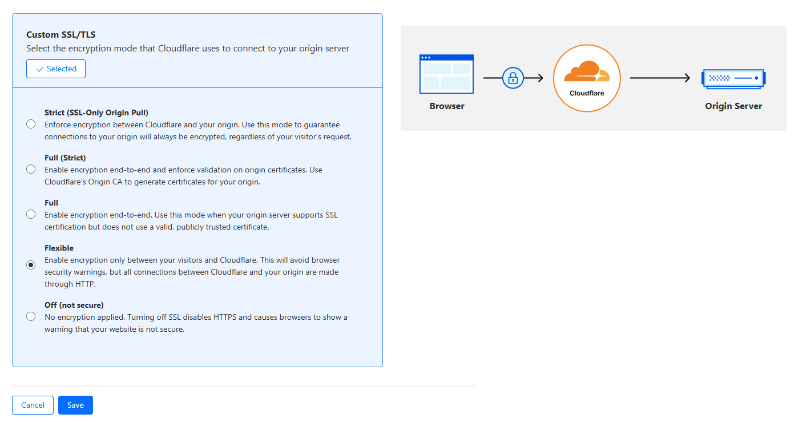

Choose the **Flexible** mode, which means that the connection between the user and Cloudflare will be encrypted, but the connection between Cloudflare and your local server will not be encrypted.The free plan of Cloudflare Tunnel only supports the Flexible SSL mode, so we have to use this mode.

3. **Register Zero Trust**

Search for `Zero Trust` in the Cloudflare dashboard and click on it. Then, follow the instructions to register for Zero Trust, you can choose the pricing plan that suits your needs. For this project, I use the free plan. Then verify your banking card information to the Cloudflare account. 

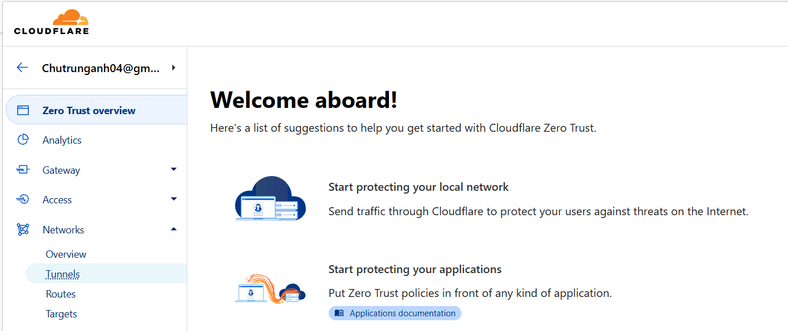

After registering for Zero Trust, you can now see the `Tunnels` section in the Zero Trust dashboard.


4. **Create a new Tunnel**

Click on the `Create a tunnel` button to create a new tunnel. Give it a name

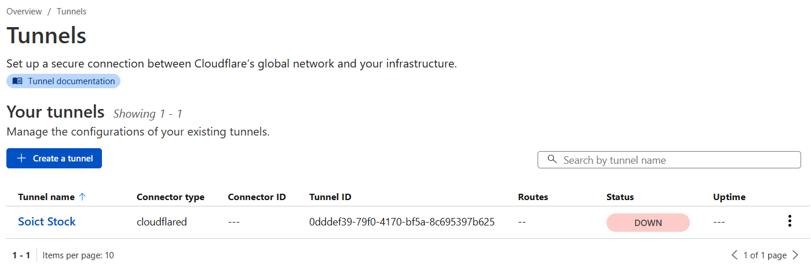

Then Cloudflare offers us various ways to run the tunnel, for simplicity, let's choose using Docker:

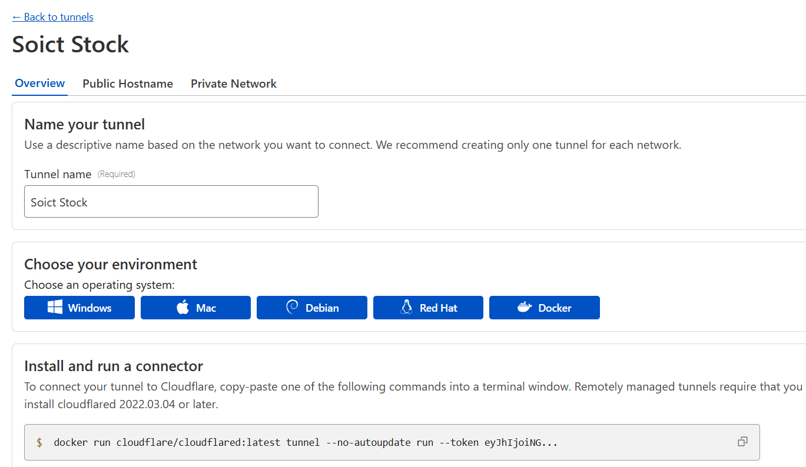

Move to the Public network tab, here is the place you enter your IP address of local machine and the domain name you want to use for this tunnel. In this case, I use the domain name `soictstock.io.vn` that I registered on Cloudflare earlier.

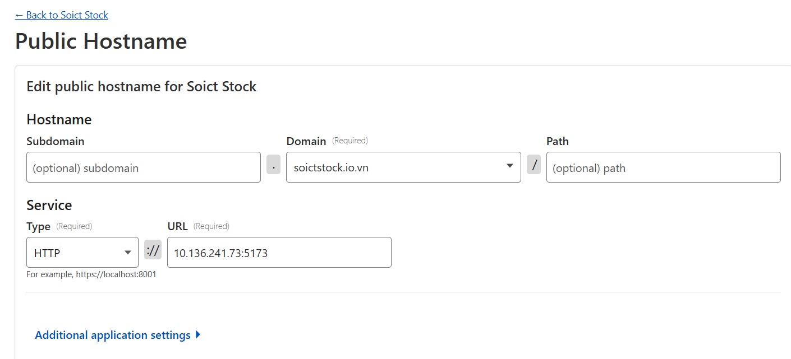

Note that you will need to enter your local machine IP address. Use `ipconfig` command on Windows or `ip a` command on Linux to find your local machine IP address. **DO NOT** enter `localhost` or `127.0.0.1`, this will not work.

After that, you can run the Tunnel using the docker command provided by Cloudflare. Your webstie now can be accessed via the domain name you just entered, e.g., `https://soictstock.io.vn`.

# 7. Cloudflare WAF (Web Application Firewall)


## Theory

When register domain name and use Tunnels of Cloudflare, we are actualy using Clodflare as a reverse proxy for our web application. This come with some additional security features that can be enbaled to protect our web application, one of them is the Web Application Firewall (WAF).

## Implementation

Search for `WAF` in the Cloudflare dashboard and click on it. There are some pre-configured rules that you can enable to protect your web application. 

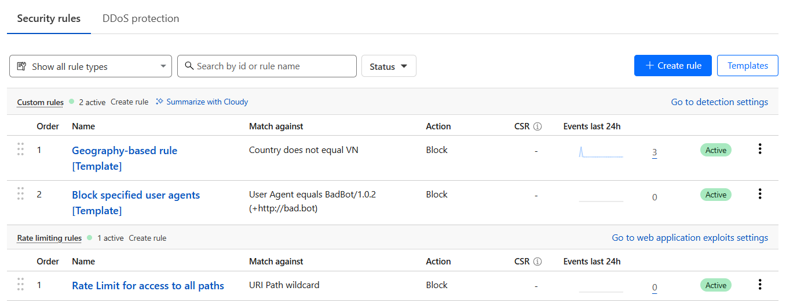

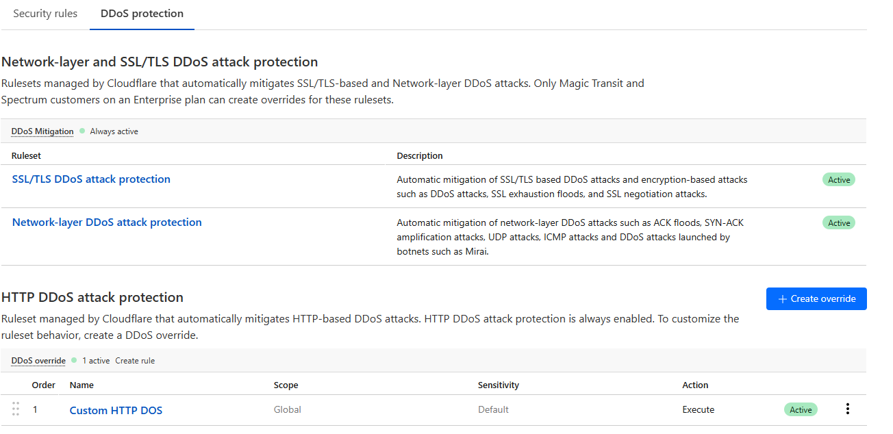


Free plan offers 5 custom rules. Some other option turn on default by Cloudflare and can be futher customized.

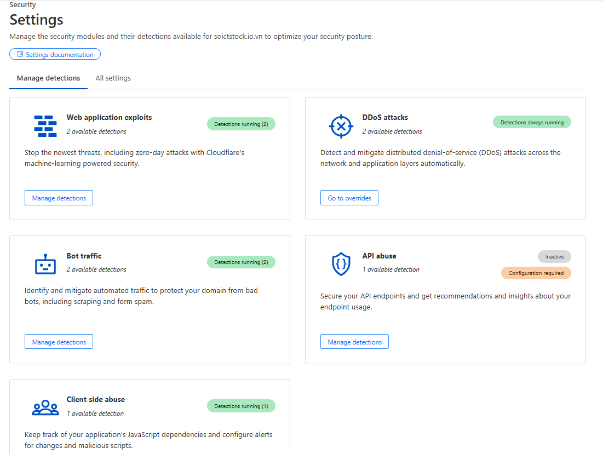


# 8. Cloudflare Turnstile

## Theory

Cloudflare Turnstile is a free CAPTCHA alternative to Google reCAPTCHA. It is designed to be more user-friendly and less intrusive, while still providing effective protection against bots and spam.

Search for `Turnstile` in the Cloudflare dashboard and click on it. 

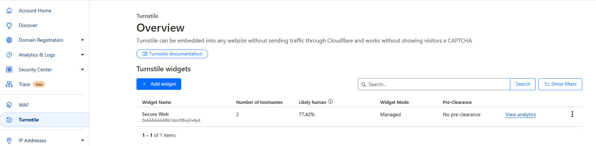

Then create a new Turnstile, add domain name that you want to use Turnstile for. In this case, I add two domain names: `soictstock.io.vn` and `localhost`. One finish, you will receive two keys: a site key and a secret key. The site key is used to render the Turnstile widget on your website (frontend), while the secret key is used to verify the Turnstile response on your server.

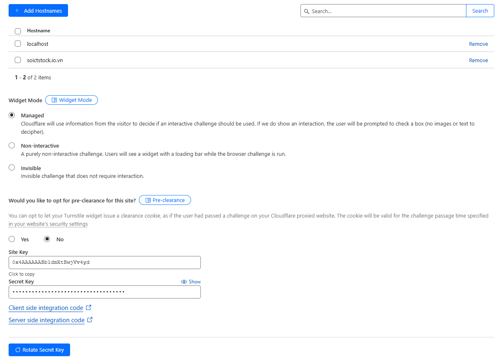

Cloudflare offers many themes for Turnstile, you can choose the one that suits your website design. In this project, I use the `light` theme.

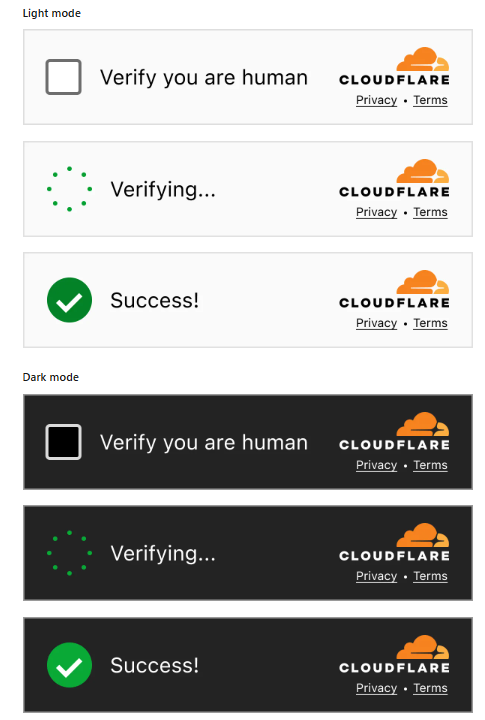

## Implementation

Clouflare also offer sample code two integrate Turnstile into your website. Here is what is applied in our project:

- Frontend side:

```javascript

// Add this at the top, after other imports
const SITE_KEY = import.meta.env.VITE_SITE_KEY;

// Dynamically load Turnstile script and render widget
  useEffect(() => {
    let script;

    function renderTurnstile() {
      if (window.turnstile && turnstileWidgetRef.current && SITE_KEY) {
        // Always clear before rendering
        turnstileWidgetRef.current.innerHTML = '';
        window.turnstile.render(turnstileWidgetRef.current, {
          sitekey: SITE_KEY,
          size: 'flexible',
          theme: 'light',
          callback: (token) => {
            setTurnstileToken(token);
          },
          'error-callback': () => setTurnstileToken(''),
          'expired-callback': () => setTurnstileToken(''),
        });
      }
    }

    if (!document.getElementById('cf-turnstile-script')) {
      script = document.createElement('script');
      script.id = 'cf-turnstile-script';
      script.src = 'https://challenges.cloudflare.com/turnstile/v0/api.js';
      script.async = true;
      script.defer = true;
      script.onload = renderTurnstile;
      document.body.appendChild(script);
    } else {
      renderTurnstile();
    }

    return () => {
      if (turnstileWidgetRef.current) {
        turnstileWidgetRef.current.innerHTML = '';
      }
    };
  }, []);

// when submits te form, check if Turnstile token is present
const handleSubmit = async (e) => {
    e.preventDefault();
    setError('');
    setIsLoading(true);
    
    if (!identifier || !password) {
      setError('Please enter both username/email and password');
      setIsLoading(false);
      return;
    }

    if (import.meta.env.MODE === 'production' && !turnstileToken) {
      setError('Please complete the CAPTCHA verification first');
      setIsLoading(false);
      return;
    }
```

- Backend side:

```javascript

const TURNSTILE_SECRET_KEY = process.env.TURNSTILE_SECRET_KEY;
const VERIFY_URL = 'https://challenges.cloudflare.com/turnstile/v0/siteverify';

/**
 * Verifies a Cloudflare Turnstile token using the siteverify API.
 * @param {string} token - The token from the client (cf-turnstile-response).
 * @param {string} remoteip - (Optional) The user's IP address.
 * @returns {Promise<object>} The verification result from Cloudflare.
 */
export async function verifyTurnstileToken(token, remoteip) {
  if (!TURNSTILE_SECRET_KEY) {
    throw new Error('TURNSTILE_SECRET_KEY is not set in environment variables');
  }
  if (!token) {
    throw new Error('No Turnstile token provided');
  }
  try {
    const payload = {
      secret: TURNSTILE_SECRET_KEY,
      response: token,
    };
    if (remoteip) payload.remoteip = remoteip;
    const response = await axios.post(VERIFY_URL, payload, {
      headers: { 'Content-Type': 'application/json' },
    });
    return response.data;
  } catch (error) {
    return {
      success: false,
      error: error.message,
      details: error.response?.data || null,
    };
  }
} 
``` 

# 9. Banking Payment API

## Theory

In our application, when a user creates an account, they are given a default portfolio balance of $100,000 in virtual money (used only within the platform). In addition, users can top up their portfolio balance with real money—similar to how players recharge in games to buy items. Currently, we support bank transfers via QR code, as shown in the image below.


To enable this feature, we use a third-party service called [Sepay](https://sepay.vn/). For this project, we are using their free plan for testing purposes:


Briefly, how Sepay works:


In simple term, Sepay act as the middleman between the user and the bank. User transfer money to a virtual account (VA) provided by Sepay, these money will be transfer to the real user bank account. Bank account notify the Sepay system that the money has been transfered. Sepay now that te money have been transfered, then how our app know that. There is two ways to do this:

- Using sepay webhook: This is when Sepay automatically sends a notification to our website when a transaction occurs. Each time a payment is made, Sepay triggers a webhook, allowing our system to instantly detect that the customer has paid and update the order status accordingly.

- Using Sepay API: This is when our website actively sends a request to Sepay to check the status of a transaction. Sepay then responds with the transaction details. APIs allow us to manually or periodically verify transaction status.

In this proejct, we choose to use the second method, which is to use Sepay API snce it is much more easier to config and implement.

*Why we not use the bank API directly?*

-> This will require working directly with the bank, which is a complex and time-consuming process, require you prove your organization is a real business to access the bank API.

## Implementation

First, create an account on the Sepay website. Then, go to the Bank Accounts section to connect your own bank account.


Select the **Bank API**, not SMS banking.


After successfully connecting your bank account, click on it and create a virtual account. When users make a transfer, this virtual name will be displayed instead of your real account name. However, the money will still be deposited into your main bank account. 


After creating the virtual account (VA), click on it to view the information needed to integrate it into your website.


From now on, all transactions will be made through this virtual account. You can see all the transactions made to this account in the **Transaction** section.


Next, we need  to create an API token so that our web can send requests to Sepay. Go to the **API** section and click on **Create API Token**.


Create a new API


After creating the virtual account, you will receive a token. This token must be included in every payment request your website sends to Sepay.
You can read more about how to create and use the API token [here](https://docs.sepay.vn/tao-api-token.html)


> [!CAUTION]
> Note: Currently, Sepay does not support authorization scopes for API keys. This means that any API key you generate will have full access to your account.

The structure of the APIs is documented here: https://docs.sepay.vn/api-giao-dich.html. In this project, we only use the following API to filter transactions by reference number/transaction ID (to check the transaction and extract the amount sent by the user):

```http
GET https://my.sepay.vn/userapi/transactions/list?reference_number={reference_number}
```

After finish setting on the Sepay website, we need to implement the payment feature in our web application. 

At the frontend, insert the QR image that we got from the Sepay website

```javascript
<div className="qr-container">
    
```

Along with this, there is an input field where users can enter the reference number of the transaction and a button to confirm the transaction.


```javascript
 <input
    type="text"
    placeholder="Enter transaction reference number from banking app"
    value={transactionId}
    onChange={(e) => setTransactionId(e.target.value)}
    className="transaction-input"
/>
{error && <p className="error-message">{error}</p>}
<button 
    className="verify-button"
    onClick={handleVerifyPayment}
    disabled={verifying}
>
```

The Reference Number (Transaction ID/ Mã giao dịch) displayed on the screen when the user completes a transfer on their banking app. For example:

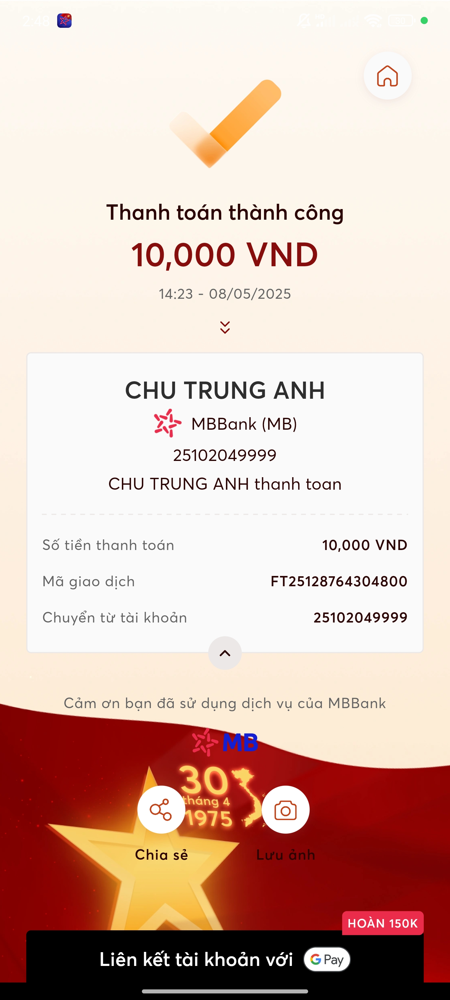

User will need to enter this number in the input field and click the button to verify the payment.


At this point, the frontend will make a request ->  backend -> send a request to Sepay to retrieve the transaction information with this reference number. The backend will then check if the transaction is valid and update the user's portfolio balance accordingly.

Step by step:

When the user clicks the button, the `verifyPayment` function is called

```javascript
const result = await verifyPayment(transactionId);
```

This function is defined in the `payment.js` file in the `api` folder (A folder in frontend that contains all the API calls to the backend).

```javascript
// Function to verify payment and update balance
export const verifyPayment = async (transactionId) => {
    try {
        const response = await apiClient.post('payments/verify', { referenceNumber: transactionId });
        return response.data;
    } catch (error) {
        throw error.response?.data || error.message;
    }
};

```
Let continue to see what this URL does in the backend by examine the controller of this URL in the `paymentController.js` file.

```javascript
// Verify payment and update user's balance
export const verifyPaymentController = async (req, res, next) => {
    const { referenceNumber } = req.body;
    const portfolioId = req.user.portfolio_id;


    ....

        const result = await verifyPayment(referenceNumber, actualPortfolioId);
        res.json({
            success: true,
            message: 'Payment verified and balance updated successfully',
            data: result
        });
    } catch (error) {
        log.error('Payment verification error:', error);
        next(error);
    }
};

```

It will then call service, `verifyPayment`, in the `paymentService.js` file. This is where the actual backend logic for processing the payment takes place:


```javascript
const SEPAY_API_TOKEN = process.env.SEPAY_API_TOKEN;
const SEPAY_API_URL = process.env.SEPAY_BASE_API_URL;

export const verifyPayment = async (referenceNumber, portfolioId) => {
    const client = await pool.connect();
    try {
        await client.query('BEGIN');

      
        // Check if reference number was already used
        const existingTransaction = await client.query(
            'SELECT * FROM payment_transactions WHERE reference_number = $1',
            [referenceNumber]
        );

        if (existingTransaction.rows.length > 0) {
            throw new Error('This payment has already been processed');
        }

        // Get current portfolio balance
        const currentBalance = await client.query(
            'SELECT cash_balance FROM portfolios WHERE portfolio_id = $1',
            [portfolioId]
        );


        // Verify with Sepay API
        const sepayResponse = await axios.get(`${SEPAY_API_URL}/transactions/list`, {
            params: { reference_number: referenceNumber },
            headers: {
                'Authorization': `Bearer ${SEPAY_API_TOKEN}`,
                'Content-Type': 'application/json'
            }
        });

        log.info('Sepay API response:', sepayResponse.data);

        if (!sepayResponse.data.transactions?.length) {
            throw new Error('No transaction found with this reference number');
        }

        // Find incoming transaction (looking for amount_in > 0)
        const incomingTransaction = sepayResponse.data.transactions.find(
            t => parseFloat(t.amount_in) > 0
        );

        if (!incomingTransaction) {
            throw new Error('No incoming payment found with this reference number');
        }

        const vndAmount = parseFloat(incomingTransaction.amount_in);
        const virtualAmount = vndAmount; // 1:1 conversion (1000 VND = 1000 USD)

        log.info('Payment amounts:', { vndAmount, virtualAmount });

        // Update portfolio balance
        const updateResult = await client.query(
            'UPDATE portfolios SET cash_balance = cash_balance + $1 WHERE portfolio_id = $2 RETURNING cash_balance',
            [virtualAmount, portfolioId]
        );

        log.info('Portfolio balance update result:', {
            portfolioId,
            newBalance: updateResult.rows[0]?.cash_balance
        });

        // Record transaction
        const transactionResult = await client.query(
            'INSERT INTO payment_transactions (portfolio_id, reference_number, vnd_amount, virtual_amount) VALUES ($1, $2, $3, $4) RETURNING *',
            [portfolioId, referenceNumber, vndAmount, virtualAmount]
        );

        log.info('Payment transaction recorded:', transactionResult.rows[0]);

        await client.query('COMMIT');

        return {...};
    } catch (error) {
        await client.query('ROLLBACK');
        log.error('Payment verification error:', error);
        throw error;
    } finally {
        client.release();
    }
};
```

Let I break down the code:

First, we need to check if the transaction reference number has already been used. If it has, we will not allow it to be used again.

*Each time a transaction is processed, we save it in the payment_transactions table in the database:*

```javascript
await pool.query(`
    CREATE TABLE IF NOT EXISTS payment_transactions (
        id SERIAL PRIMARY KEY,
        portfolio_id INTEGER NOT NULL REFERENCES portfolios(portfolio_id),
        reference_number VARCHAR(255) NOT NULL UNIQUE,
        vnd_amount DECIMAL(15,2) NOT NULL,
        virtual_amount DECIMAL(15,2) NOT NULL,
        status VARCHAR(50) NOT NULL DEFAULT 'completed',
        created_at TIMESTAMP WITH TIME ZONE DEFAULT CURRENT_TIMESTAMP,
        updated_at TIMESTAMP WITH TIME ZONE DEFAULT CURRENT_TIMESTAMP
    );
`);
```

*However, since we are currently testing, we delete this table each time the backend is restarted. This allows the transaction reference number to be reused for testing purposes without needing to perform the actual bank transfer to Sepay again.*

```javascript
       // Development mode - drop table if exists
        if (process.env.NODE_ENV === 'development') {
            await pool.query('DROP TABLE IF EXISTS payment_transactions CASCADE');
        }
```

**Note**: Regarding security, to ensure that the transaction reference number cannot be reused and to prevent double-spending of funds, I came up with two methods:

- Check if the transaction reference number has already been used (by querying the transaction reference number stored in the database). If it has, we do not allow it to be used again, as we did earlier. However, for this method, we would need to store all used transaction reference numbers in the database. This could make querying slower when there are a large number of transactions.

- A more practical approach is to limit the validity of the transaction reference number to a specific time frame, such as 5 minutes. The table schema already includes a timestamp field, so we can simply compare it with the current time without needing to store all used transaction reference numbers in the database.

However, as mentioned, since this is just for a demo project, we are using the first method. This way, we can simply delete the table to reuse the transaction reference number for testing purposes without needing to perform the actual bank transfer to Sepay. (Sepay only free for 50 transactions per month at the time of writing this, so we need to be careful not to exceed this limit).


After confirming that the transaction reference number has not been used, we will call Sepay’s API to retrieve this transaction by calling the following URL:

```javascript
const sepayResponse = await axios.get(`${SEPAY_API_URL}/transactions/list`, {
    params: { reference_number: referenceNumber },
    headers: {
        'Authorization': `Bearer ${SEPAY_API_TOKEN}`,
        'Content-Type': 'application/json'
    }
});
```

Or you can test in REST client like Postman first:

```http
GET https://my.sepay.vn/userapi/transactions/list?reference_number=FT25128764304800
Authorization: Bearer N3RT..........
```

The request needs to be attached with the API token that we created on the Sepay website. This request will retrieve the transaction associated with the given reference number. For example, it will return the following data:

```json
{
  "status": 200,
  "error": null,
  "messages": {
    "success": true
  },
  "transactions": [
    {
      "id": "12462228",
      "bank_brand_name": "MBBank",
      "account_number": "25102049999",
      "transaction_date": "2025-05-08 14:23:00",
      "amount_out": "10000.00",
      "amount_in": "0.00",
      "accumulated": "0.00",
      "transaction_content": "...  CHU TRUNGANH thanh toan",
      "reference_number": "FT25128764304800",
      "code": null,
      "sub_account": null,
      "bank_account_id": "...."
    },
    {
      "id": "12462218",
      "bank_brand_name": "MBBank",
      "account_number": "25102049999",
      "transaction_date": "2025-05-08 14:23:04",
      "amount_out": "0.00",
      "amount_in": "10000.00",
      "accumulated": "0.00",
      "transaction_content": "....  CHU TRUNG ANH thanh toan",
      "reference_number": "FT25128764304800",
      "code": null,
      "sub_account": "VQRQACJBQ9436",
      "bank_account_id": "...."
    }
  ]
}
```

With a transaction reference number, we will retrieve two transactions: one is minus user account and other is plus into our bank account (Sepay virtual account). We will filter and only keep the transaction where money was transferred into Sepay (i.e., `amount_in > 0`). After that, we will extract the amount from this transaction, convert it into virtual money (in this case, a 1:1 ratio, meaning 1,000 VND deposited will result in 1,000 USD in the virtual account), and then update the user's `portfolio` balance in the portfolios table.

We will also store this transfer transaction in the `payment_transactions` table in the database to mark that this transaction reference number has been used and cannot be used again.


# 10. Identyfy devices with fingerprintjs

## Theory

FingerprintJS is a library that allows you to identify devices based on their unique characteristics, such as browser type, operating system, and more. It generates a unique fingerprint for each device, which can be used to track users across sessions and prevent fraud. For more detail, visit its Github repository at: https://github.com/fingerprintjs/fingerprintjs.git

Please note that FingerprintJS is a open-source library, but its authors also offer a commercial version with more features and better accuracy which is called Fingerprints Identification, see at: https://fingerprint.com/products/identification/. Some main differences between the two versions are:

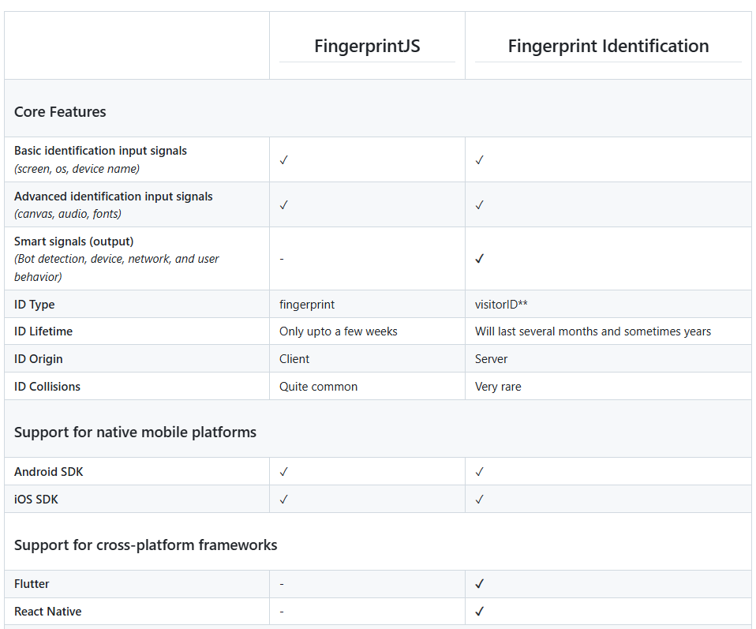
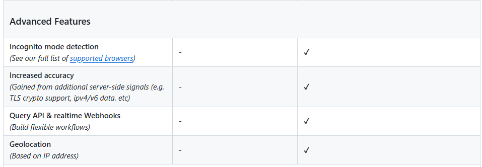

With fingerprintJS, we just need to install the library and use it to generate a fingerprint for each device, while the commercial version fingerprint identification provides API to call to their server to analyze the fingerprint and return the device information. 

You can access these link of the authors to see the fingerprint of your own device returned by the library:

- For the open-source version(FingerprintJS): https://fingerprintjs.github.io/fingerprintjs/

- For the commercial version (Fingerprint Identification): https://demo.fingerprint.com/playground

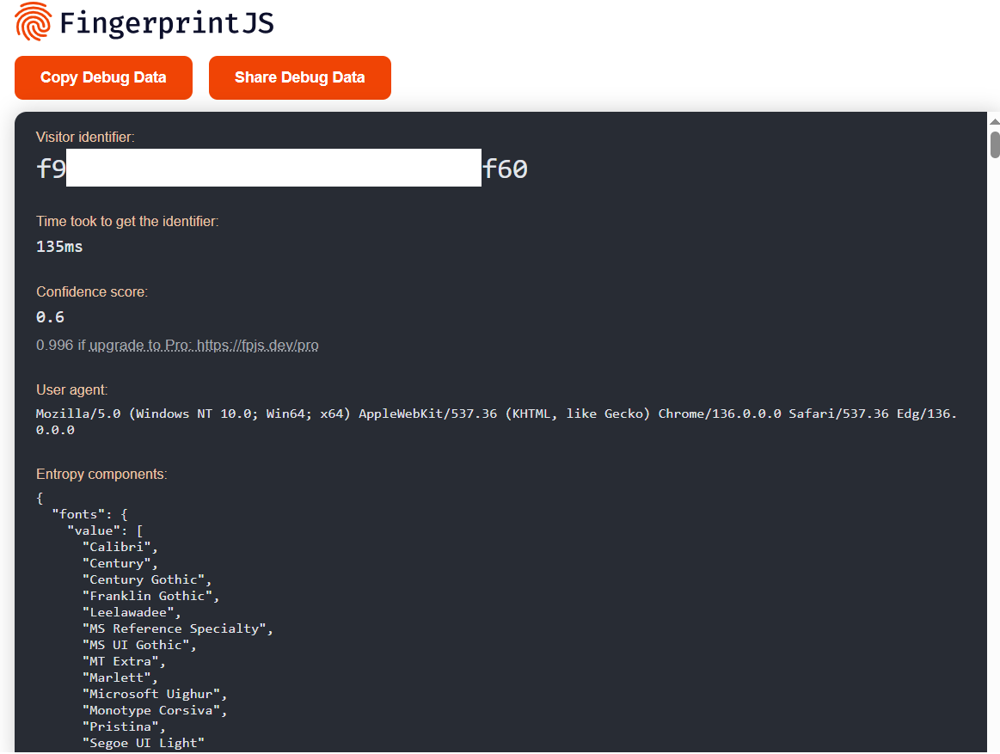

## Implementation

In this project, we use the open-source version of FingerprintJS. In the `LoginForm.jsx` file in frontend:

```javascript
import FingerprintJS from '@fingerprintjs/fingerprintjs';

// Function to get fingerprint with confidence check
  const getFingerprint = async () => {
    if (!fpPromise) return null;
    
    try {
      // Functions provided by FingerprintJS to get the fingerprint
      const fp = await fpPromise;
      const result = await fp.get();
      
      // Store both the visitorId and confidence score
      setVisitorId(result.visitorId);
      setFingerprintConfidence(result.confidence);

      // Log components in development mode
      if (import.meta.env.MODE === 'development') {
        console.log('Fingerprint components:', FingerprintJS.componentsToDebugString(result.components));
      }

      return {
        visitorId: result.visitorId,
        confidence: result.confidence
      };
    } catch (error) {
      console.error('Error getting fingerprint:', error);
      return null;
    }
  };
```


This will return the `visitorId` and `confidence` score of the fingerprint to the backend (when user click on `Remember Me` checkbox). In the backend, we will store this information in the [`remembered_devices`](../../app/backend/src/services/security/rememberedDeviceService.js) table in the database: (see detail in the `rememberDeviceServices.js`)

```javascript
export const rememberDeviceService = async (userId, visitorId, confidenceScore = 0) => {
  try {
    // Only store devices with sufficient confidence
    if (confidenceScore < MIN_CONFIDENCE_SCORE) {
      console.log(`Skipping device remember due to low confidence score: ${confidenceScore}`);
      return { success: false, message: 'Device fingerprint has very low confidence score' };
    }

    const expiresAt = new Date();
    expiresAt.setMinutes(expiresAt.getMinutes() + REMEMBER_DEVICE_MINUTES);

    await pool.query(
      `INSERT INTO remembered_devices (user_id, visitor_id, confidence_score, expires_at)
       VALUES ($1, $2, $3, $4)
       ON CONFLICT (user_id, visitor_id) 
       DO UPDATE SET expires_at = EXCLUDED.expires_at,
                    confidence_score = EXCLUDED.confidence_score`,
      [userId, visitorId, confidenceScore, expiresAt]
    );

    // Provide a warning if confidence is low but above minimum threshold
    if (confidenceScore < 0.3) {
      return { 
        success: true, 
        warning: true,
        message: 'Device remembered with low confidence score. You may need to verify again in the future.'
      };
    }
```

Example when a user click `Remember Me` checkbox ten submit the login form, check the database:

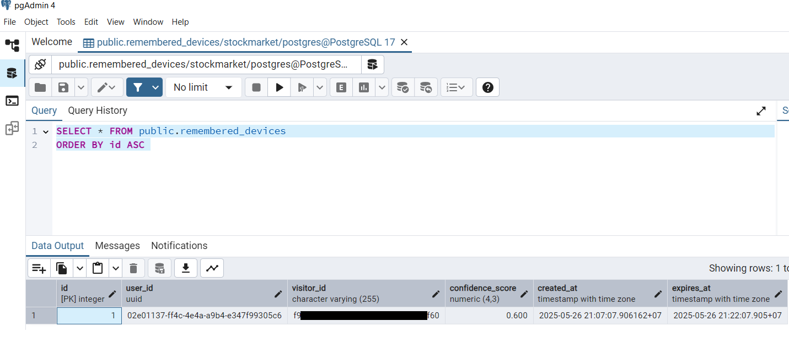

Only when the confidence score is above a certain threshold (in this case, 0.3), we will store the fingerprint in the database. This is to ensure that we only store fingerprints that are likely to be unique and accurate. DO NOT raise this threshold too high, since the fingerprintJS free version as said by authors only accourate 40%-60% of the time.

Now we have stored te device fingerprint in the database, we can use it to identify if need to perfrom 2FA or not when login by just make a query to the `remembered_devices` table:

```javascript
const result = await pool.query(
    `SELECT id, confidence_score FROM remembered_devices 
    WHERE user_id = $1 
    AND visitor_id = $2 
    AND expires_at > CURRENT_TIMESTAMP`,
    [userId, visitorId]
);
```
If the query returns a row, it means that the device has been remembered and we can skip the 2FA step. If not, we will need to perform 2FA to verify the user's identity.


# 11. NodeMailer

## Theory

NodeMailer is a module for Node.js applications to allow easy email sending. It supports various transport methods, including SMTP, which is the most common method for sending emails. NodeMailer can be used to send emails from your application, such as sending verification emails, password reset emails, or any other type of notification. To send real emails, you will need to register Oauth2 with Google Cloud Developer Console, see guide here: https://trungquandev.com/nodejs-viet-api-gui-email-voi-oauth2-va-nodemailer/. But for simplicity, in this project, we use **`Ethereal`** email service, which is a simulated email service that allows you to send emails without actually sending them to real email addresses. Ethereal is useful for testing purposes, as it provides a fake SMTP server that captures the emails sent by your application and allows you to view them in a web interface.


## Implementation

See in the `otpService.js` file in the `services/security` folder, we use NodeMailer to send OTP to the user's email address. The code is as follows:

```javascript
/**
 * Generate and send OTP to the user's email.
 * @param {string} email - The user's email address.
 */

export const sendOtpService = async (email) => {
  try {
    if (!email) {
      throw new Error('Email is required');
    }

    const normalizedEmail = email.trim().toLowerCase();
    // Generate 8-character alphanumeric OTP using crypto
    const otp = otpGenerator.generate(8, {
      upperCaseAlphabets: true,
      lowerCaseAlphabets: true,
      digits: true,
      specialChars: false
    });
    const otpExpiration = Date.now() + 1 * 60 * 1000; // 1 minute from now

    // Save OTP to the database (in-memory)
    await OTP.save(normalizedEmail, otp, otpExpiration);

    console.log('Generated OTP:', { email: normalizedEmail, otp, otpExpiration });

    const transporter = await getEtherealTransporter();

    const mailOptions = {
      from: '"Soict Stock" <no-reply@soictstock.com>',
      to: email,
      subject: 'Soict Stock - Two-Factor Authentication (OTP) Verification',
      text: `Dear user,\n\nYour One-Time Password (OTP) for secure login to Soict Stock is: ${otp}\n\nThis OTP is valid for 1 minute.\n\nIf you did not request this, please ignore this email.\n\nThank you,\nSoict Stock Security Team`,
      html: `
        <div style="font-family: Arial, sans-serif; background: #f9f9f9; padding: 24px; border-radius: 8px; max-width: 480px; margin: auto; color: #222;">
          <div style="text-align: center; margin-bottom: 24px;">
            <h2 style="color: #f0b90b; margin: 0;">Soict Stock</h2>
          </div>
          <h3 style="color: #222;">Two-Factor Authentication (OTP) Verification</h3>
          <p>Dear user,</p>
          <p>To complete your secure login to <b>Soict Stock</b>, please use the following One-Time Password (OTP):</p>
          <div style="font-size: 2rem; font-weight: bold; letter-spacing: 2px; color: #f0b90b; background: #222; padding: 12px 0; border-radius: 6px; text-align: center; margin: 16px 0;">${otp}</div>
          <p style="margin: 0 0 8px 0;">This OTP is valid for <b>1 minute</b>.</p>
          <p style="color: #888; font-size: 13px; margin: 0 0 16px 0;">If you did not request this OTP, please ignore this email or contact our support team immediately.</p>
          <hr style="border: none; border-top: 1px solid #eee; margin: 24px 0;" />
          <div style="font-size: 13px; color: #888; text-align: center;">
            Thank you for choosing Soict Stock.<br />
            <span style="color: #f0b90b;">Soict Stock Security Team</span>
          </div>
        </div>
      `
    };

    const info = await transporter.sendMail(mailOptions);

    console.log('Preview URL:', nodemailer.getTestMessageUrl(info));

    return { message: 'OTP sent successfully', previewUrl: nodemailer.getTestMessageUrl(info) };
  } catch (error) {
    console.error('Error in sendOtpService:', error.message);
    throw new Error('Failed to send OTP. Please try again.');
  }
};
```

Ethereal will generate a link to preview the email, click on the link will show something like this:

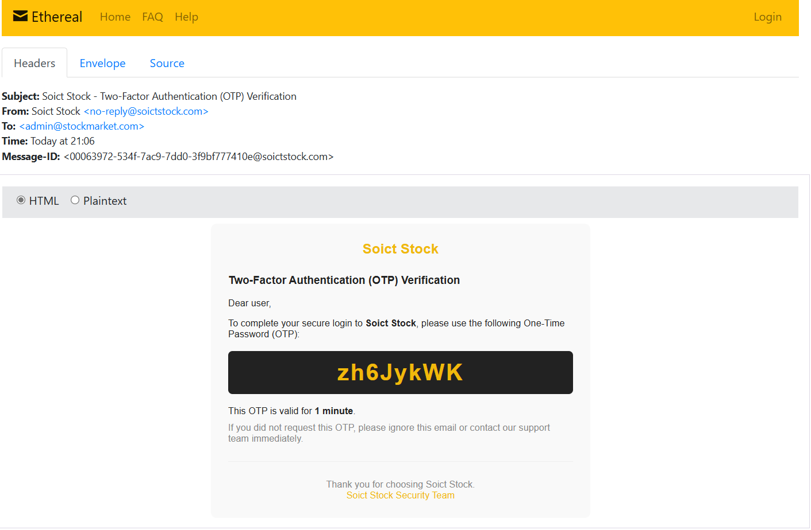


