**This file contains the tech stack used in the project, including the theory and examples implemented in the code.**

# Features

ADD THIS TO README LATER

Some features of the website require third-party services such as Google SSO, QR code bank payments via Sepay, and remote access through Cloudflare Tunnel. These services may become unavailable after the project is made public, as we plan to delete the associated accounts or projects for security and resource reasons. However, we provide detailed instructions so you can reconfigure these services using your own keys or tokens.

# 1. bcrypt

## Theory

To store the password securely, we use bcrypt to hash the password before storing it in the database. How does bcrypt work?

1. It auto generates a random salt, concatenates it with the password, and then hashes the result. This will prevent attackers from using precomputed hash tables (rainbow tables) to crack the password. 

2. bycrpyt use slow hashing algorithm, which makes it computationally expensive to brute-force the password. The cost factor (SALT_ROUNDS) determines how many iterations of the hashing algorithm are performed. A higher cost factor means more iterations, making it harder to crack the password. In the code, we use 10 rounds which tells bcrypt to perform 2^10 iterations of the hashing algorithm. The larger the number of rounds, the more secure the hash is, but it also requires more hardware resources to compute. As OWASP recommends, a cost factor should be at least 10. 

So in theory, when user register, the process would be: **hash(password_user_input + salt)**, we store this result in the database. When the user tries to log in, take in the password they entered, hash it again with the **SAME** salt, and compare the result to the stored hash. This means we need to store both the hashed password and the salt in the database corresponding to user account. However, in practicular, we do not need to create another field in the database or write any code to store the salt, brypt **automaticaly** handles that under the hood. For more detail, bycrypt auto includes the salt in the output string itself, so when you hash a password, the output will include both the salt and the hash. The output string is something like this:

```plaintext
$2a$10$abcdefghijklmnopqrstuu3guuo/XeYbYBk7Zenk4Yf9XuYoeZ4JWD
```
With:
- `$2a$`: The bcrypt version identifier.
- `$10$`: The cost factor (SALT_ROUNDS).
- `abcdefghijklmnopqrstuu`: The salt used for hashing (22 characters).
- `3guuo/XeYbYBk7Zenk4Yf9XuYoeZ4JWD`: The actual hashed password.

## Implementation

When user register a new account -> create hash using `bycrypt.hash` function. This function take two parameters: the password to hash and the cost factor (SALT_ROUNDS) -> Store this output hash in the database.


```javascript
// Hash the password before storing it
const hashedPassword = await bcrypt.hash(password, SALT_ROUNDS);
```
When user login -> fetch the user from the database by email -> compare the password user input with the hashed password in the database using `bcrypt.compare` function. This function takes two parameters: the password to compare and the hashed password from the database. It returns true if they match, false otherwise.

However, we need to be careful when implementing the login function. If we check the email first, if not exist then throw error, if exist then calculate the hash of input password and compare again the password stored in database, we can introduce a **timing attack** vulnerability. 

An attacker can determine if an email exists in the database by measuring the time it takes to respond to the login request, like in case the web immediately respone, attacker can know that the email does not exist in the database, and if the web takes a long time to respond (since it  need to slow hash the provided password and compare it with the hashed password in the database), attacker can know that the email exists in the database.

To prevent this, **always** perfrom password hashing, even if the email does not exist in the database. This way, the time it takes to respond to the login request will be the same regardless of whether the email exists or not.
    
```javascript   
export const loginUserService = async (email, password) => {
  try {
    // Fetch the user by email
    const result = await pool.query(
      'SELECT id, username, email, password, role FROM users WHERE email = $1',
      [email]
    );

    let user = result.rows[0];

    // Generate a fake hash
    const fakeHashedPassword = '$2b$10$abcdefghijklmnopqrstuv';  // A dummy bcrypt hash
    
    // Determine the hashed password to use for comparison
    const hashedPassword = user ? user.password : fakeHashedPassword; // Use the actual hashed password if user exists, otherwise use a dummy hash

    // ALWAYS perform input password hash and comparison, even if the email does not exist. The idea is we ALWAYS hash the password user input, incase the email exists, we compare with true hashed password, otherwise we compare with a fake hash to maintain timing attack resistance
    const isPasswordValid = await bcrypt.compare(password, hashedPassword ); 

    // If user does not exist or password is incorrect, return the same error message
    if (!user || !isPasswordValid) {
      throw new Error('Invalid email or password');
    }
```

More info, how does bcrypt.compare work under the hood?

1. It extracts the salt and cost factor from string of the hashed password.

2. It hashes the user input password with the extracted salt and cost factor.

3. It compares the newly hashed password with the stored hashed password. This comparison uses a constant-time algorithm instead of naive === comparison to prevent timing attacks (This timming attack is mention about gesting the password one character at a time aspect, not for the timing attack in bruce force login name we mentione earlier).

*Why using === comparison is not a good idea?*

String comparision is JavaScript with === termiates as soon as it finds a mismatch. This means if two strings are not the same length or have an early mismatch, === stops immediately. An attacker can measure response time and gradually guess the correct password one character at a time.


# 2. JWT

## Theory

See more about JWT: https://youtu.be/fyTxwIa-1U0?si=9TshHtO-Hl3oiS4L, https://youtu.be/LxeYH4D1YAs?si=1lOsrVljX55OVXfH to see how it is different from session-based authentication. 

The JWT secret key is used to sign the token, ensuring that it cannot be tampered with. The secret key should be kept private in the `.env` file and not exposed in the code. The JWT token contains user information (user ID, username, email, role) and is signed with the secret key. The token is then sent back to the client and stored in a cookie. The client sends the token back to the server in subsequent requests to authenticate the user.

## Implementation


!!!! NEED TO ADD TIMESTAMP TO THE JWT TOKEN TO MAKE SURE THE TOKEN IS DIFFERENT EVERY TIME THE USER LOGS IN. !!!

After user login successfully, we generate a JWT token (inside the `userService.js file`).

```javascript
// Define the user object to be included in the token
const userForToken = {
    id: user.id,
    username: user.username,
    email: user.email,
    role: user.role
};

// Create JWT token with user info and secret key from environment variables
const token = jwt.sign(
    userForToken,
    process.env.JWT_SECRET, // Fallback for development
    { expiresIn: process.env.JWT_EXPIRES_IN || '24h' } // Fallback for development
);

// Return user info and token
return {
    user: User.getSafeUser(user),
    token
};
```

The `userServices.js` return the user object and the token back to the `userController.js` file. The `userController.js` file is responsible for sending the token back to the client, this token can be send back to client directly in the response body or in a cookie. In this case, we send the token back to the client in a cookie. The cookie is set with the `httpOnly` flag, which prevents JavaScript from accessing the cookie (XSS protection). The cookie is also set with the `secure` flag, which ensures that the cookie is only sent over HTTPS in production. The `maxAge` option sets the expiration time for the cookie, and the `sameSite` option prevents the cookie from being sent in cross-site requests.

```javascript
const result = await loginUserService(email, password); // Call to service function in userService.js
        
// Put the JWT token in a cookie to return to the client
// The cookie will be sent back to the client in the response headers
res.cookie('jwt', result.token, {
    httpOnly: true, // Prevents JavaScript from reading the cookie (XSS protection)
    secure: process.env.NODE_ENV === 'production', // Cookie can only be sent over HTTPS in production, in development it can be sent over HTTP
    maxAge: 24 * 60 * 60 * 1000, // 24 hours
    sameSite: 'strict' // Prevents the cookie from being sent in cross-site requests
});
```

Now we have cookie containing the JWT token, every time the client makes a request to the server, their browser will automatically send the cookie back to the server. The server can then verify the token and authenticate the user, allow them to access protected routes. This is done in the `authMiddleware.js` file.

```javascript
// Get token from cookie
if (req.cookies && req.cookies.jwt) {
token = req.cookies.jwt;
} 
// Or from Authorization header (for API clients that don't use cookies)
else if (req.headers.authorization && req.headers.authorization.startsWith('Bearer')) {
token = req.headers.authorization.split(' ')[1];
}

if (!token) {
return res.status(401).json({
    status: 401,
    message: 'Not authorized, no token provided',
    data: null
});
}

try {
// Verify token
const decoded = jwt.verify(token, process.env.JWT_SECRET || 'your-secret-key-here');

// Attach user info to request object
req.user = {
    id: decoded.id,
    username: decoded.username,
    email: decoded.email,
    role: decoded.role
};
```  

# 3. cors

## Theory

Cros stand for Cross-Origin Resource Sharing, it is a security feature implemented by web browsers to prevent malicious websites from making requests to a different domain than the one that served the original web page. CORS allows servers to specify which origins are allowed to access their resources. This is done by including specific HTTP headers in the server's response. See more about cros in this link: https://youtu.be/FggsjTsJ7Hk?si=Cwp0EzYCwREDtG7R , https://youtu.be/E6jgEtj-UjI?si=lmJzdVFbUFbnRXsZ, https://200lab.io/blog/cors-la-gi

## Implementation

In our case, just in case the frontend and backend are running on ports, we need to configure CORS in our Express server to allow requests from the frontend domain. Without this config, the frontend/ client browser can not send the cookie to the backend server. This is done using the `cors` setting in the `index.js` file.


```javascript
// Idealy, defined the origin in the .env file and use it here.
app.use(cors({
  origin: process.env.FE_URL, // Allow frontend origin
  credentials: true, // Important for cookies to work with CORS
  methods: ['GET', 'POST', 'PUT', 'DELETE', 'OPTIONS'],
  allowedHeaders: ['Content-Type', 'Authorization'],
  exposedHeaders: ['Content-Type']
}));

app.use(cookieParser()); // Add cookie-parser middleware
```


# 4. SSO

## Theory

Single Sign-On (SSO) is a mechanism that allows a user to authenticate once and gain access to multiple applications or systems without needing to log in again. Imagine you log into one app, and then you can seamlessly use other apps without re-entering your credentials—that’s SSO in action. 

An example like when you access a website for the firsttime, beside the option to create a new account using username and password, you also have the option to login using your Google or Facebook account. This is SSO, where you can use your Google or Facebook account to access multiple applications without needing to create a new account for each one. 

Another example can be the HUST email system, where you can use your HUST email account to access multiple website in the HUST system without needing to create a new account for each one fro example: qldt, ictsv, ehust,... Everytime you access to these websites, you will be redirect to this login page:


**How SSO Works Behind the Scenes**

SSO relies on a centralized **Identity Provider (IdP)**, which is a trusted service responsible for authenticating users. Your applications, known as **Service Providers (SPs)**, delegate authentication to this IdP. Here’s the general flow:

1. User Attempts to Access Your App: The user tries to visit a protected route in your NodeJS app.

2. Redirect to IdP: If the user isn’t authenticated, your app redirects them to the IdP’s login page.

3. User Logs In: The user enters their credentials (e.g., username and password) at the IdP. If they’ve already logged in recently (via another app using the same IdP), this step is skipped because the IdP recognizes their active session.

4. IdP Issues Tokens: After successful authentication, the IdP generates tokens (e.g., an ID token and an access token) and sends them back to your app.

5. App Verifies and Grants Access: Your app verifies the tokens and allows the user to access the protected resources.

6. SSO Across Apps: If the user then accesses another app that uses the same IdP, the process repeats, but since the IdP already has an active session, it immediately returns tokens without prompting for login again.

Some Key Components:

- **Identity Provider (IdP)**: Manages user identities and authentication. Example like Auth0, Okta, Keycloak, which allow you to set up organization accounts and manage users or Google, facebook, Github, etc. which force you to use your Google, Facebook, Github account to login to other applications.

- **Tokens**: Typically, SSO uses protocols like SAML (XML-based assertions) or OpenID Connect (OIDC) (JWT-based tokens) to communicate authentication details. In our project, we choose OIDC.

- Session: The IdP often sets a cookie in the user’s browser tied to its domain. This cookie indicates an active session, enabling SSO across apps.


Here’s a simplified diagram of the SSO process using OIDC:

```plaintext
User          Your Node.js App (SP)                      Identity Provider (IdP)
 |                    |                                             |
 | 1. Access app      |                                             |
 |------------------->|                                             |
 |                    | 2. Not authenticated yet?                   |
 |                    |    Redirect to IdP                          |
 |                    |-------------------------------------------->|
 |                                                                  |
 | 3. Google login page show up                                     |
 |<-----------------------------------------------------------------|
 |                                                                  |
 | 4. User logs in with Google account                              |
 |----------------------------------------------------------------->|
 |                                                                  |
 |                    | 5. Redirect user back to the app + tokens   |
 |                    |<--------------------------------------------|
 |                    |                                             |        
 |                    | 6. Verify tokens, grant access user         |
 |                    |     to protected route                      |
 |                    |                                             |
 ```

## Implementation

1. Go to [Console Google Cloud](https://console.cloud.google.com/), click on `Select a project` and then `create a new project`. If you already have a project, select it from the list.

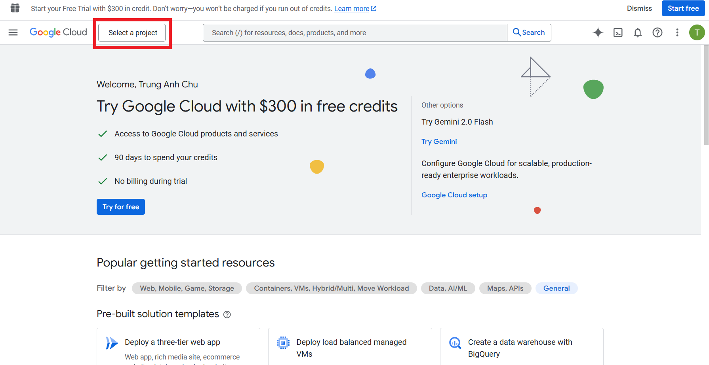

2. Name your project and click `Create`

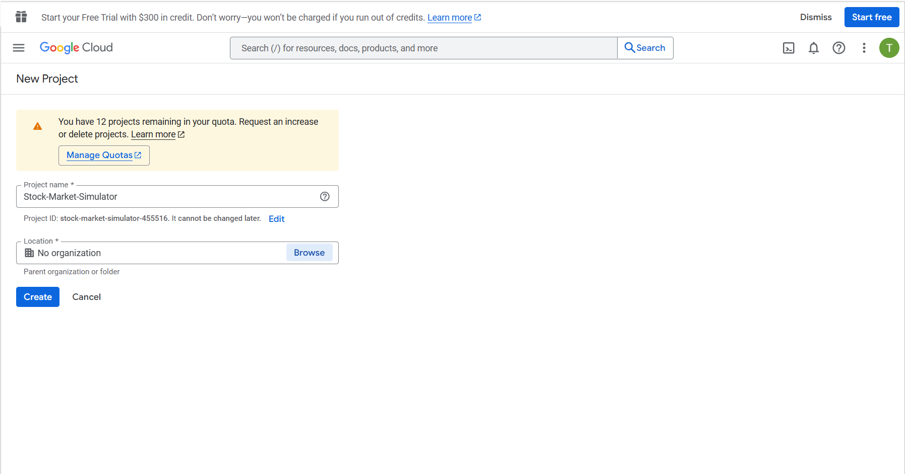

3. Setup the credentials for your project. Click on `APIs & Services` -> `Credentials` -> `Create Credentials` -> `OAuth client ID`

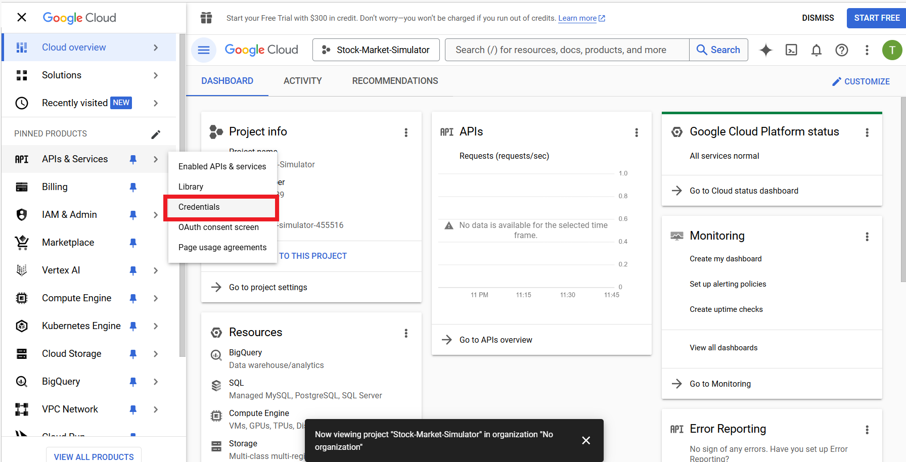


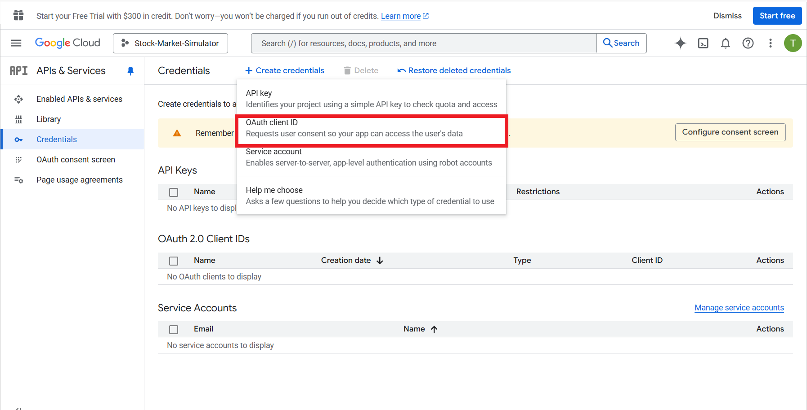

You may be ask to create a consent screen first, click on `Configure consent screen` 

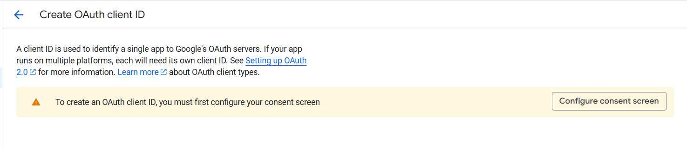

Set up the consent screen by Google instructions. Here is explaination about some impoetanr settings:

- User Type: Choose between "External" and "Internal". In my case I choose External 
  - External: For a webapp available to all Google account users (public-facing).
  - Internal: For a webapp restricted to users within your Google Workspace organization.

- User Support Email: Provide an email for user inquiries.
- Developer Contact Information: Add your email address.
- Under Scopes, add the following for basic sign-in:
  - openid (required for OAuth authentication)
  - profile (to access the user’s basic profile info)
  - email (to get the user’s email address)

Click `Save` and Continue through the remaining steps (e.g., "Scopes," "Test Users") and save the consent screen. This screen defines what users see when granting permissions to your app.

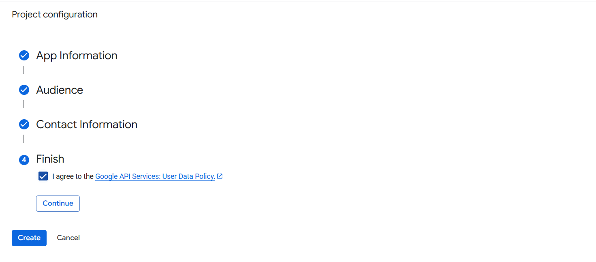

4. Config the OAth client ID

Choose the application type as `Web application` and give it a name (e.g., "Web App Client").

Under `Authorized Redirect URIs`, add the URL where Google will send users after authentication (e.g., https://yourapp.com/auth/google/callback). For development, you can use `http://localhost:port/auth/google/callback` with `:port` being the port our backend server is running on.

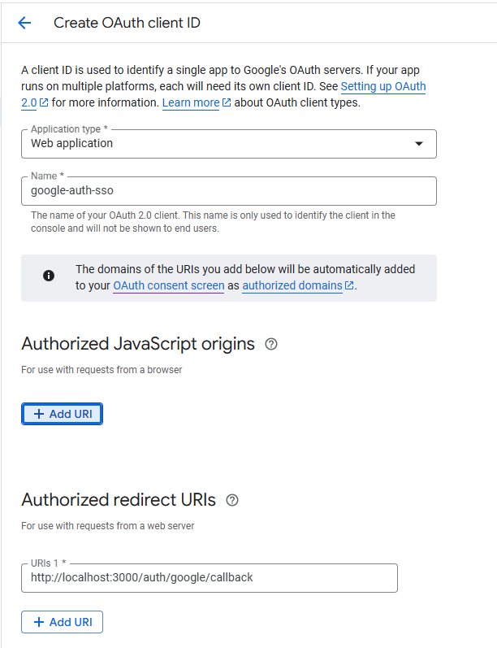

After creating the OAuth client ID, you will see the `Client ID` and `Client Secret`. You need to copy these values and put them in your `.env` file.

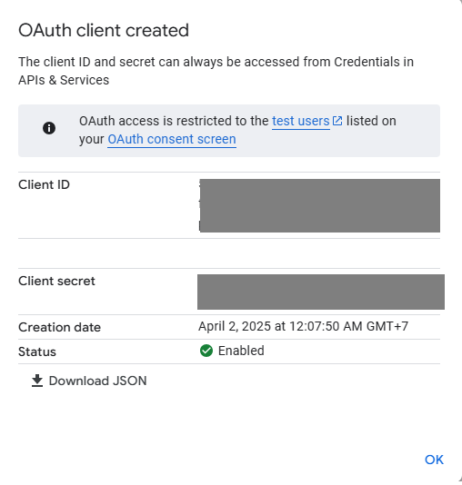

After registor our webapp to the Google Developer Console, we can start implementing the SSO in our webapp.

1. Create a config file for the Google SSO call `passportConfig.js` inside the `config` folder. This file will contain the Google OAuth client ID and client secret, which we will use to authenticate users with Google.

```javascript
// Configure Google OAuth 2.0 strategy
const configurePassport = () => {
  passport.use(
    new GoogleStrategy(
      {
        clientID: process.env.GOOGLE_CLIENT_ID,
        clientSecret: process.env.GOOGLE_CLIENT_SECRET,
        callbackURL: process.env.GOOGLE_CALLBACK_URL,
        scope: ['profile', 'email']
      },
      async (accessToken, refreshToken, profile, done) => {
        try {
          // Extract user information from Google profile
          const userData = {
            google_id: profile.id,
            email: profile.emails[0].value,
            username: profile.displayName || profile.emails[0].value.split('@')[0]
          };

          // Find or create user based on Google ID
          const user = await findOrCreateGoogleUserService(userData);
          return done(null, user);
        } catch (error) {
          return done(error, null);
        }
      }
    )
  );

  // Serialize user into the session
  passport.serializeUser((user, done) => {
    done(null, user.id);
  });

  // Deserialize user from the session
  passport.deserializeUser(async (id, done) => {
    try {
      // Use your existing service to find user by ID
      const user = await getUserByIdService(id);
      done(null, user);
    } catch (error) {
      done(error, null);
    }
  });

  return passport;
};

export default configurePassport;
```

The config file use a function `findOrCreateGoogleUserService` to find or create a user in the database based on the Google ID. This function is implemented in the `userService.js` file. 

```javascript
export const findOrCreateGoogleUserService = async (userData) => {
  const { google_id, email, username } = userData;
  
  try {
    // Begin transaction
    const client = await pool.connect();
    try {
      await client.query('BEGIN');
      
      // First check if user exists with this Google ID
      let result = await client.query(
        'SELECT id, username, email, role, google_id, created_at FROM users WHERE google_id = $1',
        [google_id]
      );
      
      let user = result.rows[0];
      
      // If no user found with Google ID, check if user exists with the same email
      if (!user) {
        result = await client.query(
          'SELECT id, username, email, role, google_id, created_at FROM users WHERE email = $1',
          [email]
        );
        
        user = result.rows[0];
        
        // If user exists with same email but no Google ID, link the accounts
        if (user) {
          result = await client.query(
            'UPDATE users SET google_id = $1 WHERE id = $2 RETURNING id, username, email, role, google_id, created_at',
            [google_id, user.id]
          );
          
          user = result.rows[0];
        } 
        // If no user exists at all, create a new one
        else {
          result = await client.query(
            'INSERT INTO users (username, email, google_id, role) VALUES ($1, $2, $3, $4) RETURNING id, username, email, role, google_id, created_at',
            [username, email, google_id, 'user']
          );
          
          user = result.rows[0];
        }
      }
      
      // Commit transaction
      await client.query('COMMIT');
      
      // Generate JWT token
      const userForToken = {
        id: user.id,
        username: user.username,
        email: user.email,
        role: user.role
      };
      
      const token = jwt.sign(
        userForToken,
        process.env.JWT_SECRET,
        { expiresIn: process.env.JWT_EXPIRES_IN || '24h' }
      );
      
      return {
        user: User.getSafeUser(user),
        token
      };
    } catch (error) {
      await client.query('ROLLBACK');
      throw error;
    } finally {
      client.release();
    }
  } catch (error) {
    throw new Error(`Error during Google authentication: ${error.message}`);
  }
};
```
This function first check if the user already exists in the database with the same Google ID. If not, it checks if a user exists with the same email. If a user is found with the same email but no Google ID, it updates the user's record to link the Google ID. If no user is found at all, it creates a new user in the database. Not forget to add the `google_id` field in the `users` table in the database.

```javascript
class User {
  constructor(userData) {
    this.id = userData.id;
    this.username = userData.username;
    this.email = userData.email;
    this.role = userData.role;
    this.created_at = userData.created_at;
    this.updated_at = userData.updated_at;
    this.google_id = userData.google_id;
  }
```  

2. Create routes for Google SSO in the `userRoutes.js` file. We will create two routes: one for redirecting the user to Google for authentication and another for handling the callback from Google after authentication.

```javascript
router.get("/auth/google", googleAuth); // Google SSO authentication initiate
router.get("/auth/google/callback", googleAuthCallback);  // Google SSO authentication callback
```

These two routes will call two functions in the `userController.js` file: `googleAuth` and `googleAuthCallback`. 

```javascript
// Initiate Google OAuth authentication, no need to call to any services since this is handled by Passport.js built in function
export const googleAuth = (req, res, next) => {
    passport.authenticate('google', { scope: ['profile', 'email'] })(req, res, next);
  };
  
// Handle Google OAuth callback, no need to call to any services since this is handled by Passport.js built in function
export const googleAuthCallback = (req, res, next) => {
    passport.authenticate('google', { session: false }, async (err, user, info) => {
        if (err) {
            return next(err);
        }
        
        if (!user) {
            return handleResponse(res, 401, 'Google authentication failed');
        }
        
        try {
            // Put the JWT token in a cookie
            res.cookie('jwt', user.token, {
                httpOnly: true,
                secure: process.env.NODE_ENV === 'production',
                maxAge: 24 * 60 * 60 * 1000, // 24 hours
                sameSite: 'strict'
            });
            
            // For easy testing, return the token in the response as well
            if (process.env.NODE_ENV === 'development') {
                return handleResponse(res, 200, 'Google authentication successful', {
                    user: user.user,
                    token: user.token, // Include token for testing
                    message: 'Copy this token for testing protected routes'
                });
            }
            
            // In production, redirect to frontend
            res.redirect(process.env.FE_URL);
        } catch (error) {
            next(error);
        }
    })(req, res, next);
};
```

The passport.js library already have built in functions for these so our controller do not need to call any service as other controllers do.


# 5. Matching Engine

The orders book generally supports various queues for processing buy and sell orders:

- Cancel Order
- Market Order Buy Queue
- Market Order Sell Queue
- Limit Order Buy Queue
- Limit Order Sell Queue


Orders are processed in the order listed above. Cancel orders are processed first and instantly, followed by market, limit, and stop orders.

Some of the other rules that apply to the system of order-matching engines are:

- The orders may be partially filled or not filled in the case of limit orders. Ví dụ nếu người dùng đặt lệnh mua 100 cổ phiếu với giá 10$ và hiện chỉ có 50 cổ phiếu được bán với giá 10$, thì lệnh mua sẽ được thực hiện với 50 cổ phiếu với giá 10$ và 50 cổ phiếu còn lại sẽ được giữ lại trong hàng đợi mua cho đến khi có người bán khác đồng ý bán với giá đó.

- Market orders may be partially filled at different prices. Ví dụ nếu người dùng đặt lệnh mua 100 cổ phiếu với giá 10$ và hiện có 50 cổ phiếu được bán với giá 9$ và 50 cổ phiếu được bán với giá 11$, thì lệnh mua sẽ được thực hiện với 50 cổ phiếu với giá 9$ và 50 cổ phiếu với giá 11$.

- Orders with the highest bid (buy) price are kept at the top of the queue and will be executed first. Orders with the lowest sell (ask) prices will be sold first. For orders with the same ask price, the order that arrives first will be sold first.

UNDER DEVELOPMENT.....


# 6. Cloudlflare Tunnel

# 7. Banking Payment API

## Theory

In our application, when a user creates an account, they are given a default portfolio balance of $100,000 in virtual money (used only within the platform). In addition, users can top up their portfolio balance with real money—similar to how players recharge in games to buy items. Currently, we support bank transfers via QR code, as shown in the image below.


To enable this feature, we use a third-party service called [Sepay](https://sepay.vn/). For this project, we are using their free plan for testing purposes:

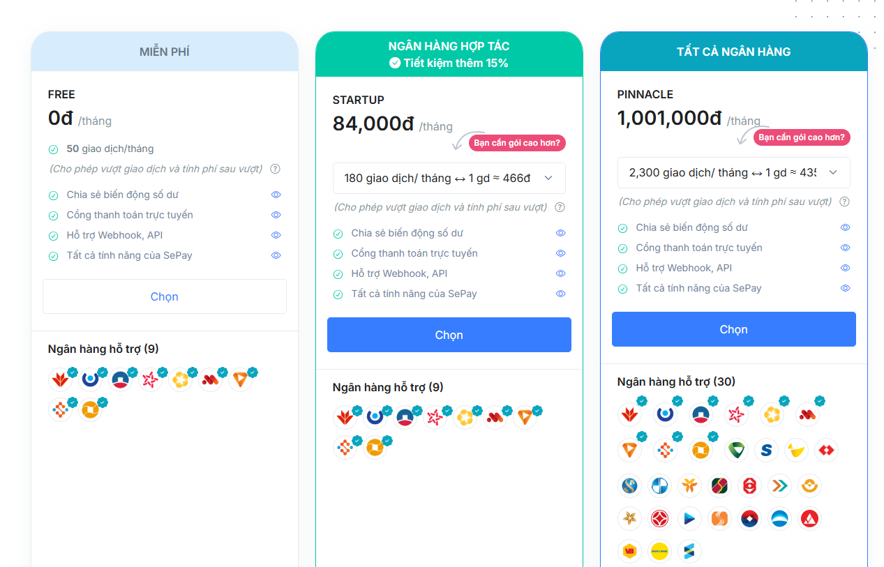

Briefly, how Sepay works:

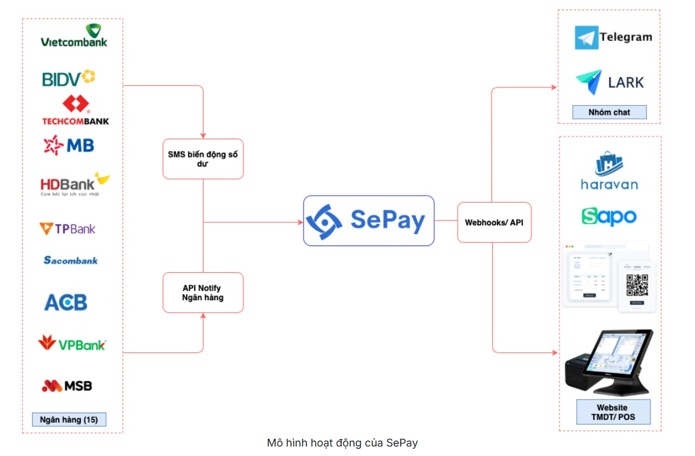

In simple term, Sepay act as the middleman between the user and the bank. User transfer money to a virtual account (VA) provided by Sepay, these money will be transfer to the real user bank account. Bank account notify the Sepay system that the money has been transfered. Sepay now that te money have been transfered, then how our app know that. There is two ways to do this:

- Using sepay webhook: This is when Sepay automatically sends a notification to our website when a transaction occurs. Each time a payment is made, Sepay triggers a webhook, allowing our system to instantly detect that the customer has paid and update the order status accordingly.

- Using Sepay API: This is when our website actively sends a request to Sepay to check the status of a transaction. Sepay then responds with the transaction details. APIs allow us to manually or periodically verify transaction status.

In this proejct, we choose to use the second method, which is to use Sepay API snce it is much more easier to config and implement.

*Why we not use the bank API directly?*

-> This will require working directly with the bank, which is a complex and time-consuming process, require you prove your organization is a real business to access the bank API.

## Implementation

First, create an account on the Sepay website. Then, go to the Bank Accounts section to connect your own bank account.

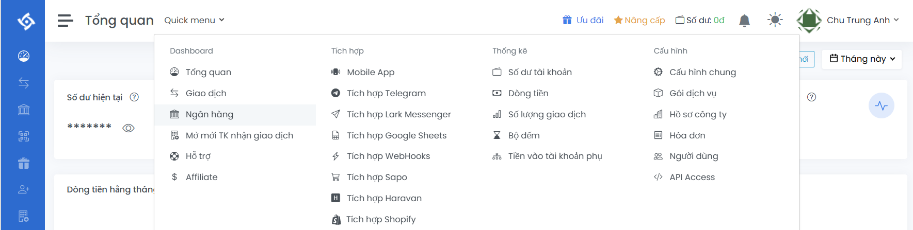

Select the **Bank API**, not SMS banking.

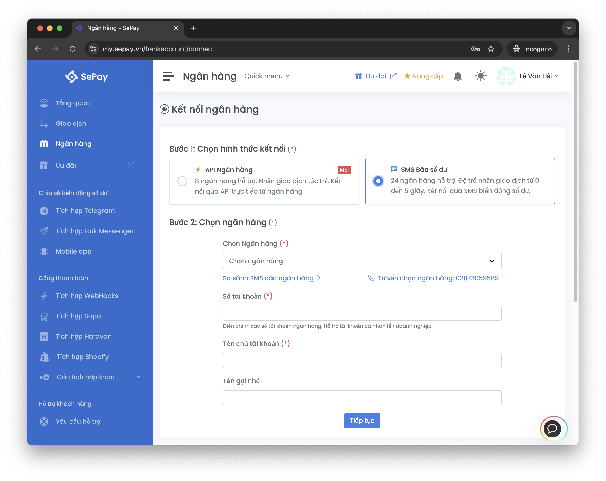

After successfully connecting your bank account, click on it and create a virtual account. When users make a transfer, this virtual name will be displayed instead of your real account name. However, the money will still be deposited into your main bank account. 

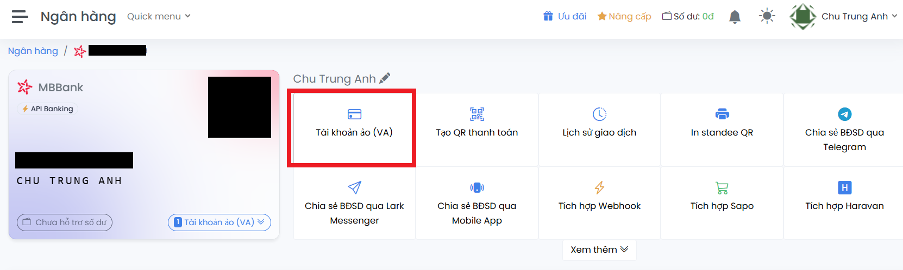

After creating the virtual account (VA), click on it to view the information needed to integrate it into your website.

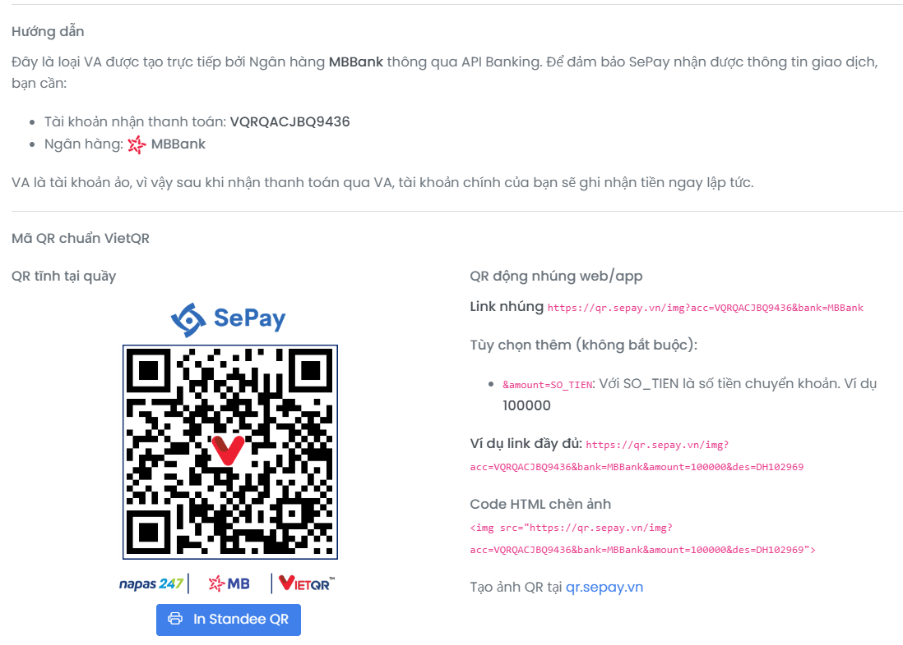

From now on, all transactions will be made through this virtual account. You can see all the transactions made to this account in the **Transaction** section.

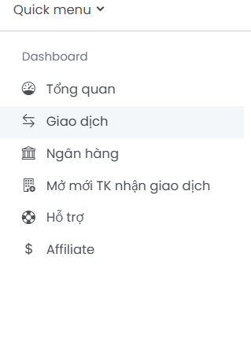

Next, we need  to create an API token so that our web can send requests to Sepay. Go to the **API** section and click on **Create API Token**.

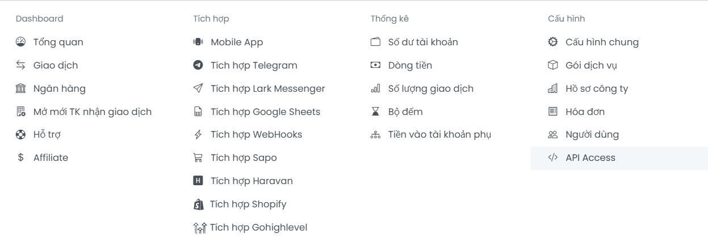

Create a new API

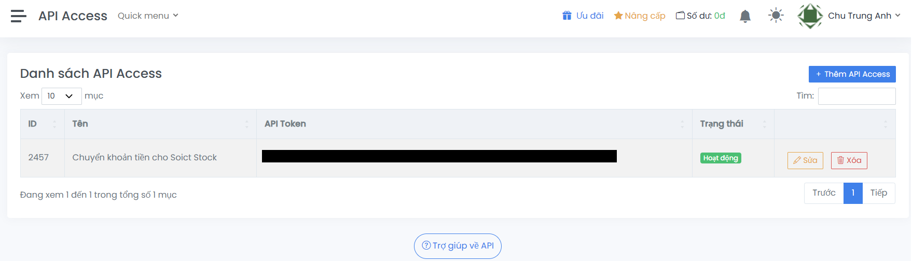

After creating the virtual account, you will receive a token. This token must be included in every payment request your website sends to Sepay.
You can read more about how to create and use the API token [here](https://docs.sepay.vn/tao-api-token.html)


> [!CAUTION]
> Note: Currently, Sepay does not support authorization scopes for API keys. This means that any API key you generate will have full access to your account.

The structure of the APIs is documented here: https://docs.sepay.vn/api-giao-dich.html. In this project, we only use the following API to filter transactions by reference number/transaction ID (to check the transaction and extract the amount sent by the user):

```http
GET https://my.sepay.vn/userapi/transactions/list?reference_number={reference_number}
```

After finish setting on the Sepay website, we need to implement the payment feature in our web application. 

At the frontend, insert the QR image that we got from the Sepay website

```javascript
<div className="qr-container">
    
```

Along with this, there is an input field where users can enter the reference number of the transaction and a button to confirm the transaction.


```javascript
 <input
    type="text"
    placeholder="Enter transaction reference number from banking app"
    value={transactionId}
    onChange={(e) => setTransactionId(e.target.value)}
    className="transaction-input"
/>
{error && <p className="error-message">{error}</p>}
<button 
    className="verify-button"
    onClick={handleVerifyPayment}
    disabled={verifying}
>
```

The Reference Number (Transaction ID/ Mã giao dịch) displayed on the screen when the user completes a transfer on their banking app. For example:


user will need to enter this number in the input field and click the button to verify the payment.


At this point, the frontend will make a request ->  backend -> send a request to Sepay to retrieve the transaction information with this reference number. The backend will then check if the transaction is valid and update the user's portfolio balance accordingly.

Step by step:

When the user clicks the button, the `verifyPayment` function is called

```javascript
const result = await verifyPayment(transactionId);
```

This function is defined in the `payment.js` file in the `api` folder (A folder in frontend that contains all the API calls to the backend).

```javascript
// Function to verify payment and update balance
export const verifyPayment = async (transactionId) => {
    try {
        const response = await apiClient.post('payments/verify', { referenceNumber: transactionId });
        return response.data;
    } catch (error) {
        throw error.response?.data || error.message;
    }
};

```
Let continue to see what this URL does in the backend by examine the controller of this URL in the `paymentController.js` file.

```javascript
// Verify payment and update user's balance
export const verifyPaymentController = async (req, res, next) => {
    const { referenceNumber } = req.body;
    const portfolioId = req.user.portfolio_id;


    ....

        const result = await verifyPayment(referenceNumber, actualPortfolioId);
        res.json({
            success: true,
            message: 'Payment verified and balance updated successfully',
            data: result
        });
    } catch (error) {
        log.error('Payment verification error:', error);
        next(error);
    }
};

```

It will then call service, `verifyPayment`, in the `paymentService.js` file. This is where the actual backend logic for processing the payment takes place:


```javascript
const SEPAY_API_TOKEN = process.env.SEPAY_API_TOKEN;
const SEPAY_API_URL = process.env.SEPAY_BASE_API_URL;

export const verifyPayment = async (referenceNumber, portfolioId) => {
    const client = await pool.connect();
    try {
        await client.query('BEGIN');

      
        // Check if reference number was already used
        const existingTransaction = await client.query(
            'SELECT * FROM payment_transactions WHERE reference_number = $1',
            [referenceNumber]
        );

        if (existingTransaction.rows.length > 0) {
            throw new Error('This payment has already been processed');
        }

        // Get current portfolio balance
        const currentBalance = await client.query(
            'SELECT cash_balance FROM portfolios WHERE portfolio_id = $1',
            [portfolioId]
        );


        // Verify with Sepay API
        const sepayResponse = await axios.get(`${SEPAY_API_URL}/transactions/list`, {
            params: { reference_number: referenceNumber },
            headers: {
                'Authorization': `Bearer ${SEPAY_API_TOKEN}`,
                'Content-Type': 'application/json'
            }
        });

        log.info('Sepay API response:', sepayResponse.data);

        if (!sepayResponse.data.transactions?.length) {
            throw new Error('No transaction found with this reference number');
        }

        // Find incoming transaction (looking for amount_in > 0)
        const incomingTransaction = sepayResponse.data.transactions.find(
            t => parseFloat(t.amount_in) > 0
        );

        if (!incomingTransaction) {
            throw new Error('No incoming payment found with this reference number');
        }

        const vndAmount = parseFloat(incomingTransaction.amount_in);
        const virtualAmount = vndAmount; // 1:1 conversion (1000 VND = 1000 USD)

        log.info('Payment amounts:', { vndAmount, virtualAmount });

        // Update portfolio balance
        const updateResult = await client.query(
            'UPDATE portfolios SET cash_balance = cash_balance + $1 WHERE portfolio_id = $2 RETURNING cash_balance',
            [virtualAmount, portfolioId]
        );

        log.info('Portfolio balance update result:', {
            portfolioId,
            newBalance: updateResult.rows[0]?.cash_balance
        });

        // Record transaction
        const transactionResult = await client.query(
            'INSERT INTO payment_transactions (portfolio_id, reference_number, vnd_amount, virtual_amount) VALUES ($1, $2, $3, $4) RETURNING *',
            [portfolioId, referenceNumber, vndAmount, virtualAmount]
        );

        log.info('Payment transaction recorded:', transactionResult.rows[0]);

        await client.query('COMMIT');

        return {...};
    } catch (error) {
        await client.query('ROLLBACK');
        log.error('Payment verification error:', error);
        throw error;
    } finally {
        client.release();
    }
};
```

Let I break down the code:

First, we need to check if the transaction reference number has already been used. If it has, we will not allow it to be used again.

*Each time a transaction is processed, we save it in the payment_transactions table in the database:*

```javascript
await pool.query(`
    CREATE TABLE IF NOT EXISTS payment_transactions (
        id SERIAL PRIMARY KEY,
        portfolio_id INTEGER NOT NULL REFERENCES portfolios(portfolio_id),
        reference_number VARCHAR(255) NOT NULL UNIQUE,
        vnd_amount DECIMAL(15,2) NOT NULL,
        virtual_amount DECIMAL(15,2) NOT NULL,
        status VARCHAR(50) NOT NULL DEFAULT 'completed',
        created_at TIMESTAMP WITH TIME ZONE DEFAULT CURRENT_TIMESTAMP,
        updated_at TIMESTAMP WITH TIME ZONE DEFAULT CURRENT_TIMESTAMP
    );
`);
```

*However, since we are currently testing, we delete this table each time the backend is restarted. This allows the transaction reference number to be reused for testing purposes without needing to perform the actual bank transfer to Sepay again.*

```javascript
       // Development mode - drop table if exists
        if (process.env.NODE_ENV === 'development') {
            await pool.query('DROP TABLE IF EXISTS payment_transactions CASCADE');
        }
```

**Note**: Regarding security, to ensure that the transaction reference number cannot be reused and to prevent double-spending of funds, I came up with two methods:

- Check if the transaction reference number has already been used (by querying the transaction reference number stored in the database). If it has, we do not allow it to be used again, as we did earlier. However, for this method, we would need to store all used transaction reference numbers in the database. This could make querying slower when there are a large number of transactions.

- A more practical approach is to limit the validity of the transaction reference number to a specific time frame, such as 5 minutes. The table schema already includes a timestamp field, so we can simply compare it with the current time without needing to store all used transaction reference numbers in the database.

However, as mentioned, since this is just for a demo project, we are using the first method. This way, we can simply delete the table to reuse the transaction reference number for testing purposes without needing to perform the actual bank transfer to Sepay. (Sepay only free for 50 transactions per month at the time of writing this, so we need to be careful not to exceed this limit).


After confirming that the transaction reference number has not been used, we will call Sepay’s API to retrieve this transaction by calling the following URL:

```javascript
const sepayResponse = await axios.get(`${SEPAY_API_URL}/transactions/list`, {
    params: { reference_number: referenceNumber },
    headers: {
        'Authorization': `Bearer ${SEPAY_API_TOKEN}`,
        'Content-Type': 'application/json'
    }
});
```

Or you can test in REST client like Postman first:

```http
GET https://my.sepay.vn/userapi/transactions/list?reference_number=FT25128764304800
Authorization: Bearer N3RT..........
```

The request needs to be attached with the API token that we created on the Sepay website. This request will retrieve the transaction associated with the given reference number. For example, it will return the following data:

```json
{
  "status": 200,
  "error": null,
  "messages": {
    "success": true
  },
  "transactions": [
    {
      "id": "12462228",
      "bank_brand_name": "MBBank",
      "account_number": "25102049999",
      "transaction_date": "2025-05-08 14:23:00",
      "amount_out": "10000.00",
      "amount_in": "0.00",
      "accumulated": "0.00",
      "transaction_content": "...  CHU TRUNGANH thanh toan",
      "reference_number": "FT25128764304800",
      "code": null,
      "sub_account": null,
      "bank_account_id": "...."
    },
    {
      "id": "12462218",
      "bank_brand_name": "MBBank",
      "account_number": "25102049999",
      "transaction_date": "2025-05-08 14:23:04",
      "amount_out": "0.00",
      "amount_in": "10000.00",
      "accumulated": "0.00",
      "transaction_content": "....  CHU TRUNG ANH thanh toan",
      "reference_number": "FT25128764304800",
      "code": null,
      "sub_account": "VQRQACJBQ9436",
      "bank_account_id": "...."
    }
  ]
}
```

With a transaction reference number, we will retrieve two transactions: one is minus user account and other is plus into our bank account (Sepay virtual account). We will filter and only keep the transaction where money was transferred into Sepay (i.e., `amount_in > 0`). After that, we will extract the amount from this transaction, convert it into virtual money (in this case, a 1:1 ratio, meaning 1,000 VND deposited will result in 1,000 USD in the virtual account), and then update the user's `portfolio` balance in the portfolios table.

We will also store this transfer transaction in the `payment_transactions` table in the database to mark that this transaction reference number has been used and cannot be used again.


